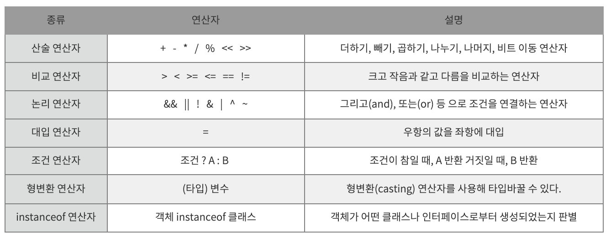

# 연산자 / Scanner

## ✏️  연산자



- % 는 모듈러스라고 읽으며, 나머지를 반환하는 연산자

```java
// 증감 연산자는 사용 위치에 따라서 실행 순서가 다르다 
int i = 10;

System.out.println(i++);	// 10
System.out.println(i);		// 11

System.out.println(++i);	// 12
System.out.println(i);		// 12
```

- 증감 연산자 값을 1씩 더하는 연산자는 ++ 이고, 1씩 빼는 연산자는 -- 이다
- 증감 연산자의 위치에 따라서 연산 순서가 상이하다

```java
int grade = 80;

if(grade>=80 & grade<90) System.out.println("true");     // true
if(grade>=80 && grade<90) System.out.println("true");    // true
```

- 비트 연산자 & 를 사용한 조건문과 논리 연산자 &&를 사용한 조건문은 모두 true이다
- 논리 연산자는 그렇다 치고, 비트 연산자는 왜 true 일까?
- 비트 연산자 & 는 두개의 항이 모두 1인 경우 true를 반환한다
- 컴퓨터에서 1은 곧 true를 의미하는데, 두개의 항이 모두 논리값이 true이므로 조건문의 결과가 true가 되는 것

## ✏️  Scanner

```java
package com.edu.operator.test;
**import java.util.Scanner;**

public class ScannerTest {

	public static void main(String[] args) {
		**Scanner sc = new Scanner(System.in);**
	}
}
```

- 실행 시점에서 값을 입력받을 수 있도록 돕는 클래스가 Scanner
- Java에 내장된 패키지여도 java.lang을 제외한 패키지는 import가 필요하다
- 클래스이므로 사용하기 위해 객체를 생성해 메모리에 멤버를 올려준다
- `[System.in](http://System.in)` : 키보드로부터 입력을 받는다

```java
package com.edu.operator.test;

import java.util.Scanner;
public class ScannerTest {

	public static void main(String[] args) {
		Scanner sc = new Scanner(System.in);

		System.out.println("> 키보드로 숫자를 입력하세요");
		int num1 = sc.nextInt();
		int num2 = sc.nextInt();
		System.out.println("입력받은 숫자 : " + num1 + num2);

		System.out.println("> 키보드로 문자열을 입력하세요");
		String str = sc.next();    // 문자열을 입력받는 메서드 
		System.out.println(str);
	}
}
```

- `sc.nextInt()` : 숫자를 입력받아 return하는 메서드로 공백(space, enter)을 기준삼아 숫자를 입력받는다
- `sc.next()` : 문자열을 입력받는다

```java
package com.edu.condition.test;
import java.util.Scanner;

public class GradeIfTest1 {

	public static void main(String[] args) {
		Scanner sc = new Scanner(System.in);
	
		// **int grade = 88;
		System.out.println("점수를 입력하세요");
		int grade = sc.nextInt();**
		
		if(grade>=90 && grade<100) {
			System.out.println("A");
		}else if(grade>=80 && grade<90) {
			System.out.println("B");
		}else if(grade>=70 && grade<80) {
			System.out.println("C");
		}else {
			System.out.println("Try Again");
		}
	}
}
```

- 프로그램은 입력 값을 알고리즘에 따라 결과값으로 반환한다
- 어떤 값을 입력받을 지 몰라도, 알고리즘에 의한 결과값을 예측할 수 있다
- 그렇기 때문에 우리는 프로그램을 만들어내기위해 값을 fix할 것이 아니라 사용자로 부터 입력받도록 한다