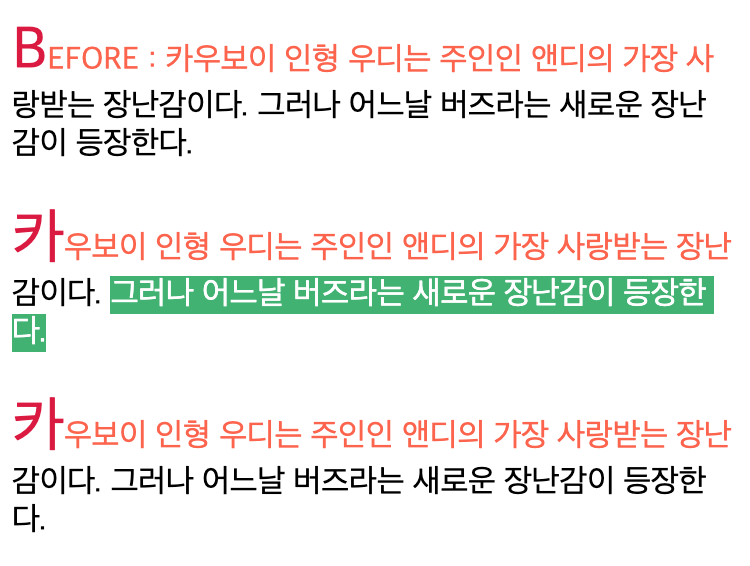
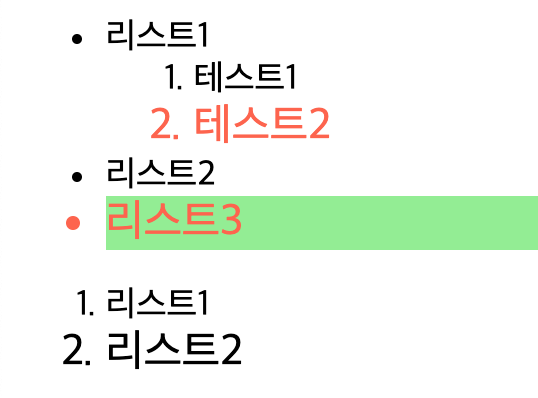
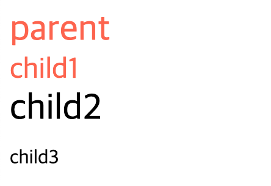

# 📌 11일차 
- 2021.09.07(화)
- 목차 : 선택자

<br>

## ✅ 선택자 (selector)
- html 요소를 선택할 때 사용
- JavaScript에서도 선택자를 사용해 html요소를 선택한다

<br>

### 👉 가상 요소 선택자 (Pseudo-Element Selector)
- CSS3 부터는 가상 클래스 선택자와 가상 요소 선택자의 구분을 위해서 **콜론(:)의 개수에 차이를 둔다**
- 가상 요소 선택자에 콜론(:)을 하나만 사용해도 적용되기는 하지만 CSS3의 권고사항을 따르도록 하자
- **가상 클래스 선택자 vs 가상 요소 선택자**
    - 가상 클래스 선택자 : 요소의 상태에 이름을 가상으로 붙여주어 사용한다
    - 가상 요소 선택자 : 실제로는 존재하지 않는 요소나 범위에 이름을 가상으로 붙여주어 사용한다

<br>

-----

```html
<div class="movie">토이스토리</div>
<div class="movie like">주토피아</div>
<div class="movie like">인사이드아웃</div>
<div class="movie">코코</div>
<div class="movie">겨울왕국</div>
```
```css
.movie::before { 
    content : 'MOVIE  ';
    color : tomato; 
    font-weight:bold;
}
.like::after { 
    content : '🧡';
}
```


1. `::before` : 특정 요소의 바로 앞에 가상의 요소를 만들어 컨텐츠를 넣고 스타일을 부여한다
2. `::after` : 특정 요소의 바로 다음에 가상의 요소를 만들어 컨텐츠를 넣고 스타일을 부여한다 
- `::before` 와 `::after` 는 html문서에는 존재하지 않는 가상 요소를 스타일처럼 적용한다
- **즉, 스타일이기 때문에 드래그를 통한 복사가 불가능하다**

<br>

-----

```html
<div class="movie">...</div>
<div class="movie">...</div>
<div class="movie">...</div>
```
```css
.movie:first-child::before { content : 'BEFORE : '; }
.movie::first-letter { font-size:30px; color:crimson;}
.movie::first-line { color:tomato; }
.movie::selection { background-color:mediumseagreen; color:#fff; }
```




3. `::first-letter` : 태그 내부의 첫번째 글자에 스타일을 부여한다 
  - 만약 `::berfoe`가 있다면, 해당 컨텐츠의 첫번째 글자에 스타일이 적용된다
4. `::first-line` : 태그 내부의 첫번째 줄에 스타일을 부여한다
  - 첫번째 줄의 기준은, 웹 브라우저의 너비에 영향을 받아 개행을 하는 시점을 의미한다 
5. `::selection` : 드래그를 했을 때에 선택된 영역에 대한 스타일을 의미한다. 

<br>

### 👉 선택자 결합 : 하위, 자식
```html
<ul class="text">
  <li>리스트1
    <ol>
      <li>테스트1</li>
      <li>테스트2</li>
    </ol>
  </li>
  <li>리스트2</li>
  <li>리스트3</li>
</ul>
<ol>
  <li>리스트1</li>
  <li>리스트2</li>
</ol>
```
```css
li:last-of-type { font-size : 20px; font-weight: bold;}
ul li:last-of-type { color : tomato; }
ul>li:last-of-type { background-color:lightgreen; }
```



- 선택자를 결합해 좀 더 범위를 좁혀서 요소를 선택할 수 있다
- ` (공백)` 을 구분자로 사용하면 해당하는 모든 하위 요소를 선택한다 
- `>` 를 구분자로 사용하면 바로 밑의 자식 요소만 선택한다


<br>

-----

```html
<h1>TITLE</h1>
<div>
  <p>P1</p>
  <span>span</span>
  <code>code</code>
  <p>P2</p>
  <div>div</div>
  <p>P3</p>
</div>
```
```css
code ~ p { color:tomato; } 
code + p { background-color:lightgray; } 
code, p, div { font-style:italic; }
```


- 일반 형제 선택자 결합(~)
  - `A ~ B` : 같은 부모를 가진 형제 태그(B)를 입력한다. 
  - 이 때 형제 선택자(B)는 현재 선택자(A) 보다, html문서 내에서 순서가 뒤쪽에 위치한 요소만 선택된다. 
- 인접 형제 선택자 결합(+)
  - `A + B` : 같은 부모를 가진 형제 태그 중 인접한 태그만 사용가능하다.
  - 위의 예제에서 `<code>`의 경우에는 인접 형제 선택자를 사용했을 때, `<span>`과 `<p>P2</p>`만을 선택할 수 있다.
- 그룹화(,)
  - `A, B` : 태그는 다르지만, 같은 스타일을 적용하고 싶을 때 사용한다


<br>

### 👉 범용 선택자(*)

```html
<h1>TITLE</h1>
<div>
  <p class="tomato">P1</p>
  <span class="tomato">span</span>
  <code class="tomato">code</code>
  <p>P2</p>
  <div class="tomato">div</div>
  <p>P3</p>
</div>
```
```css
* { color:lightseagreen; }
.tomato { color:tomato; }
*.tomato { color:tomato; }
p + * { font-size:20px; }
```


- `*` : html문서 내부의 모든 요소를 선택할 때 사용한다
- 전체를 선택할 때 사용하는 선택자로 와일드카드라고도 말한다
- 모든 요소에 적용되기 때문에 주의가 필요하다
- 적용 범위가 넓은 선택자일수록, CSS파일의 최상단에 작성하는 것을 추천한다
- 실제로 모든 선택자는 앞에 `*` 이 붙는데, 생략되어 있다 (예) .tomato 와 *.tomato 는 같다 
- 범용 선택자 역시 다른 선택자와 결합하여 사용할 수 있다 


<br>

### 👉 상속 제어하기 
- 자기 자신에게 적용된 스타일이 없는 경우 부모의 스타일을 상속받아 적용된다
- 모든 스타일이 상속되는 것은 아니다
- 상속이 되지 않는 스타일 : `background-image` 

<br>

```html
<div class="parent">
  parent
  <div class="child1">child1</div>
  <div class="child2">child2</div>
  <div class="child3">child3</div>
</div>
```
```css
.parent { color:tomato; font-size:30px;}
.child1 { color:lightgreen; font-size:24px;}
.child2 { color:initial; }    /*글자 색상 상속을 끊는다*/
.child3 { all:initial; }      /*모든 속성의 상속을 끊는다*/
.child1 { color:inherit; }      /*자기자신의 스타일이 아닌, 상속받은 스타일을 적용할 때 사용한다*/
```




1. `initial` : 상속을 끊어내고 싶을 때, 해당 속성의 값으로 사용한다 (예) color : initial
2. `inherit` : 자기 자신에게 적용된 스타일이 아닌, 부모 요소로부터 상속받은 스타일을 적용하고 싶을 때 사용한다 (예) color : inherit
3. `unset` : 상속을 받는지 여부에 따라서 자동으로 결정된다
   - 상속 받는 스타일이 있는 경우 : inherit
   - 상속 받는 스타일이 없는 경우 : initial
4. `all` : 모든 속성의 상속 여부를 결정할 수 있다


<br>

### 👉 스타일의 우선 순위
```html
<style>
    #box { background-color:gray; }
</style>
<link rel="stylesheet" href="style.css">
...
<div id="box" class="classBox">
    Box
</div>
```
```css
/* style.css */
#box { background-color:lightgreen; }
.classBox { background-color:red; }
```

1. **선언된 위치에 따른 우선 순위**
    - html문서 내부의 `<style>`이 `<link>`를 통해 연결된 `css`파일보다 먼저 선언된 경우
    - `<style>`태그 내부에서 적용된 스타일이 나중에 적용된 `css`파일의 스타일에 덮어쓰여지므로 우선순위가 낮다  
    - 선언 순서에 따라서 어떤 스타일이 적용될지가 결정된다
    - 가장 우선 순위가 높은 위치는 인라인 스타일인데, 권장하지 않는다 (예) `<div style="color:red">test</div>`
    
<br>
    
2. **명시도** : 적용 범위가 좁을수록 명시도가 높다. 즉, 대상을 특정지을 수 있는 경우에 명시도가 높다
    - 명시도가 낮은 선택자를 사용해 스타일을 덮어씌우려고 해도, 명시도가 높은 스타일이 적용된다
    - 예제를 보면 `#box`가 `.classBox`보다 먼저 사용되었으나, `#box`의 스타일이 적용된 것을 확인할 수 있다  
    - `id`는 `class` `attribute` `가상 클래스(Pseudo Class)`보다 명시도가 높다
    
<br>

3. **우선 순위**


- `!important` 는 가장 강력한 값으로, 사용하지 않는 것을 권장한다


