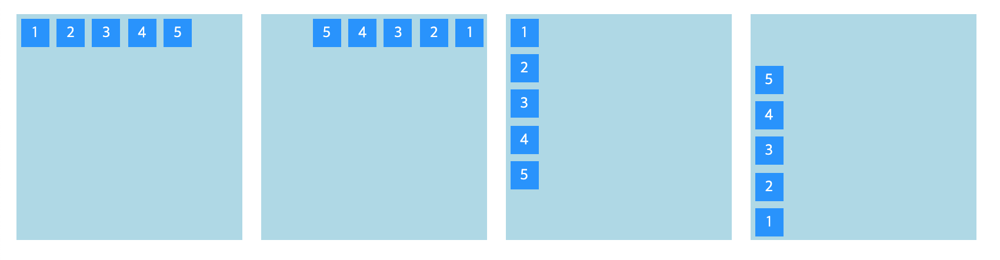
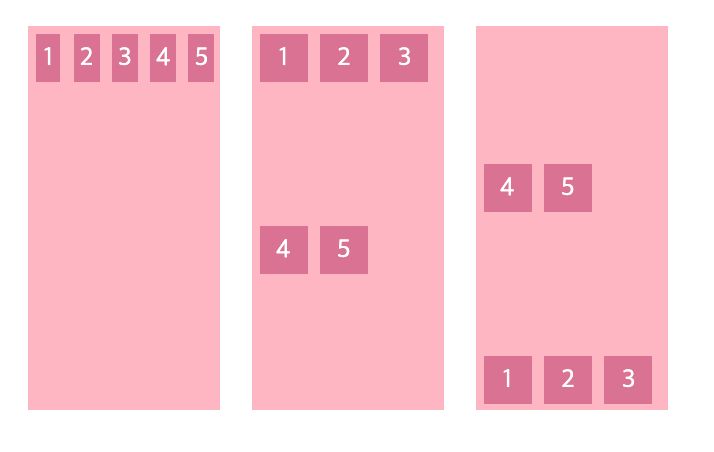

# 📌 15일차 
- 2021.09.11(토)
- 목차 : flexbox 

<br>

## ✅ Flexbox
### 👉 Flexbox 개요 
```css
.container { display : flex; }
.container>.item { width:50px; height:50px; }
```
- 요소의 레이아웃 설계를 위한 방법 
- `display:inlin-block`과 `float`는 원하는 레이아웃을 설정하기 힘들다 
- `display:flex`를 부모 요소에 사용하면 원하는 레이아웃으로 설정할 수 있다 
    - 자식 요소들이 가로 정렬된다
    - 부모 요소의 크기에 맞춰 자식 요소의 `width`값이 자동으로 변경된다  


<br>

### 👉 Flexbox 용어
- `flex container` : `item`을 감싸주는 부모 요소
- `flex item` : `container`의 자식 요소를 의미
- `flex container`와 `flex item`이 사용할 수 있는 속성이 다르므로 잘 구분해두자
- `flexbox` 는 1차원의 직선 형태의 정렬을 의미한다 
- `main axis` : 주축의 기본 값(default)은 가로축 
- `cross axis` : 교차축의 기본 값(default)은 세로축
- `axis` 의 기준은 변경될 수 있다

<br>

### 👉 Container : `display`
- `display-outside` : **형제 요소**와의 배치 방법을 설정
    - 키워드 : `inline` `block` `inline-block` 
- `display-inside` : **자식 요소**를 어떻게 배치할지를 설정
    - 키워드 : `flex` `grid` 
- `display-outside` 와 `display-inline`을 함께 지정하려면 
    - CSS2의 작성 방식(`display-legacy`) : `display : inline flex;`
    - CSS3의 작성 방식 : `display : inline-flex;` 

<br>

### 👉 Container : `flex-direction`
```css
.container  {
    width:240px; height:240px; margin:10px;
    background-color:lightblue; 
    display:flex;  
}
.container1 {flex-direction:row;}
.container2 {flex-direction:row-reverse;}
.container3 {flex-direction:column;}
.container4 {flex-direction:column-reverse;}
```



- `main-axis` : 원점 기준 왼쪽에서 오른쪽으로 향하는 가로축(default)
- `cross-axis` : 원점 기준 위에서 아래로 향하는 세로축(default)
- `main-axis`와 `cros-axis` 의 위치와 방향을 설정한다
    - 위치 : `main-axis`가 세로축, `cross-axis`를 가로축으로 지정
    - 방향
        - `main-aixs`의 방향을 원점 기준 오른쪽 → 왼쪽으로 변경
        - `cross-aixs`의 방향을 원점 기준 아래쪽 → 위쪽으로 변경
- 키워드별 기준축과 방향
<table>
    <tr>
        <th rowspan="2">/</th>
        <th colspan="2">main-axis</th>
    </tr>
    <tr>
        <th>기준축</th>
        <th>방향</th>
    </tr>
    <tr>
        <th>row</th>
        <td>가로축</td>
        <td>왼 → 오</td>
    </tr>
    <tr>
        <th>row-reverse</th>
        <td>가로축</td>
        <td>오 → 왼</td>
    </tr>
    <tr>
        <th>column</th>
        <td>세로축</td>
        <td>위 → 아래</td>
    </tr>
    <tr>
        <th>column-reverse</th>
        <td>세로축</td>
        <td>아래 → 위</td>
    </tr>
</table>  


<br>

### 👉 Container : `flex-wrap`, `flex-flow` 단축 속성(short hand)
```css
.container  {
    width:120px; height:240px; margin:10px;
    background-color:lightpink; 
    display:flex;  
}
.container1 {flex-wrap:nowrap;}
.container2 {flex-wrap:wrap;}
.container3 {flex-wrap:wrap-reverse;}
```



- `flex-wrap` : `item`을 강제로 한 줄로 배치시킬 것인지 개행을 줄 것인지에 대해 결정하는 속성
    - `nowrap` : `container` 의 `width`, `height` 에 맞춰 `item`의 크기를 조절하며 강제로 한줄로 배치 (default)
    - `wrap` : `item`의 크기를 유지하며 여러 줄로 배치 
    - `wrap-reverse` : `wrap`과 동일하나 순서가 반전된다
    - `warp` 이나 `wrap-reverse`를 설정했을 때의 행 간격은 `container`의 `height`값에 영향을 받는다 

----
```css
.container {
  display:flex;
  flex-flow:column wrap;
}
```
- `flex-flow` : `flex-wrap`과 `flex-direction`을 함께 설정할 수 있는 단축 속성(short hand)
- 공백을 구분자로 사용해 `flex-wrap`과 `flex-direction`을 작성한다  

<br>


### 👉 Item : `order`
```css
.container  {
    height:200px; margin:10px;
    background-color:lightsalmon; 
    display:flex;  
}
.item:nth-child(3){order:1;}
.item:nth-child(5){order:8;}
.item:nth-child(4){order:-10;}
```


- `flex` 또는 `grid`가 적용된 `container`안에서 자신의 위치를 설정한다
- 정수를 사용할 수 있고, 음수도 사용할 수 있다 
- HTML문서 내부의 순서나 tab 순서와는 상관없고 화면에 보여지는 순서에만 영향을 준다 
- `item`에 `order`를 사용하려면 부모 요소가 `display:flex`이어야만 한다 

<br>


