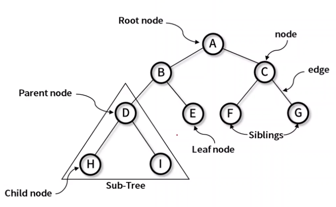
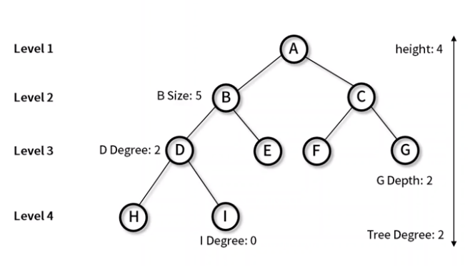
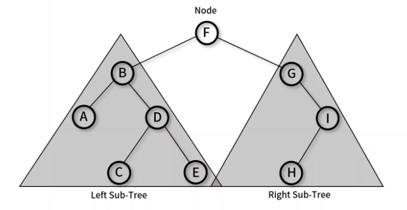
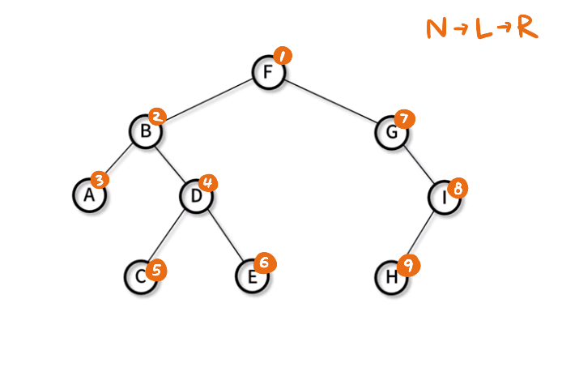
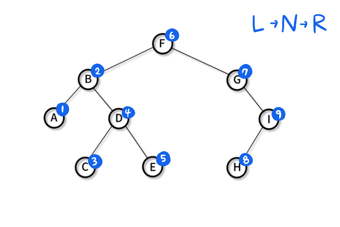
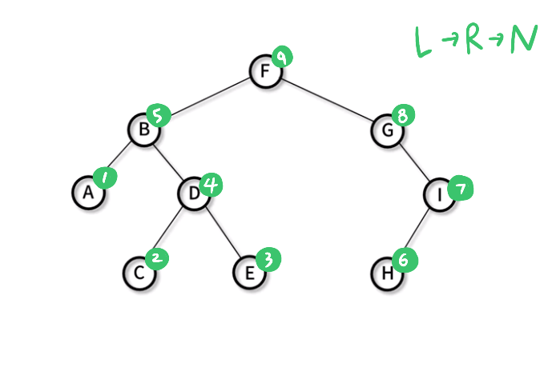
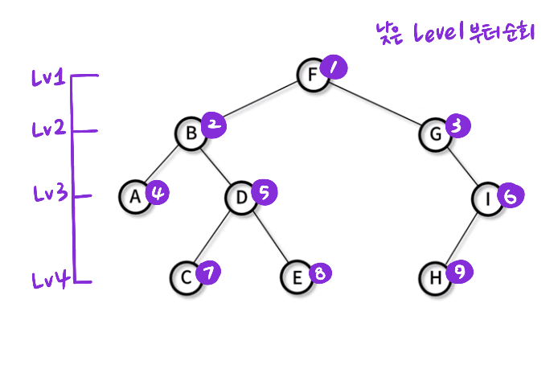

# 📌 21일차 
- 2021.10.15(금)
- 강의 : 비선형 자료구조 41~45강
  - 트리
  
<br>

### 👉 트리(Tree)



- **트리** : 그래프의 일종으로 두 노드 사이에 하나의 간선만 연결되어 있는 최소 연결과 계층 형태의 비선형 자료 구조를 말한다
- **노드(node)** : 하나 이상의 값을 갖는 객체 단위 
- **간선(edge)** : 두 노드를 연결하는 선 
- **루트 노드(Root node)** : 부모가 없는 최상위 노드
- **단말 노드(Leaf node)** : 자식이 없는 노드
- **부모 노드(Parent node)** : 특정 Sub-Tree 내에서의 상위 노드
- **자식 노드(Child node)** : 특정 Sub-Tree 내에서의 하위 노드
- **형제 (Sibling)** : 같은 부모를 갖는 자식 노드

<br> 


### 👉 트리 특징
- 트리는 최소 연결 트리로 불리며 계층모델, 방향 비순환 그래프(DAG)의 한 종류이다
- 트리 종류 : 이진 트리, 이진 탐색 트리, AVL 트리, 힙(heap)



- **노드 크기(size)** : 자신을 포함한 모든 자손 노드의 개수 (예) 노드B의 크기 : 5
- **노드 깊이(depth)** : 루트 노드에서 특정 노드에 도달하기 위한 간선의 개수 (예) 노드G의 깊이 : 2 / 노드H의 깊이 : 3
- **노드 레벨(level)** : 트리의 특정 깊이를 가지는 노드의 집합 (예) 노드B,C : 2 / 노드 D,E,F,G : 3 / 노드 H,I : 4
- **노드 차수(dgree)** : 노드가 지닌 가지의 수 (예) D노드의 차수 : 2  / I노드의 차수 : 0
- **트리 차수(tree degree)** : 트리의 최대 차수 (노드의 차수 중 max)
- **트리 높이(height)** : 루트 노드에서 가장 깊숙이 있는 노드의 깊이 (예) Tree height : 4


<br>


### 👉 트리 순회



- 트리 구조에서 각각의 노드를 정확히 한번씩 체계적인 방법으로 방문하는 과정
- 필요 용어 
  - N(Node) : 해당 노드를 방문
  - L(Left) : 왼쪽 서브 트리로 이동
  - R(Right) : 오른쪽 서브 트리로 이동
- 순회 방식
  - 전위 순회(Pre-order) : N → L → R
  - 중위 순회(In-order) : L → N → R
  - 후위 순회(Post-order) : L → R → N
  - 층별 순회(Level-order) : 낮은 level부터 순차적 순회 ( F → B → G → A → D → I → C → E → H )

<br>


### 👉 전위 순회(Pre-order)



- 전위 순회 방법 : N → L → R
  1. 노드를 방문한다.
  2. 왼쪽 서브 트리를 전위 순회
  3. 오른쪽 서브 트리를 전위 순회
- 방문 순서 : F(root) → (left sub tree) → B → A → D → C → E → (right sub tree) → G → I → H
  - 전위 순회는 서브 트리의 노드를 N → L → R 의 방향으로 방문한다
  - 먼저 루트 노드인 F를 방문하고(N) 왼쪽 서브 트리를 전위 순회한다 
  - 왼쪽 서브트리의 N인 노드B를 방문하고, 그 다음 왼쪽 서브 트리를 전위 순회하는 방식이 반복된다.
- **의사 코드(pseudo-code)**
```text
preorder(node) 
  print node.value                                  // N
  if node.left != null then preorder(node.left)     // L
  if node.right != null then preorder(node.right)   // R
```

<br>


### 👉 중위 순회(In-order)



- 중위 순회 방법 : L → N → R 
  1. 왼쪽 서브 트리를 중위 순회
  2. 노드를 방문한다.
  3. 오른쪽 서브 트리를 중위 순회
- 방문 순서 : (left sub tree) → A → B → C → D → E → F(root) → (right sub tree) → G → H → I
  - 중위 순회는 서브 트리의 노드를 L → N → R 의 방향으로 방문한다
  - 먼저 루트노드를 기준으로(N) 왼쪽 서브 트리로 계속 이동한다. 더 이상 왼쪽 서브 트리가 없는 노드A(L)를 방문한다 
  - 그리고 서브트리의 N인 노드B를 방문하고, 그 다음 왼쪽 서브 트리를 중위 순회하는 방식이 반복된다.
- **의사 코드(pseudo-code)**
```text
inorder(node) 
  if node.left != null then inorder(node.left)     // L
  print node.value                                 // N
  if node.right != null then inorder(node.right)   // R
```
<br>


### 👉 후위 순회(Post-order)



- 후위 순회 방법 : L → R → N
  1. 왼쪽 서브 트리를 후위 순회
  2. 오른쪽 서브 트리를 후위 순회
  3. 노드를 방문한다.
- 방문 순서 : (left sub tree) → A → C → E → D → B → (right sub tree) → H → I → G → F(root)
  - 후위 순회는 서브 트리의 노드를 L → R → N 의 방향으로 방문한다
  - 먼저 루트노드를 기준으로(N) 왼쪽 서브 트리로 계속 이동한다. 더 이상 왼쪽 서브 트리가 없는 노드A를 방문한다 
  - 그리고 오른쪽 서브 트리로 이동해, 왼쪽 서브 트리를 찾아 더 이상 왼쪽 서브 트리가 없는 노드C를 방문한다
  - 왼쪽 서브 트리를 모두 순회했으므로, 오른쪽 서브 트리를 찾아 더 이상 오른쪽 서브 트리가 없는 노드E를 방문한다 
- **의사 코드(pseudo-code)**
```text
postorder(node) 
  if node.left != null then postorder(node.left)     // L
  if node.right != null then postorder(node.right)   // R
  print node.value                                   // N
```


<br>


### 👉 층별 순회(Level-order)



- 층별 순회 방법 : 낮은 level부터 순차적으로 순회
  1. 루트 노드 방문
  2. level 증가
  3. 왼쪽에서 오른쪽 순으로 방문
- 방문 순서 : F → B → G → A → D → I → C → E → H
- **의사 코드(pseudo-code)**
```text
levelorder(root)                               
    q.enqueue(root)
    while not q.empty do
        node := q.dequeue()
        print node.value
        if node.left != null q.enqueue(node.left)
        if node.right != null q.enqueue(node.right)
```


<br>


