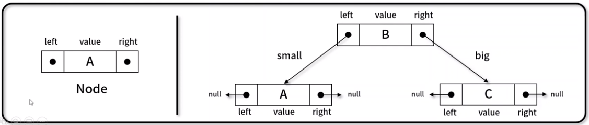

# 📌 22일차 
- 2021.10.16(토)
- 강의 : 비선형 자료구조 52~55강
  - 이진 탐색 트리
  
<br>

### 👉 이진 탐색 트리



- 현재 노드를 기준으로 왼쪽에는 작은 값, 오른쪽은 큰 값으로 정렬하는 이진 트리 기반의 자료 구조 
- 구현 메서드 
  - 노드 추가 : `BinarySerchTree._insertNode()`, `BinarySerchTree.insert()`
  - 노드 탐색(최댓값) : `BinarySerchTree._maxNode()`, `BinarySerchTree.max()`
  - 노드 탐색(최솟값) : `BinarySerchTree.minNode()`, `BinarySerchTree.min()`
  - 노드 탐색(특정값) : `BinarySerchTree._searchNode()`, `BinarySerchTree.search()`
  - 노드 삭제 : `BinarySerchTree._findMinNode()`, `BinarySerchTree._removeNode()`, `BinarySerchTree.remove()`
<br> 


### 👉 이진 탐색 트리 구현(1) 
```javascript
// Node() : value와 left, right node 저장을 위한 생성자 
function Node(value){
  this.value = value;
  this.left = null;
  this.right = null;
};

// BinaryTree() : 시작 노드인 root를 저장하기 위한 생성자 
function BinaryTree(){
  this.root = null;
};

// _inOrderTraverseNode() : 재귀로 트리를 순회하며 중위 순회
BinaryTree.prototype._inOrderTraverseNode = function(node, callback){
  if(node == null) return;
  this._inOrderTraverseNode(node.left, callback);
  this._inOrderTraverseNode(node.right, callback);
};

// inOrderTraverse() : 중위 순회하며 노드 출력
BinaryTree.prototype.inOrderTraverse = function(callback){
  this._inOrderTraversNode(this.root, callback);
  console.log("end");
};

// insertNode() : 재귀로 트리를 순회하며 노드 추가(private funciton)
BinaryTree.prototype._insertNode = function(node, value){
  if(node === null){
    node = new Node(value);
  }else if(value<node.value){
    node.left = this._insertNode(node.left, value);
  }else if(value>=node.value){
    node.right = this._insertNode(node.right, value);
  }
  return node;
};

// insert() : 노드 추가 
BinaryTree.prototype.insert = function(value){
  this.root = this._insertNode(this.root, value);
};
```

<br>


### 👉 이진 탐색 트리 구현(2) 
```javascript
// _minNode()
BinaryTree.prototype._minNode = function(node){
  if(node === null) return null;
  while(node && node.left !== null) node = node.left;
  return node.value;
};

// _maxNode()
BinaryTree.prototype._maxNode = function(node){
  if(node === null) return null;
  while(node && node.right !== null) node = node.right;
  return node.value;
};

// min()
BinaryTree.prototype.min = function(){
  return this._minNode(this.root);
};

// max()
BinaryTree.prototype.max = function(){
  return this._maxNode(this.root);
};
```

<br>


### 👉 이진 탐색 트리 구현(3) 
```javascript
// _searchNode()
BinaryTree.prototype._searchNode = function(node, value){
  if(node === null) return false;
  if(node.value === value){
    return true;
  }else if(node.value > value){
    return this._searchNode(node.left, value);
  }else if(node.value < value){
    return this._searchNodE(node.right, value);
  }
};

// search()
BinaryTree.prototype.search = function(value){
  return this._searchNode(this.root, value);
};
```

<br>


### 👉 이진 탐색 트리 구현(4) 
```javascript
// _findMinNode() : 반복문으로 트리를 순회하여 최솟값을 보유한 노드 탐색
BinaryTree.prototype._findMinNode = function(node){
  while(node && node.left != null) node = node.left;
  return node;
};

// _removeNode() : 재귀로 트리를 순회하며 값을 만족하는 노드를 찾고 삭제 
BinaryTree.prototype._removeNode = function(node, value){
  if(node === null) return null;
  if(node.value === value){
    // leaf node
    if(node.left === null && node.right ==== null) node = null;;
    // 1 child node
    else if(node.left === null) node = node.right;
    // 2 child node
    else if(node.right === null) node = node.left;
    else{
      let aux = this._findMinNode(node.right);
      node.value = aux.value;
      node.right = this._removeNode(node.right, aux.value);
    }
  }else if(node.value > value){
    node.left = this._removeNode(node.left, value);
  }else if(node.vlaue < value>){
    node.right = this._removeNode(node.right, value);
  }

  return node;
};

// remove()
BinaryTree.prototype.remove = function(value){
  root = this._removeNode(this.root, value);
};
```

<br>
