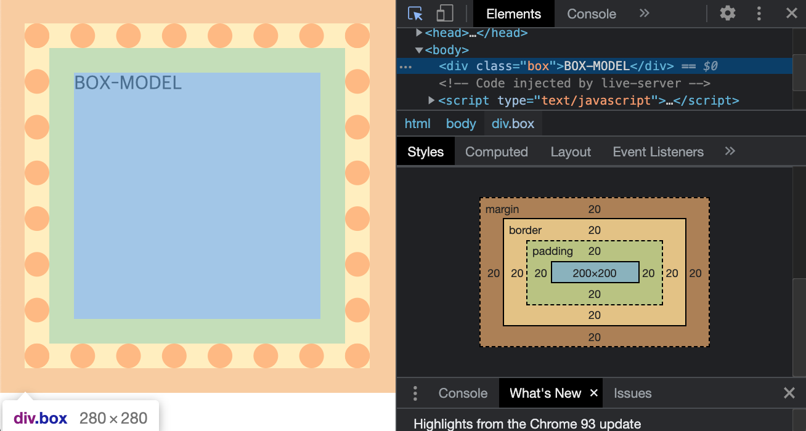

# 📌 12일차 
- 2021.09.08(수)
- 목차 : 박스 모델

<br>

## ✅ 박스 모델
### 👉 박스 모델 이란
- css를 기반하는 기본 개념 


- `content` : html요소의 내용(contents)을 담는 핵심적인 부분
- `padding` : content와 테두리(border) 사이의 여백
- `border` : padding 과 margin 사이의 테두리(border)를 의미
    -  기본 값은 0px이라 따로 스타일을 주기 전에는 눈에 보이지 않는다
- `margin` : 가장 바깥 쪽 레이어로, 다른 요소와의 거리 간격을 조절한다

<br>

```html
<div class="box">BOX-MODEL</div>
```
```css
.box{
    width:200px; height:200px;
    padding:20px; border: 20px dotted tomato;
    margin:20px;
}
```



- 크롬(Chrome)의 개발자 도구를 사용해 박스 모델 설정을 확인할 수 있다


<br>

### 👉 크기 
1. `width` : 블럭 요소의 너비를 설정할 때 사용하는 속성 
    - `auto` : 요소의 너비 기본 값 
    - 자식 요소에게 상속되지 않는다
2. `heigth` : 블럭 요소의 높이를 설정할 때 사용하는 속성 
    - `auto` : 요소의 높이 기본 값 (컨텐의 크기에 따라 결정된다)
    - 자식 요소에게 상속되지 않는다
3. `max-width` : 너비의 최대값을 설정
    - `width`값이 상대적인 단위를 사용할 때, 너비의 최대값을 설정한다
    - `max-width`보다 `width`값이 커지지 않도록 제한한다 
4. `min-width` : 너비의 최소값을 설정
    - `width`값이 상대적인 단위를 사용할 때, 너비의 최소값을 설정한다
    - `min-width`보다 `width`값이 줄어들지 않도록 제한한다 
5. `max-height` : 높이의 최대값을 설정
    - `height`값이 상대적인 단위를 사용할 때, 높이의 최대값을 설정한다
    - `max-height`보다 `height`값이 커지지 않도록 제한한다 
6. `min-height` : 높이의 최소값을 설정
    - `height`값이 상대적인 단위를 사용할 때, 높이의 최대값을 설정한다
    - `min-height`보다 `width`값이 커지지 않도록 제한한다 

- `min()` 이나 `max()`보다, `max-width`, `min-width`, `max-width`, `min-width`를 사용하는 것을 추천


<br>


### 👉 여백 
1. `margin` : 다른 요소와의 간격을 설정한다
- 단축 속성(short-hand)에 해당 : `margin-top`, `margin-right`, `margin-bottom`, `margin-left`
- 값을 1개를 주면 모든 방향의 `margin`에 적용
- 값을 2개를 주면 첫번째 값은 top,bottom에 적용되고 두번째 값은 right,left에 적용
- 값을 3개를 주면 첫번째 값은 top에 적용, 두번째 값은 값은 right,left에 적용, 마지막 값은 bottom에 적용
- 값을 4개를 주면 단축 속성(short-hand)의 순서대로 top,rith,bottom,left 순으로 적용된다
- `margin`을 따로 설정하지 않았을 때 적용되는 기본 값은 0 이다
- 음수를 사용할 수 있다
- **[ ⚠️ 주의 ⚠️ ️️]** 
  - 부모 요소의 크기를 기준으로 하는 상대 단위 `%`를 사용할때는, 부모 요소의 `margin`이 기준이 아니다
  - 부모 요소의 너비(`width`)를 기준으로 상대적인 값을 가지므로 주의하자
    
<br>

2. `margin collapsing` : margin 상쇄
- 여러 **블록 요소**들의 **위 아래 margin**이 겹치는 경우, 큰 크기를 가진 margin으로 결합/상쇄되는 현상
- 아래의 3가지 상황에 발생한다
  1. 인접 형제 : 두 형제 요소간의 위 아래 여백이 만나 상쇄된다
  2. 부모-자식요소
      - 부모 요소에 `border`, `padding`, `inline content`가 없거나
      - 부모와 자식 요소를 분리할 `height`값이 지정되어있지 않아 
      - 부모와 자식의 `margin-top`, `margin-bottom`이 만나는 상황 
  3. 빈 블록
      - `border`, `padding`, `content` 가 없고 `height` 또한 존재하지 않는 경우 상쇄된다
      - 내용(content)이 없는 경우, 자기 자신의 `margin-top`과 `margin-bottom`이 서로 만나 결합/상쇄가 일어난다
<br>

3. `padding`
- `border`를 기준으로 안쪽 여백을 의미한다
- `padding` 역시 단축 속성(short-hand) : `padding-top`, `padding-right`, `padding-bottom`, `padding-left`
- 값을 1개를 주면 모든 방향의 `padding`에 적용
- 값을 2개를 주면 첫번째 값은 top,bottom에 적용되고 두번째 값은 right,left에 적용
- 값을 3개를 주면 첫번째 값은 top에 적용, 두번째 값은 값은 right,left에 적용, 마지막 값은 bottom에 적용
- 값을 4개를 주면 단축 속성(short-hand)의 순서대로 top,rith,bottom,left 순으로 적용된다
- `padding-top` 을 기준으로 시계 방향 순서로 적용된다고 기억하자
- `padding` 에는 결합/상쇄가 일어나지 않고, 음수값을 사용할 수 없다 
- **[ ⚠️ 주의 ⚠️ ️️]** 
  - 부모 요소의 크기를 기준으로 하는 상대 단위 `%`를 사용할때는, 부모 요소의 `padding`이 기준이 아니다
  - 부모 요소의 너비(`width`)를 기준으로 상대적인 값을 가지므로 주의하자


<br>


### 👉 테두리(border)
- `border-style`, `border-width`, `border-color`, `border-radius` 모두 단축 속성(short-hand)
- `border-top` `border-right` `border-bottom` `border-left` 순으로 적용 
- `border-radius` 는 왼쪽 위의 꼭지점, 오른쪽 위의 꼭지점, 왼쪽 아래의 꼭지점, 오른쪽 아래의 꼭지점 순으로 적용 
- `border` vs `outline`
    - `outlin` : 포커싱된 요소의 테두리 의미한다. 따로 박스모델에서 영역을 차지하지 않는다.  
    -  `border` : 요소의 테두리를 의미한다. 박스모델에서 영역을 차지한다 
- [참고] https://developer.mozilla.org/ko/docs/Web/CSS/border 

<br>

1. `border-style` : `border` 의 스타일을 지정해주는 속성
    - 기본값 : none으로, 따로 스타일을 지정해주지 않으면 테두리는 보이지 않는다 
    - 키워드 : `dotted` `hidden` `solid` `doulbe` `groove` ...
2. `border-width` : `border` 의 굵기를 지정해주는 속성
    - 기본값 : 0 으로, 따로 스타일을 지정해주지 않으면 테두리는 보이지 않는다 
    - 키워드 : `thin`, `medium`, `thick`
    - 각 키워드의 굵기가 명확하게 지정되어있지 않아 굵기는 브라우저별로 상이하다
    - 키워드를 사용하게되면 정확히 몇 px이 적용되는지 알수없기때문에, 디자인적인 측면에서는 절대 단위인 `px`를 사용하는 것을 권장한다
3. `border-color` : `border` 의 색상을 지정해주는 속성 
4. `border-radius` : `border`의 꼭지점 부분을 둥글게 해주는 속성 
    - 부모 요소의 크기를 기준으로 하는 상대 단위 `%`를 사용할 때 
      - 가로 축의 값은 부모 요소의 너비에 대한 상대 크기
      - 세로 축의 값은 부모 요소의 높이에 대한 상대 크기 
5. `border` 단축 속성(shorthand)
    - 테두리 관련 속성을 한번에 묶어서 `border`라는 단축 속성을 사용해 지정할 수 있다
    - 속성을 입력하는 순서는 따로 정해져있지않고, 일관성을 가지고 작성하기를 권장한다
    - `border-radius`는 `border` 단축 속성(shorhand)에 포함되지 않는다
    - (예) `border : solid 3px black;`

<br>


### 👉 box-sizing
- 요소의 너비와 높이를 계산하는 방법을 설정 
- 박스 모델의 어떤 영역까지 너비와 높이에 포함시킬 것인가에 대한 내용 
- `content-box` : `width`와 `height`값이 `content`박스에만 적용된다 / `default`
- `border-box` : `width`와 `height`값이 `border`박스까지 적용된다. <br>
  → 즉, `border`, `padding`까지 포함한 크기가 `width`,`height`값이 되도록 자동으로 조절한다


<table>
<tr>
  <th>/</th>
  <th>content-box</th>
  <th>border-box</th>
</tr>
<tr>
  <th>width</th>
  <td colspan="2" style="text-align:center;">200px</td>
</tr>
<tr>
  <th>height</th>
  <td colspan="2" style="text-align:center;">100px</td>
</tr>
<tr>
  <th>padding</th>
  <td colspan="2" style="text-align:center;">20px</td>
</tr>
<tr>
  <th>border</th>
  <td colspan="2" style="text-align:center;">10px</td>
</tr>
<tr>
  <th>content-width</th>
  <td colspan="2" style="text-align:center;">100px</td>
</tr>
<tr>
  <th>content-height</th>
  <td colspan="2" style="text-align:center;">20px</td>
</tr>
<tr>
  <th>box-width</th>
  <td style="text-align:center;">360px</td>
  <td style="text-align:center;">200px</td>
</tr>
<tr>
  <th>box-height</th>
  <td style="text-align:center;">200px</td>
  <td style="text-align:center;">100px</td>
</tr>
</table>


<br>


