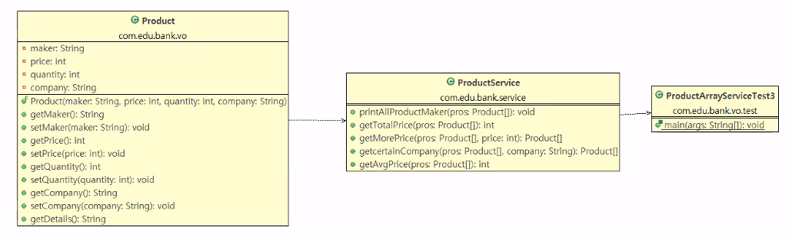

# [설치] amateras uml eclipse 플러그인 설치

## ✏️  클래스 다이어그램을 위해 amateras uml eclipse 설치

- 구글에 `amateras uml eclipse` 라고 검색
- [https://takezoe.github.io/amateras-update-site](https://takezoe.github.io/amateras-update-site) 복사

- 이클립스 Help 메뉴 → Install New Software → Add → Location에 복사한 url 붙여넣기 → Name도 설정 → Add
- 설치 url 이 있는 경우, Install New Software를 사용해 플러그인을 설치할 수 있다
- Mac OS에서는 설치 오류가 나길래 직접 설치해야했다
    - [https://mobilenweb.tistory.com/112](https://mobilenweb.tistory.com/112)
    - 위 링크를 참고해서 직접 jar파일을 다운로드 받고
    - 이클립스 우클릭 → 패키지 열기 → Eclips → plugins 폴더로 옮기고 이클립스를 재실행하면 설치가 완료된다

## ✏️  사용하기

1. 자바 프로젝트 우클릭 → other → AmaterasUML → Class Diagram 선택 → Next
2. 확장자가 cld(Class Diagram)인 파일명을 수정한다 (예제에서는 ProductServiceUML1.cld) → finish
    

    
3. java파일을 선택하고 끌어와서 열려있는 cld파일에 drag and drop 한다
4. UML형식으로 java파일이 보여진다
5. hasing관계를 표시할 때에는 Aggregation이나 Dependency를 사용한다
6. 붉은색 네모로 표시된 건 private를 의미하고, 초록색 원은 public을 의미한다

<aside>
💡 Class간의 유기적인 관련성을 직관적으로 보기위해서는 UML보다 **Class Diagram**을 사용하자

</aside>

