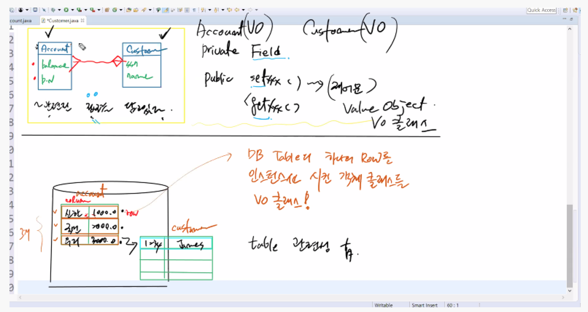

# Value Object / VO클래스

## ✏️  VO Class

- DO(Domain Object) → **VO(Value Object)** → DTO(Domain Transfer Object)
- 특정한 정보를 관련 정보를 담고, private Field, public settet/getter 만으로 이루어진 클래스를 VO Class고 말한다
- 말하자면 DB Table 하나의 Row를 인스턴스화 시킨 객체 클래스가 바로 VO Class
- VO의 필드가 DB테이블의 칼럼으로 매핑된다
- 우리는 DB와 Class의 관계를 반드시 알아야한다
- [참고하자] [https://velog.io/@livenow/Java-VOValue-Object란](https://velog.io/@livenow/Java-VOValue-Object%EB%9E%80)

## ✏️  VO Class 만들기

1. private 필드
2. 기본 생성자, 명시적 생성자
3. setter, getter
4. toString Overriding

## ✏️  DB (Data Base)

- 테이블(table)의 형태로 이루어져 있으며, row(행)와 column(열)을 갖는다
- 말하자면 DB Table 하나의 Row를 인스턴스화 시킨 객체 클래스가 바로 VO Class
- VO Class와 Table은 맵핑된다