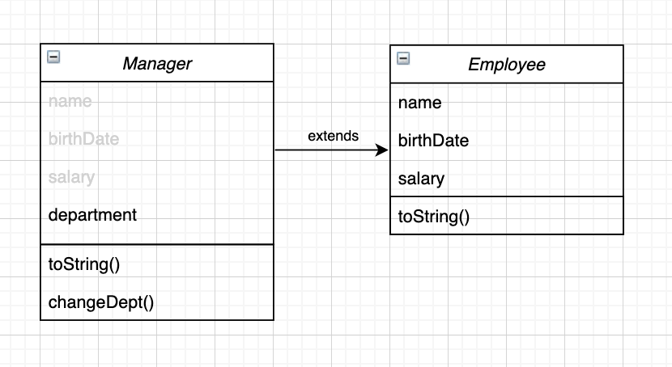

# 1. 다형성(Polymorphism)

## ✏️  예제 코드의 구조 확인하기



## ✏️  다형성(Polymorphism)

```java
Employee m = new Manager("yuri", new MyDate(2021, 10, 26), 300, "IT");
System.out.println(m.toString());    // yuri,2021-10-26,300.0, Department: IT
```

- **부모 클래스 타입으로 다양한 자식 객체를 생성하는 것**을 말한다. 이를 위해서는 상속이 전제가 되어야만한다
- `Employee` 의 메서드를 호출했는데도, 자식클래스의 **OverRiding된 메서드가 호출된 것을 확인할 수 있다(이슈1)**

```java
**m.changeDept("Design");** // ERROR!!
```

- 반면, **자식클래스 메서드의 호출에는 에러가 발생한다(이슈2)**
- 이렇게 부모타입의 클래스로 자식을 생성하는 경우 다양한 이슈가 발생한다

## ✏️  다형성 이슈(1) : Virtual Method Invocation

```java
System.out.println(m.toString());    // yuri,2021-10-26,300.0, Department: IT
```

- 부모 클래스 타입의 객체임에도 자식클래스의 **OverRiding된 메서드가 호출된 것을 확인할 수 있다**

<aside>
💡 **Compile Type Method** 와, **Runtime Type Method**가 다르기 때문

</aside>

- 상속관계의 경우, 부모 클래스의 메서드와 자식 클래스의 오버라이딩된 메서드는 내부적으로 관계를 맺는다
- 그렇기 때문에 부모 타입으로 자식 객체를 생성하는 경우, **컴파일 시에는 부모 클래스, 실행될 때에는 자식 클래스가 호출된다**
- 컴파일 시의 메소드와 실행 시의 메소드가 다르기 위한 전제는 아래와 같다
    1. 상속 관계인가? **YES**
    2. 부모 클래스 타입으로 자식 클래스 객체를 생성했는가? **YES**
    3. 오버라이딩된 메소드인가? **YES**
- 이러한 원리가 바로 **Virtual Method Invocation** 이다. 정리하면 아래와 같다
    - Compile Type Method : 부모 클래스의 메소드가 호출
    - Runtime Type Method : 자식 클래스의 메소드가 호출

## ✏️  다형성 이슈(2) : Object Casting

```java
Employee m = new Manager("yuri", new MyDate(2021, 10, 26), 300, "IT");
System.out.println(m.toString());    // yuri,2021-10-26,300.0, Department: IT
**m.changeDept("Design");** // ERROR!!
```

- 컴파일은 부모 클래스로 진행했으므로, 자식 클래스의 메소드에는 접근할 수 없다

```java
**((Manager) m)**.changeDept("Design"); // GOOD!
```

- 자식 클래스의 메소드를 사용하고 싶다면, 일시적으로 자식 클래스로 Casting해주어야한다
- 이러한 이슈 역시, 상속관계의 부모 클래스 타입으로 자식 클래스 객체를 생성했을 때에만 발생한다

## ✏️  다형성 이슈(3) 결합도가 높은 상속 관계


```java
Employee[] emps = {
			new Secretary("s1", new MyDate(1980, 1, 2),  100, "Tom"),
			new Engineer("e1", new MyDate(1990, 2, 3), 400, "AI", 100),
			new Manager("m1", new MyDate(1992, 3, 2), 500, "IT"),
};

// 부모 클래스에만 존재하는 메서드를 공동으로 사용할 수 있다		
for(Employee e : emps) { System.out.println(**e.getSalary()**); } // 100 400 500
```

- 부모 클래스 타입으로 다양한 자식 클래스의 객체를 생성한 경우
- 자식 클래스마다 동일한 용도의 메서드를 생성할 필요 없이, 부모 클래스에만 메서드를 만들어 공통으로 사용할 수 있다
- 이는 상속 관계의 경우 클래스간의 결합도가 높아지기 때문이다
- 이러한 성질은 편리하지만, 자식 클래스가 부모 클래스에 있어 독립성을 가질 수 없으므로 재사용성에 있어 문제가 발생한다
- 이런 경우 **[instanceof 키워드](1-2%20instanceof%20e2a6a2a0fdda4693a32ab0462ae1b064.md)**를 사용해 자식 클래스마다 대응할수도 있지만,
- **이를 해결하기위한 근본적인 개념은 바로 [인터페이스(Interface)](9%20%E1%84%8B%E1%85%B5%E1%86%AB%E1%84%90%E1%85%A5%E1%84%91%E1%85%A6%E1%84%8B%E1%85%B5%E1%84%89%E1%85%B3(Interface)%20%E1%84%86%E1%85%A1%E1%86%BA%E1%84%87%E1%85%A9%E1%84%80%E1%85%B5%201391ffaea8084af5925a1e41edb06b42.md) 이다**