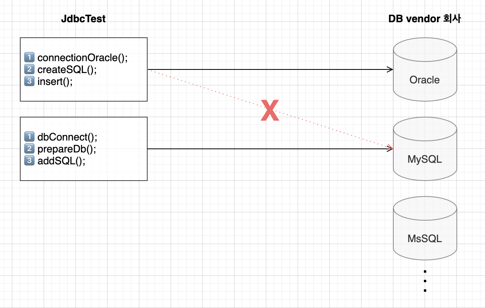

# 11. 인터페이스(Interface) 사용 사례

최종 편집 일시: 2021년 11월 1일 오후 7:54
키워드: interface

- 과거에는 DB vendor사에 따라 사용하는 함수가 모두 달랐다
- 만약 DB vendor 사가 바뀌는 경우, 변경된 vendor사에 맞추어 프로그램을 새로만들어야해서 굉장히 비효율적이었다
- 이에 Sun MicroSystem 에서는 대표적인 DB vendor사들에게 표준화를 제안했으나 거절당한다

- 그래서 Sun MicroSystem에서 자체 표준화 시스템을 개발한다
- 이 때, 필요한 기능들에 대한 추상메서드(템플릿 메서드)를 만들어 표준화를 진행했다