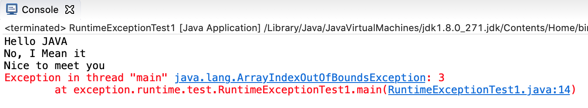

# 2. Runtime Exception


## ✏️  Runtime Exception

```java
package exception.runtime.test;

public class RuntimeExceptionTest1 {
	public static void main(String[] args) {	
		String[] str = { "Hello JAVA", "No, I Mean it", "Nice to meet you" };
		int i = 0;
		while(i <= 3) {
			System.out.println(str[i++]);
		}
		System.out.println("while loop the end");
	}
}
```


- 위의 코드는 저장할 때(컴파일) 는 문제가 발생하지 않고, 실행에서 문제가 발생했다
- 이렇게 컴파일러가 인식하지 못하고 Runtime에서 발생하는 문제를 **Runtime Exception** 이라고 한다
- **Runtime Exception** 이 발생한 결과, 프로그램이 정상 종료되지 않고 비 정상적으로 프로그램이 종료되었다
- while문 전체에서 발생한 문제가 아니라, 특정 라인에서 발생한 문제이다.
- Exception은 일반적으로 **{Method Block} 내부에서 줄 단위로 발생한다**
- 그렇기 때문에 예외처리를 명시적으로 하지 않고, **소스 코드를 수정을 통해서도 대응할 수 있다**

## ✏️  Runtime Exception : 명시적 예외처리

```java
package exception.runtime.test;

public class RuntimeExceptionTest2 {

	public static void main(String[] args) {	
		String[] str = {
				"Hello JAVA",
				"No, I Mean it",
				"Nice to meet you"
		};
		
		int i = 0;
		while(i <= 3) {
			**try {
				System.out.println(str[i++]);
			}catch(NullPointerException e){
				System.out.println("Nice Catch / 1.NullPointerException");
			}catch(ArithmeticException e){
				System.out.println("Nice Catch / 2.ArithmeticException");
			}catch(ArrayIndexOutOfBoundsException e){
				System.out.println("Nice Catch / 3.ArrayIndexOutOfBoundsException");
			}**
		}
		System.out.println("while loop the end");
	}
}
```

- try-catch 구문을 사용해 [명시적 예외처리](1-1%20%E1%84%86%E1%85%A7%E1%86%BC%E1%84%89%E1%85%B5%E1%84%8C%E1%85%A5%E1%86%A8%20%E1%84%8B%E1%85%A8%E1%84%8B%E1%85%AC%E1%84%8E%E1%85%A5%E1%84%85%E1%85%B5%200a204648bd7444d5842fbd6d74d2b934.md)를 진행했다
- catch문의 인자에는 예외의 타입을 작성하는데 , 이 때는 이전에 발생했던 오류를 참고하여 작성한다