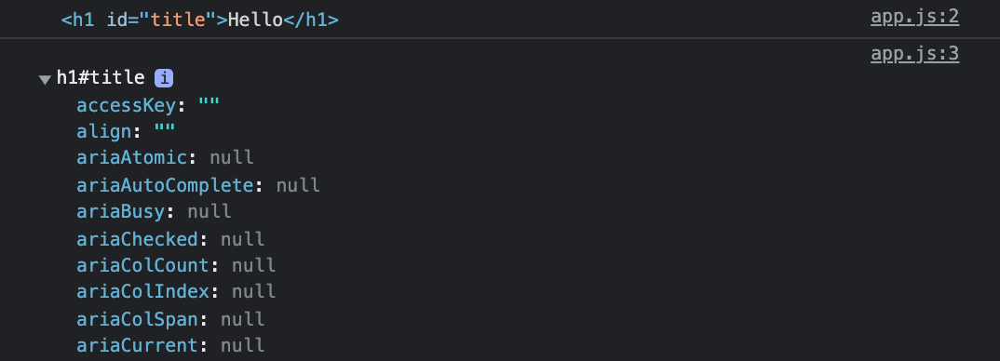
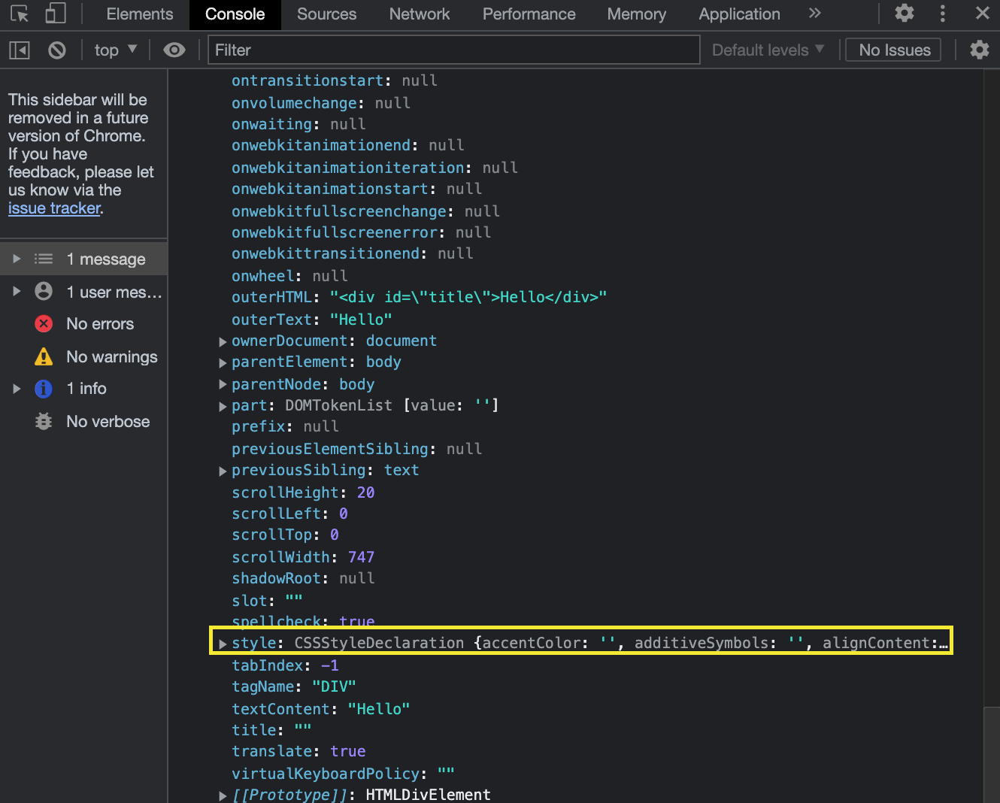
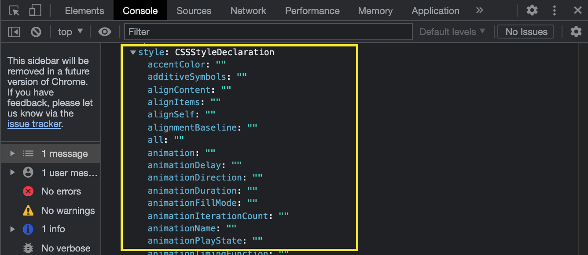

# 📌 Chrome-app-Clone
## ✅ 강의 3.0 ~ 3.5
- 21/09/23(목) 
- The Document Object
- HTML in JavaScript
- Searching For Elements
- Events

<br>

<br>


### 👉 The Document Object
```javascript
// console.log와 console.dir
console.log(document);           // HTML문서
console.dir(document);           // Object Document

// document을 사용해 HTML 읽기 
console.log(document.title);     // Hello

// document을 사용해 HTML 수정 
document.title = "HI";  
consooe.log(document.title);     // HI
```
- `document`는 Object의 형태를 가지며, HTML에 접근하고 읽을 수 있다
- `document`를 사용해 HTML을 읽어오고 값을 수정하는 것도 가능하다

<br>


### 👉 HTML in JavaScript
```javascript
console.log(document.getElementById("title"));  // 요소의 HTML 코드를 확인할 수 있다
console.dir(document.getElementById("title"));  // 요소를 Object의 형태로 확인할 수 있다
```

- `document.getElementById()` : 특정 id를 가진 요소를 읽어온다. 
```javascript
const h1 = document.getElementByID("title");
h1.ineerText = "Change"; // 태그 내부 text를 변경
```
- `console.dir()`을 통해 확인한 태그의 다양한 속성으로 접근하고 활용할 수 있다

<br>


### 👉 Searching For Elements
```javascript
const temp = document.getElementsByClassName("hello");
```
- `getElementsByClassName()` 는 태그의 class를 사용해 요소를 읽어온다
- 동일한 class를 가진 요소가 여러개일때에는 Array의 형태로 읽어온다 

```javascript
const temp = document.getElementsByTagName("div");
```
- `getElementsByTagName()` 는 태그를 사용해 요소를 읽어온다
- 동일한 tag name을 가진 요소가 여러개일때에는 Array의 형태로 읽어온다 

```javascript
const temp1 = document.querySelector(".hello h1");
const temp2 = document.querySelector(".hello:first-child");
const temp3 = document.querySelectorAll(".hello h1");
```
- `querySelector()`는 요소를 CSS방식으로 찾아 읽어온다
- 요소를 찾지 못했을 때에는 `null`을 반환한다
- 해당하는 요소가 여러개일때에는 가장 첫번째 요소만을 찾아 읽는다
- 조건에 맞는 모든 요소를 읽어와 다루고 싶다면 `querySelectorAll()`을 사용한다


<br>


### 👉 Style in JavaScript 


- `console.dir()`을 통해 태그의 속성을 확인할 수 있다
```javascript
const h1 = document.querySelector("div.title");
h1.style.color = "blue";
```
- 확인한 속성 중 `style`을 사용해 CSS를 수정할 수 있다


<br>

### 👉 Events
```javascript
const h1 = document.querySelector("h1#title");

// function
function handleTitleClick(){
    console.log("title was clicked");
    h1.style.color = "blue";
};

h1.addEventListener("click", handleTitleClick);  // click event 함수 설정
```
- `addEventListner()`를 사용해 요소에 다양한 이벤트를 추가할 수 있다
- `addEventListner()`의 첫번째 인자에는 **어떤 상황에 이벤트가 발생**할 것인지에 대해 작성하고
- 두번째 인자는 **어떤 이벤트**를 실행할 것인지에 대해 작성한다
- **[참고1. MDN 공식문서]** https://developer.mozilla.org/ko/docs/Web/API/EventTarget/addEventListener
- **[참고2. 이벤트의 종류]** https://developer.mozilla.org/ko/docs/Web/Events
- **[참고3. HTML Element]** https://developer.mozilla.org/ko/docs/Web/API/HTMLELEMENT

```javascript
const h1 = document.querySelector("h1#title");
console.dir(h1);

// function
function handleMouseEnter(){
    h1.innerText = "Mouse is here!";
}
function handleMouseLeave(){
    h1.innerText = "Mouse is gone!";
}

// addEventListner
h1.addEventListener("mouseenter", handleMouseEnter); // mouse가 요소 위에 올라가면 이벤트가 발생
h1.addEventListener("mouseleave", handleMouseLeave); // mouse가 요소 위에서 내려오면 이벤트가 발생
```

- `console.dir()`로 확인한 속성에 **on**이 붙어 있다면, 추가할 수 있는 이벤트의 종류를 의미한다
- `addEventListner()`를 통해 이벤트를 추가할 때에는 **on**을 떼고 사용한다 (예) onmouseenter → mouseenter
```javascript
h1.addEventListener("mouseenter", handleMouseEnter);
h1.onmouseenter = handleMouseEnter; 
```
- event를 추가하는 방법은 예제처럼 두가지 방법이 있다
- `addEventListener()`를 사용해 이벤트를 추가하면 `removeEventListener()`를 통해 이벤트를 제거할 수 있다
- 위와 같은 이유로 `addEventListener()`의 사용을 권장한다 
```javascript
function handleWindowResize(){
    document.body.style.backgroundColor = "tomato";
}

window.addEventListener("resize", handleWindowResize); // window의 크기에 변화가 있을 때 이벤트 발생 
```
- `window`는 JavaScript에서 기본으로 제공하며, 웹 브라우저 자체를 의미한다
- `document.body.style.backgroundColor = "tomato";` 의 의미는 아래와 같다
    - `document` : HTML 문서
    - `body` : <body> 태그
    - `style` : css style
    - `backgroundColor` : css 속성 (bakcground-color)
- 특별하게 <body> 태그만이 위와 같은 방법으로 읽어올 수 있다
- 다른 요소는 `getElementById()`, `querySelector()` 등의 방법으로 읽어와야한다 
```javascript
function handleWindowCopy(){
    alert("copier!");
}
window.addEventListener("copy", handleWindowCopy); // Copy를 하려고 했을 때 이벤트 발생
```
```javascript
function handleWindowOffline(){
    alert("SOS no WIFI!");
}
function handleWindowOnline(){
    alert("ALL GOOOOOOD!");
}

window.addEventListener("offline", handleWindowOffline); // WIFI에 연결되어 있지 않을 때 이벤트 발생
window.addEventListener("online", handleWindowOnline); // WIFI에 연결될 때 이벤트 발생
```
- [참고] https://developer.mozilla.org/ko/docs/Web/API/Window


<br>