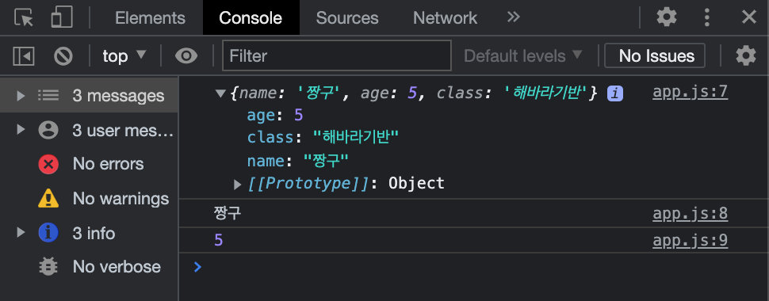
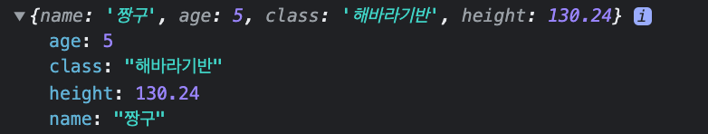

# 📌 Chrome-app-Clone
## ✅ 강의 2.6 ~ 2.11
- 21/09/21(화) 
- Objects
- Functions
- Returns

<br>

<br>


### 👉 Objects
```javascript
const student = {
    // key : value
    name : "짱구",
    age : 5,
    class : "해바라기반"
};

console.log(student);
console.log(student.name);
console.log(student.age);
```


- 모든 요소가 하나의 의미를 갖는 Array와 달리, Object는 요소마다 어떠한 한 대상에 대해 설명하는 속성이 다르다
- Objects는 어떠한 속성을 가진 데이터를 저장할 수 있도록 해준다 

```javascript
console.log(student.name);      // 짱구
console.log(student["name"]);   // 짱구
```
- Object의 속성에 접근할 때에는 구분자로 `.`을 사용하거나, `Object[key]`의 형태로 사용한다


```javascript
student.class = "장미반"; // O
student = "오류 발생"; // X
``` 

- `const`를 사용해 Object를 선언해도 내부의 속성의 수정이 가능하다
- 하지만 Object 자체를 하나의 값으로서 업데이트할 때에는 오류가 발생한다

```javascript
// name : "짱구",
// age : 5,
// class : "해바라기반"

student.height = 130.24;
console.log(student);
```

- Object에 속성을 추가할 때에는 Object의 속성에 접근할 때와 마찬가지로
- 구분자로 `.`을 사용하거나 `Object[key]`의 형태를 통해 추가할 수 있다
- 이미 존재하는 속성이면 value가 update되고, 없는 속성이라면 속성이 추가된다 

<br>

### 👉 Functions
```javascript
function sayHello(userName){
    console.log("Hello, " + userName);
};

sayHello("짱구");
sayHello("유리");
sayHello("철수");
```

- Function은 반복되는 코드를 캡슐화해 반복해서 사용할 수 있다
- Argument(인수)는 Function에 필요한 어떤 데이터를 보내기위한 방법

```javascript
function divide(n1, n2){
    conosle.log(n1/n2);
}

divide(10,20);  // 0.5
divide(20,10);  // 2

console.log(n1) // ERROR
```

- `,`를 구분자로 사용해 여러개의 Argument를 받을 수 있다
- 여러개의 Argument를 사용한다면, Function을 사용할 때 Argument 입력 순서에 주의해야한다 
- Argument로 받아온 데이터는 해당 블록 안, 즉 Function 내부에서만 유효하다 

```javascript
const student = {
    name : "짱구",
    age : 5,
    class : "해바라기반"x
    sayHello : function(personName) {
        console.log("hello! "+personName+", Nice to meet you!");
    }
};

student.sayHello("철수"); // hello! 철수, Nice to meet you!
```
- Object의 속성으로 Function을 활용할 수 있다
- 이 경우는 `key`가 Fucntion의 이름이 되고, `value`가 실행될 코드를 의미한다 


<br>

### 👉 Returns
```javascript
const age = 23;
function clculateKrAge(ageOfForeigner){
    return ageOfForeigner + 2;
}

const krAge = clculateKrAge(age);
console.log(krAge)  //25
```
- Function 외부에서 결과를 받아 사용하고자할 때 Return을 사용한다 

<br>