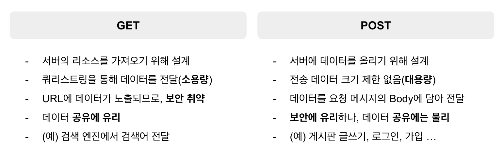
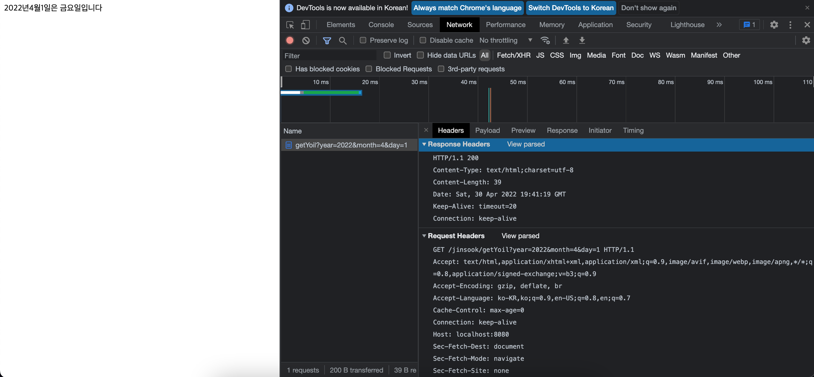

# 스프링의 정석
- 2022.04.29(금)
- 강의 목표: Spring의 기본 원리 이해, Spring으로 웹 사이트 구축 & AWS 배포
- 강의 자료: https://github.com/castello/spring_basic
- 강의 진도 
	- Ch027. HTTP 요청과 응답 - 이론

<br>

## [복습] HTTP 요청과 응답 - 실습
- 원격 접근 허용하기
	1. 프로그램 등록: `@Controller`
	2. URL 매핑: `@RequestMapping`
- HTTP 요청과 응답
	1. 입력
		- 메인 메서드의 매개변수는 
			1. `HttpServletRequest request` 
				- 요청 시 전달할 데이터는 `HttpServletRequest` 객체에 담아 전달한다
				- 요청 시 전달한 데이터를 객체에서 얻기 위해서는 `객체명.getParameter(key)` 를 사용한다
			2. `HttpServletResponse response`
				- `response.getWriter()`: `HttpServeltResponse`를 통해 출력 스트림을 얻어와 `PrintWriter` 객체에 담는다 
	2. 작업
	3. 출력 
		- 브라우저가 전달할 수 있는 데이터는 String과 binary뿐이다
		- 브라우저가 어떤 데이터를 보낼 것인지에 대한 정보가 필요하고, 아래와 같이 명시한다
			- `response.setContentType("text/html");`: 데이터 유형 명시
			- `response.setCharacterEncoding("utf-8");` 텍스트의 인코딩 방법 명시 
		- `response.getWriter()`: `HttpServeltResponse`를 통해 출력 스트림을 얻어와 `PrintWriter` 객체에 담는다 
		- `PrintWriter` 객체의 `println()` 메서드를 통해 브라우저에 출력한다 
- image 경로: 프로젝트>src>main>webapp>resources>img 
	- 사용할 때 경로는 `resources/img/OOO.jpg`

<br>

## HTTP 요청과 응답 - 이론
### 프로토콜(Protocol): HTTP
- 프로토콜(Protocol): 서로간의 통신을 위한 약속이자 규칙으로 주고 받을 데이터에 대한 형식을 정의한다
- HTTP(Hyper Text Transfer Protocol): 텍스트를 전송하기위한 프로토콜
	- Hyper Text = HTML
	- Human Readable: 텍스트 기반의 프로토콜으로 단순하기때문에 사람이 읽기 쉽다 (예) `Host:111.22.33.44:8080`
	- Stateless: 상태를 유지하지 않는다. 클라이언트의 정보를 저장하지 X
		- Stateless한 성질을 보완하기 위해 쿠키와 세션을 사용한다. 쿠키와 세션을 사용하면 클라이언트를 구별할 수 있다
	- Custom Header: 표준 헤더에 커스텀 헤더(header)를 추가해 확장할 수 있다
		- 헤더의 이름은 대소문자를 구분하지 않는다
		- 헤더 이름과 값 사이의 공백은 무시한다
		- 정해진 표준 헤더 외의 커스텀 헤더를 추가할 수 있다

<br>

### HTTP 메세지
```html
HTTP/1.1 200 OK	
<!-- Headers: 요청에 대한 설명-->
Content-Length: 1024
Content-Type: text/html
Date: Sat,20 Oct 2018 19:03:38 GMT

<!-- Body: 실제 전달하고자 하는 내용 -->
<html>
	<head>
		<title>Dics</title>
	</head>
	<body>
		
		
	</body>
</html>
```
- 사용자가 URL을 입력해 접속하면, 브라우저는 HTTP 요청 메세지를 만들어서 서버에 전달한다
- 서버는 요청 메세지를 받아 응답을 한다(응답 메세지). 응답한 내용은 브라우저에 표시된다

<br>

### HTTP 메세지 - 응답
```html
<!-- 상태 라인(stateLine) -->
HTTP/1.1 200 OK						
<!-- Headers: 요청에 대한 설명-->
Content-Length: 44					<!-- Header(1): Length -->
Content-Type: text/html				<!-- Header(2): Content-Type-->
Date: Sat,20 Oct 2018 19:03:38 GMT	<!-- Header(3): Date -->
									<!-- Header와 Body를 구분하기 위한 빈 줄-->
<!-- Body: 실제 전달하고자 하는 내용 -->
<html>
	<head></head>
	<body>
		Hello
	</body>
</html>
```
- 상태라인(state line): 요청이 어떻게 처리되었는지를 의미하는 상태코드와 그에 대한 설명
	- `1xx`: Informational (HTTP/1.1에서 추가) → 정보 교환이 목적
	- `2xx`: Success
	- `3xx`: Redirect	
	- `4xx`: Client Error (예) 잘못된 URL으로 접근 
	- `5xx`: Server Error 
- 사용자 헤더를 추가할 수 있기 때문에, Headers는 정해진 Line 개수가 없다
- 그렇기 때문에 바디와 구분하기 위해 반드시 비어있는 줄이 하나 필요하다

<br>

### HTTP 메세지 - 요청/GET
```html
<!-- 요청 라인(requestLine) -->
GET /ch2/getYoil?year=2021&month=10&day=1 HTTP/1.1					
<!-- Headers: 요청에 대한 설명-->
Host: 111.22.33.44:8080						<!-- Header(1): Host -->
User-Agent: Mozilla/5.0(Windows NT 10.0)	<!-- Header(2): User-Agent-->
Accept: text/html							<!-- Header(3): Accept -->
Connection: keep-alive						<!-- Header(4): Connection -->
											<!-- Header와 Body를 구분하기 위한 빈 줄-->
<!-- Body: 실제 전달하고자 하는 내용 = 없음 -->
```
- 단순히 서버에서 리소스를 가져오기위한 방법으로, Body가 존재하지 않는다 (읽기)
- 대신 데이터를 전달해야한다면 쿼리 스트링을 활용한다

<br>

### HTTP 메세지 - 요청/POST
```html
<!-- 요청 라인(requestLine) -->
POST /ch2/getYoil HTTP/1.1					
<!-- Headers: 요청에 대한 설명-->
Host: 111.22.33.44:8080						<!-- Header(1): Host -->
User-Agent: Mozilla/5.0(Windows NT 10.0)	<!-- Header(2): User-Agent-->
Accept: text/html							<!-- Header(3): Accept -->
Connection: keep-alive						<!-- Header(4): Connection -->
											<!-- Header와 Body를 구분하기 위한 빈 줄-->
<!-- Body: 실제 전달하고자 하는 내용 -->
year=2021&month=10&day=1
```
- Body를 가지며, 데이터를 전달할 때 Body에 담아 전달한다
- 글을 작성하거나 로그인, 회원가입, 파일 첨부 등의 목적으로 요청할 때 사용한다 

<br>

### HTTP 메서드 - GET, POST



- POST방식이 보안에 유리한 것은 HTTP프로토콜과 TLS프로토콜(암호화)을 함께 적용해 https를 사용하기 때문이다
	- SSL → TLS(new!)

<br>

### 실습



- GET 방식으로 데이터를 전달하고 개발자 도구의 Network탭에서 Name을 선택해 HTTP 메세지를 확인할 수 있다
- POST 방식으로 요청을 하기 위해서는 `<form>` 태그가 필요하다
	- `Tabbed Postman - REST Client` 확장 프로그램을 설치해 원하는 요청 방식을 임시로 사용해 볼 수 있다