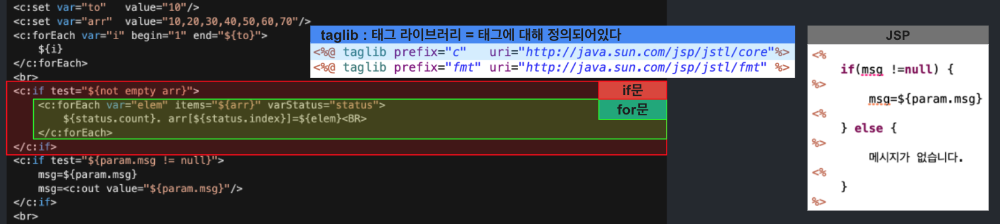

# 스프링의 정석
- 2022.05.14(토)
- 강의 목표: Spring의 기본 원리 이해, Spring으로 웹 사이트 구축 & AWS 배포
- 강의 자료: https://github.com/castello/spring_basic
- 강의 진도 
	- Ch0213. 서블릿과 JSP(1)
	- Ch0214. 서블릿과 JSP(2)
	- Ch0215. 서블릿과 JSP(3)
	- Ch0216. 서블릿과 JSP(4)

<br>

## 서블릿과 JSP
- 서블릿과 JSP에 대해 공부한다
- 서블릿과 JSP는 거의 유사한 형태를 가지며, Spring은 서블릿을 발전시킨 형태이다. 그리고 Spring에서 서블릿을 이용하기도 한다

### (1) 서블릿과 컨트롤러의 비교 
```java
// *TwoDice.java
// 차이(1) @Controller, @RequestMapping로 분리 : 하나의 클래스안에 여러 메서드를 만들어 각각 mapping할 수 있다 
@Controller
public class TwoDice { // 차이(2) HttpServlet 상속X : Java는 단일 상속이 가능하므로, 가능하면 상속을 안받는 편이 좋다 = 컨트롤러에서 개선되었다
    @RequestMapping("/rollDice")
    // 차이(3) main메서드(response) : 필요한 매개변수만을 사용한다 = 서블릿은 request와 response를 고정으로 사용한다 
    public void main(HttpServletResponse response) throws IOException {
        int idx1 = (int)(Math.random()*6)+1;
        int idx2 = (int)(Math.random()*6)+1;

        response.setContentType("text/html");
        response.setCharacterEncoding("utf-8");
        PrintWriter out = response.getWriter();
        out.println("<html>");
        ...
    }
}
```
```java
// *TwoDiceServlet.java = TwoDice 컨트롤러를 서블릿으로 
// 차이(1) @WebServlet사용(=@Controller+@RequestMapping): 서블릿은 클래스단위로 매핑하기때문에, 여러 클래스를 생성해야한다
@WebServlet("/rollDice2")
public class TwoDiceServlet extends HttpServlet { // 차이(2) HttpServlet 상속 
    int getRandomInt(int range) { return new Random().nextInt(range)+1; }
    // 차이(3) service메서드(request, response 필수)
    public void service(HttpServletRequest request, HttpServletResponse response) throws IOException {
        int idx1 = getRandomInt(6);
        int idx2 = getRandomInt(6);

        response.setContentType("text/html");
        response.setCharacterEncoding("utf-8");
        PrintWriter out = response.getWriter();
        out.println("<html>");
        ...   
    }
}
```
1. RequestMapping 방식 차이
    - 컨트롤러: `@Controller`, `@RequestMapping` = 메서드 단위로 매핑 = 하나의 클래스에 여러 메서드를 만들어 사용
    - 서블릿: `@WebServlet` = 클래스 단위로 매핑 = 클래스를 계속 생성해야한다 
2. 상속
    - 컨트롤러: main메서드 / 상속 X
    - 서블릿: service메서드 / HttpServlet 상속 
3. 메서드의 매개변수
    - 컨트롤러: 필요한 매개변수만 사용
    - 서블릿: 매개변수 request와 response 고정 

<br>

### (2) 서블릿 생명주기
```java
@WebServlet("/hello")
public class HelloServlet extends HttpServlet {
    @Override
    public void init() throws ServletException {  
        // 서블릿 초기화 - 서블릿이 생성 또는 리로딩 때, 단 한번만 수행됨.
        System.out.println("[HelloSerlvet] init()");
    }
    @Override // 호출될 때마다 반복적으로 수행됨.
    public void service(HttpServletRequest request, HttpServletResponse response) {
        // 입력, 처리, 출력
        System.out.println("[HelloSerlvet] service()");
    }  
    @Override   
    public void destroy() {   
        // 뒷정리 작업 - 서블릿이 제거(unload)될 때, 단 한번만 수행됨.
        System.out.println("[HelloSerlvet] destroy()");  
    }
}
```
- 서블릿은 3개의 메서드를 갖는다
    1. `init()` : 서블릿의 초기화, 서블릿이 생성되거나 리로딩될 때 단 한번 수행한다 
    2. `service()` : 호출될때마다 반복적으로 수행한다 
    3. `destroy()` : 서블릿이 메모리 상 제거(unload)될 때 단 한번 수행한다
- 서블릿의 메서드는 Servlet Container가 호출한다 
- 요청을 받았을 때 Servlet Context가 어떻게 처리하는지 살펴보자
    - 요청을 받았을 때, 서블릿 인스턴스가 존재하는지 확인한다(초기화 여부 확인)
        - NO: 요청 → 서블릿 인스턴스 존재X → 서블릿 클래스 로딩 & 인스턴스 생성 → `init()` 호출 → `service()` 호출 → 응답 
        - YES: 요청 → 서블릿 인스턴스 존재O → `service()` 호출 → 응답 
    - 서블릿이 메모리에서 내려갈 때 `destroy()` 호출 
- Servlet Context는 `children`이라는 멤버를 가진다
- `children`은 Map의 형태로 서블릿 이름(key)과 서블릿(Value)이 등록되어 있다
- Servlet Context가 요청을 받았을 때, 서블릿 인스턴스가 존재하는 지는 `children`을 통해 확인한다. 추후 자세히 다룬다
- Servlet은 기본적으로 싱글톤 방식을 따른다. 하나의 인스턴스를 만들어 여러번 사용한다
- Spring 역시 기본적으로 싱글톤 방식을 따른다.
- 싱글톤 방식을 사용하는 이유는 요청마다 다른 작업을 진행하는 것이 아닌 동일한 작업을 진행하기 때문이다
- 그렇기 때문에 사용자마다 프로그램을 둘 필요가 없다

<br>

### (3,4) JSP(Java Server Pages), 서블릿 비교 
- html안에 Java코드를 작성할 수 있게 한다
    - `<%@ page 페이지 설정 %>`
    - `<%! 클래스 영역의 Java코드 %>` 
    - `<% service 메서드 영역의 Java코드 %>`
    - `<%= 변수에 저장된 값 사용 %>`
    - `<%-- 주석 --%>`
- JSP로 작성하면 자동으로 Servlet으로 변환한다
    - JSP의 html코드는 `out.println()` 으로
    - JSP의 내용은 `service()` 메서드 안으로 들어간다 
- JSP페이지의 경로: `src/main/webapp/OOOO.jsp`
- JSP페이지는 자동으로 매핑된다

<br>

### (5) JSP의 호출과정
1. jsp파일 요청 
2. JspServlet이 요청을 받아 서블릿 인스턴스의 존재를 확인한다
    - 없으면 jsp파일을 서블릿으로 변환, 컴파일한 후 인스턴스(객체)를 생성한다
    - `_jspInit()` : jsp 서블릿 초기화 메서드
3. 서블릿 인스턴스의 `_jspService()` 서비스 메서드를 호출
4. 응답 

<hr>

- jsp파일이 변경되면 다시 servlet으로 변환하고 컴파일하는 과정을 거쳐서 객체를 생성한다
- 처음부터 서블릿으로 변환해 두는 것이 아니라, 요청이 있는 경우 변환한 다음 인스턴스를 만든다
- 서블릿의 이러한 특징을 `lazy-init`, 느린 초기화라고 말한다
- 서블릿의 느린 초기화는 Spring에서 빠른 초기화(`early-init`)으로 개선된다
    - 요청이 오기 전에 미리 객체를 만들어 초기화해둔다
    - 서블릿 역시 Spring처럼 미리 초기화하는 방법을 제공한다

<br>

### (6) JSP의 기본 객체
```jsp
<%@ page contentType="text/html;charset=utf-8"%>
<%@ page import="java.util.Calendar" %>
<%
	String year  = request.getParameter("year");
	String month = request.getParameter("month");
	String day   = request.getParameter("day");
    
    ...	
    Calendar cal = Calendar.getInstance();
	cal.set(yyyy, mm - 1, dd);
...
```
- 기본 객체: 객체 생성없이 사용할 수 있는 객체
- import를 하고, 객체를 생성해서 사용하는 `Calendar`와 다르게 `request`는 객체 생성없이 바로 사용한다
- 이러한 객체를 기본 객체라고 부른다. service()의 지역 변수는 jsp에서 기본 객체이다

<br>

### (7) 유효 범위(scope)와 속성(attribute)
- Http는 상태 정보를 저장하지 않는다 (`Stateless`)
- Http는 Stateless 하기 때문에 상태 정보를 저장할 저장소를 필요로 한다
- 접근범위와 생존기간에 따라 4개의 저장소에 분류된다. 저장소는 Map의 형태로 상태 정보를 저장한다
- 쓰기는 `setAttribute()`, 읽기는 `getATtribute()` 메서드를 사용한다

<hr>

1. `pageContext`
    - 접근 범위: jsp페이지 
    - 저장 대상: 지역변수(기본객체)를 저장한다 (예)response, request
    - 요청할 때마다 초기화되기때문에 이전 사용자의 데이터는 남지 않는다
    - Q) 같은 페이지의 정보를 왜 저장소에 저장하는가? 
        - A) pageContext로부터 데이터를 읽어와 사용하는 EL때문 
2. `application`
    - 접근 범위: WebApplication(=ServletContext)
    - 저장 대상: 전체 어플리케이션에서 공유하는 데이터
3. `session`
    - 접근 범위: 클라이언트
    - 저장 대상: 클라이언트(사용자) 정보 (예)사용자 로그인 정보
    - 클라이언트 하나에 하나의 세션이 제공된다
    - 세션은 쿠키를 사용해 클라이언트에 대한 정보를 기억한다
    - 사용자 수만큼 세션이 생기므로 부담이 크다. 그렇기 때문에 최소한의 데이터만을 저장해야한다(사용 최소화)
4. `request`
    - 접근 범위: 요청
    - 저장 대상: 다른 페이지에게 넘겨야하는 데이터
    - 일반적으로 하나의 요청은 하나의 jsp에서 처리된다 
    - 만약 처음 요청을 받은 jsp가 처리할 수 없는 경우, 다른 jsp에게로 forward한다
    - 처음 요청을 받은 jsp가 다른 jsp에게 전달해야하는 정보가 있는 경우 request에 담아 전달한다
    - 가장 부담이 적은 방법으로, 다른 페이지에 데이터를 전달해야한다면 가장 먼저 사용 가능한지 확인한다 

<br>

### (8) URL패턴
```java
@WebServlet(urlPatterns = {"/hello", "/hello/*"}, loadOnStartup = 1)
@WebServlet("/hello")
```
- URL패턴: `@WebServlet`으로 서블릿을 URL에 맵핑할 때 사용 
- URL패턴은 하나를 등록할수도, 배열을 사용해 여러개 등록할수도 있다
- `loadOnStartup=n` : 서블릿은 LazyInit의 특징을 갖는다. `loadOnStartup`를 하면 미리 init한다
    - n은 미리 init하는 서블릿들 중, 우선순위를 의미한다 

<br>

### URL패턴의 종류

<table>
    <tr>
        <th>우선<br>순위</th>
        <th>종류</th>
        <th>URL Pattern</th>
        <th>매칭 URL</th>
    </tr>
    <tr>
        <td>1</td><td>exact mapping</td><td>/login/hello.do</td>
        <td>localhost/ch2/login/hello.do</td>
    </tr>
    <tr>
        <td>2</td><td>path mapping</td><td>/login/*</td>
        <td>localhost/ch2/login/<br>localhost/ch2/login/hello<br>localhost/ch2/login/hello.do<br>localhost/ch2/login/test/</td>
    </tr>
    <tr>
        <td>3</td><td>extenstion mapping</td><td>*.do</td>
        <td>localhost/ch2/hi.do<br>localhost/ch2/login/hello.do</td>
    </tr>
    <tr>
        <td>4</td><td>default mapping</td><td>/</td>
        <td>localhost/ch2/<br>localhost/ch2/hello.do<br>localhost/ch2/login/<br>localhost/ch2/login/hello<br>localhost/ch2/login/hello.do</td>
    </tr>
</table>

- `exact mapping`: 정확히 일치하는 URL
- `path mapping` : 경로/와일드카드 URL
- `extension mapping`: 확장자 맵핑
- `default mapping` : 기본 맵핑(모든 주소)

<br>

### 요청에 따른 URL확인 과정


<br>

### 참고
- `Servers/Tomcat/web.xml` : 전체 설정 파일
    - DeafaultServlet이 모든 요청을 받을 수 있도록 `/`으로 매핑되어있다
- `src/main/sebaap/WEB-INF/web.xml` : 개별 설정 파일 
    - DispatcherServlet을 appServlet으로 등록
    - `<load-on-startup>1</load-on-startup>`
    - `<servlet-mapping>...</servlet-mapping>`


<br>
<br>

### (9) EL(Expression Language)


<br>

### (10) JSTL(JSP Standard Tag Library)


- JSP를 사용해 자바 코드를 작성하는 것보다 미리 태그를 정의해둔 Tag library를 import해, JSTL을 사용하는 편이 가독성도 좋고 편리하다

```jsp
<c:set var="to" value="10"/>
<c:set var="arr" value="10,20,30,40,50"/>  <%-- 배열 형태 --%>
```
- `setAttribute()`와 같이 저장소에 데이터를 저장하는 역할 (scope 생략)

```jsp
<c:forEach var="i" begin="1" end="${to}">
    ${i}
</c:forEach>
```
- `<c:forEach>` : 반복문

```jsp
<c:if test="${not empty arr}">
    <c:forEach var="elem" items="${arr}" varStatus="status">
        ${status.count}.arr[${status.index}]=${elem}<br>
    </c:forEach>
</c:if>
```
- `<c:if>` : 조건문(if)

```jsp
<c:out value="${param.msg}"/>
```
- `<c:out>` : value값에 태그가 포함되어 있는 경우, 태그를 해석하지 않고 텍스트로 받아들인다

```jsp
<fmt:formatDate value="${now}" type="both" pattern="yyyy/MM/dd">
```

<br>

### (11) Filter
- 공통적인 요청의 전처리, 응답 후처리에 사용한다 (예) 로깅, 인코딩 등
- 여러개의 필터가 있는 경우 처리 순서는 아래와 같다  
    - (예) 필터A, 필터B 가 있는 경우
        - 필터A 1.전처리 / 2.다음 필터 호출 
        - 필터B 1.전처리 / 2.서블릿 호출 
        - 서블릿 2.처리
        - 필터B 3.후처리  
        - 필터A 3.후처리
