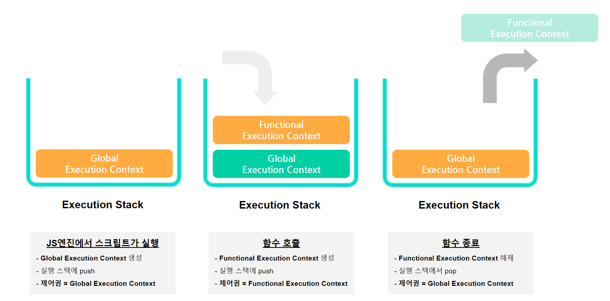

# 실행 컨텍스트 vs Lexical 환경
렉시컬 환경을 공부하다보니, 실행 컨텍스트라는 개념과 어떤 차이가 있는건지 궁금해졌다. <br>
실행 컨텍스트를 복습하며 렉시컬 환경과의 차이점도 찾아보자.

<br>
<br>

## 🔥 [복습] 실행 컨텍스트
- 코드가 평가되고 실행되는 환경을 의미하는 추상적인 개념이다
- 실행 컨텍스트는 `Global Execution Context`와 `Functional Execution Context`로 구분된다
    - `Global Execution Context` : 전체 코드가 실행되는 환경으로, 가장 기본이 되는 실행 컨텍스트
    - `Functional Execution Context` : 함수가 호출될 때마다 생성되는 함수의 실행 컨텍스트
        - 함수 실행 컨텍스트는 브라우저의 실행 스택 용량에 따라 제한적으로 생성된다

<br>

### 🚀 실행 스택(Execution Stack)

- LIFO 구조를 가지며, 코드가 실행되는 동안 생성된 모든 실행 컨텍스트를 저장하는 데 사용한다
- JS엔진에서 스크립트가 실행되면, `Global Execution Context` 가 생성된다
- 생성된 `Global Execution Context`은 실행 스택에 push한다 
- 함수가 호출될 때마다, 호출된 함수의 `Functional Execution Context` 이 생성되고 실행 스택에 push한다
- 함수의 실행이 완료되면, 실행 스택에서 `Functional Execution Context` 을 pop한다
- 그리고 top에 해당하는 실행 컨텍스트에서 제어권을 가져간다

<br>
<br>

## 🔥 [추가] 실행 컨텍스트와 Lexical 환경
- 실행컨텍스트의 동작 방식을 ES5.1 전후로 나누어 알아보자

<br>

### 🚀 ES5.1 이전 : 실행 컨텍스트의 속성
- 실행 컨텍스트는 실행 가능한 코드를 형상화하고 구분하는 추상적인 개념이지만, 물리적으로는 객체의 형태를 가진다
- 객체의 형태를 가지기 때문에, 프로퍼티를 가지고 있다
- 실행 컨텍스트의 프로퍼티는 아래와 같다
    1. Variable Object(변수 객체)
    2. Scope Chain(스코프 체인)
    3. this value

#### 1) Variable Object(변수 객체)
- 변수 객체(Variable Object/VO)는 실행 컨텍스트와 관련있는 데이터 컨테이너이다 
- 데이터 컨테이너라고 말하는 이유는 변수, 함수 선언, 인수 객체를 저장하기 때문이다
- 변수 객체(Variable Object/VO) 역시 추상적인 개념이며 각각의 컨텍스트마다 서로 다른 객체를 사용한다
- `Global Context` 와 `Functional Context` 이 각각 가리키는 객체가 다르다
    - `Global Context` 의 변수 객체(VO)는 **전역 객체(Global Object/GO)**를 가리킨다 (**[🎨 이미지 참고](https://poiemaweb.com/img/ec-vo-global.png)**)
    - `Functional Context` 의 변수 객체(VO)는 **활성 객체(Activation Object/AO)**를 가리킨다 (**[🎨 이미지 참고](https://poiemaweb.com/img/ec-vo-foo.png)**)
        - 활성 객체에는 파라미터, 인자 값 등이 포함된다

<br>

#### 2) Scope Chain(스코프 체인)
- 스코프 체인은 일종의 리스트로서 실행 컨텍스트에 존재하는 식별자를 찾기위한 객체리스트를 의미한다
- 간단히 말하면 스코프 체인은 자신의 상위 변수 객체의 리스트를 의미한다
- 0번째 인덱스에는 자신의 변수 객체가 포함되어 있다 
- 함수를 실행하는 중, 변수를 만나면
    - 스코프체인[0] = 자신의 변수 객체 : 자신의 변수 객체에서 변수를 찾는다
    - 자신의 변수 객체에 변수가 없다면, 스코프체인에 담긴 순서대로 변수 객체를 검색한다

<br>

#### 3) this value
- `this` 값은 실행 컨텍스트와 관련된 특별한 객체이다
  - `Global Context` 에서의 this값은 **전역 객체(Global Object/GO)**를 가리킨다
  - `Functional Context` 에서의 this는 어떠한 방식으로 호출하는가에 따라 this가 가리키는 값이 다르다

<br>

### 4) 실행 컨텍스트의 생성과정
1. 스코프 체인의 생성과 초기화 : 실행 컨텍스트가 생성된 이후 가장 먼저 스코프 체인의 생성과 초기화가 이루어진다
2. Variable Instantiation(변수 객체화) 실행
  - 스코프 체인의 생성과 초기화 후, 변수 객체에 속성과 값을 추가하는 `Variable Instantiaion` 이 실행된다
  1. 만약 이 때의 실행 컨텍스트가 `Functional Context`라면, 매개변수가 변수 객체의 속성명으로, arguments가 값으로 설정된다
  2. 대상 코드 내의 함수 선언을 대상으로 함수명이 변수 객체의 속성명으로, 생성된 함수 객체가 값으로 설정된다
  3. 대상 코드 내의 변수 선언을 대상으로 변수명이 변수 객체의 속성명으로, undefined가 값으로 설정된다 
3. this value의 결정
  - 변수의 선언 처리가 끝난 후, this 값이 결정된다
  - this의 값이 결정되기 전에는 전역 객체를 가리킨다
  - 전역 객체를 가리키던 this는 함수 호출 패턴에 의해 결정된다

<br>

```javascript
var same = "test";
function same() {};

console.log(typeof same); // string
```
```javascript
function same() {};
var same = "test";

console.log(typeof same); // string
```
- 참고로 하나의 실행 컨텍스트에서, 같은 이름을 가진 변수와 함수의 선언이 있다면
- 변수 선언을 한 변수의 값이 함수 선언을 한 함수 객체 위에 덮어 씌우게 된다 
- 즉 변수 객체화의 실행 순서와 상관없이, 같은 이름을 가진 변수와 함수의 선언이 있는 경우 변수의 값으로 덮어씌워진다

<br>

### 5) 실행 컨텍스트의 실행과정
```javascript
var a = "this is global variable";

function fn1(){
  var b = "this is global variable";
  console.log(this);
}

fn1();
```
1. 변수 값의 할당 
  - 현재 실행 컨테스트의 스코프체인(index=0)이 참조하고있는 변수객체를 시작으로 필요한 변수(a)를 검색한다
  - 변수객체에 변수명(a)과 동일한 속성이 있다면, undefined로 초기화되어 있던 변수에 "this is global variable"를 할당한다
2. 함수 `fn1()` 실행 컨텍스트의 생성
  - 전역 코드에서 함수 `fn1()`이 호출되면 새로운 함수 실행 컨텍스트가 생성된다
  - 함수 `fn1()`의 실행 컨텍스트로 제어권이 이동하면 아래의 3가지 단계가 순차적으로 일어난다 
    1. 스코프 체인의 생성과 초기화
    2. Variable Instantiation 실행 (변수 객체에 속성과 값을 추가)
    3. this value 결정
  - `fn1()`가 호출되어 생성된 함수 실행 컨텍스트는 아래와 같이 같이 표현할 수 있다
  
```javascript
함수 실행 컨텍스트 = {
  ScopeChain: [AO, GO],      // 1. 스코프 체인의 생성과 초기화   
  변수 객체: {                 // 2. 변수 객체에 속성과 값을 추가 
    arguments: null,  
    b : undefined, 
  },
  this: window,              // 3. this value 결정 
}
```
1. 스코프 체인의 생성과 스코프체인 초기화
    - 스코프체인의 0번지에는 자신의 실행 컨텍스트의 변수 객체를 의미하는 AO(활성 객체)
    - 1번지에는 현재 함수 실행 컨텍스트의 바로 상위 컨텍스트인 전역 실행 컨텍스트의 변수 객체를 의미하는 Global VO(전역 변수 객체/VO)를 초기화한다
    - 현재 함수 실행 컨텍스트의 스코프 체인은 AO와 Global VO를 참조하게 된다
2. Variable Instantiation 실행 (변수 객체에 속성과 값을 추가)
    - 함수는 arguments를 가지므로, argumetns 속성과 함수 내부에서 선언된 변수와 같은 이름의 속성 b를 가진다
    - `var`를 사용해 선언하였으므로, 선언과 초기화가 동시에 일어나기 때문에 속성 b 는 `undefined`로 할당된다
3. this value 결정
    - 현재 호출된 함수는 전역 실행 컨텍스트에서 호출된 함수이므로, **this의 value는 전역 객체(VO)이다**
    - `console.log(this)` 를 함수 내부와, 외부에서 찍어보면 this가 어떤 value를 가지고 있는지 추측할 수 있더라
4. `fn1()` 함수의 코드 실행
    - 함수가 실행되며 위에서부터 순차적으로 코드가 실행된다
    - 지역 변수 `b` 에 값을 할당하는 코드를 만나면, 
    - 현재 실행 컨텍스트의 스코프 체인이 참조하고 있는 첫번째 스코프의 `AO`를 먼저 검색하여 `b`를 찾는다
    - 자신의 변수 객체에 변수가 없다면, 스코프체인에 담긴 순서대로 차근차근 상위 변수 객체를 검색하여 값을 할당한다 

<br>
<br>

### 🚀 ES5.1 이후 : 실행 컨텍스트의 컴포넌트
- <a href="https://github.com/dev-ku/Today-I-Learned/blob/main/javascript/11-2.LexicalEnviroment%20VS%20ExecutionContext(2).md#-es51-%EC%9D%B4%ED%9B%84--%EC%8B%A4%ED%96%89-%EC%BB%A8%ED%85%8D%EC%8A%A4%ED%8A%B8%EC%9D%98-%EC%BB%B4%ED%8F%AC%EB%84%8C%ED%8A%B8">11-2.LexicalEnviroment VS ExecutionContext(2) ES5.1 이후</a>

## 🔥 [결론] 실행 컨텍스트의 컴포넌트 중 하나인 렉시컬 환경
- <a href="https://github.com/dev-ku/Today-I-Learned/blob/main/javascript/11-2.LexicalEnviroment%20VS%20ExecutionContext(2).md#-%EA%B2%B0%EB%A1%A0-%EC%8B%A4%ED%96%89-%EC%BB%A8%ED%85%8D%EC%8A%A4%ED%8A%B8%EC%9D%98-%EC%BB%B4%ED%8F%AC%EB%84%8C%ED%8A%B8-%EC%A4%91-%ED%95%98%EB%82%98%EC%9D%B8-%EB%A0%89%EC%8B%9C%EC%BB%AC-%ED%99%98%EA%B2%BD">11-2.LexicalEnviroment VS ExecutionContext(2) 결론</a>


<br>
<br>

<hr>
[참고] <br>
https://oyg0420.tistory.com/entry/%EC%8B%A4%ED%96%89-%EC%BB%A8%ED%85%8D%EC%8A%A4%ED%8A%B8 `추천👍`


