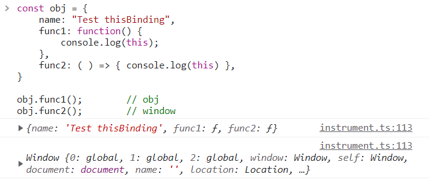

## 화살표 함수(Arrow Function Expression)
- `Array.from()` 메서드를 쓸 때 화살표함수를 많이 사용하길래, 다시 한번 제대로 정리한다

<hr>
<br>

### 1. 화살표 함수(Arrow Function Expression)
```jsx
var func = function ( x,  y ){
    return x + y;
}

var arrowFunc = ( x, y ) => x + y;

console.log(func(1,2));             // 3
console.log(arrowFunc(1,2));     // 3
```
- 화살표 함수는 전통적인 함수 표현에 대한 간편한 대안책이다
- `function` 키워드 없이, `=>` 를 사용해 정의한다

```jsx
// 매개 변수 지정
var test1 = ( ) => { console.log("Test") }      // 매개 변수가 없는 경우
var test2 = x => { console.log(x) }             // 매개 변수가 하나인 경우 소괄호 생략 가능
var test3 = (x, y) => { console.log(x, y) }     // 매개 변수가 여러 개인 경우 소괄호 *필수* 

test1();                        // Test
test2("hi");                   // hi
test3("hello", "world");    // hello world
```
- 화살표 함수에서 매개 변수를 지정할 때에는
    - 매개 변수 0개 : 소괄호를 작성해주어, 매개 변수가 필요없음을 알려준다
    - 매개 변수 1개 : 소괄호 생략 가능
    - 매개 변수 n개 : 소괄호 필수

```jsx
// 실행문 지정
var test1 = x => { return x * 2 }   // 실행문을 { } 안에 작성
var test2 = x => x * 2               // 실행문이 단 한줄의 구문이라면, 중괄호, return 생략 가능 
var test3 = x => ( {input: x} )      // 객체 반환 시, 소괄호로 감싸준다

test1(10);    // 20   
test2(10);    // 20
test3(10);    // { input: 10 }
``` 
- 화살표 함수에서의 실행문은 
    - 일반적으로 { } 안에 작성한다
    - single line function의 경우, {중괄호} 와 `return` 을 생략할 수 있다
        - 중괄호만 생략하고, `return` 을 남겨두면 에러 발생
    - multi line function의 경우, {중괄호} 와 `return` 을 생략할 수 없다
    - 만약 `return` 하고자 하는 값이 객체라면, 반드시 소괄호로 감싸준다

<br>
<br>

### 2. 화살표 함수와 function 키워드를 사용했을 때의 차이는 뭘까?
- 단순히 문법의 차이라면 왜 화살표 함수를 사용해야할까?
- `function` 키워드를 사용한 함수와, 화살표 함수의 큰 차이점은 `this`에 있다. 서로 가리키는 `this`가 다르다
- 화살표 함수가 나오기 전에는 어떻게 함수가 호출되었는가에 따라 `this`를 정의했다
- 화살표 함수에는 자기 자신이 가지는 `this`가 존재하지 않는다
- 대신, 화살표 함수를 둘러싸는 렉시컬 스코프의 `this`를 그대로 사용한다
    - 자기 자신이 `this`를 가지고 있지 않으므로, 스코프 체인을 타고 올라가 상위 스코프의 `this`를 사용한다

#### (1) 일반 함수의 `this`
```jsx
function Student() {
    this.name = "짱구";
    return {
        name: "유리",
        // 일반 함수의 this : 객체 내부에서의 this이므로, 객체 자기 자신(Student)을 의미
        print: function(){
            console.log(this.name + "입니다");
        } 
    }
}

const student = new Student();
student.print();    // 유리입니다
```
- 자바스크립트는 함수 호출 방식에 의해 `this`에 바인딩될 객체가 동적으로 결정된다
    - 생성자 함수와 객체 메서드의 `this` = 객체 자기 자신
    - 내부 함수, 콜백 함수 등 에서의 `this` = 전역 객체(window)
    - 혹은 `call()`, `apply()`, `bind()`를 사용해 직접 설정

#### (2) 화살표 함수의 `this`
```jsx
function Student() {
    this.name = "짱구";
    return {
        name: "유리",
        // 화살표 함수의 this : 상위 스코프인 생성자 함수 스코프를 의미
        print: () => {
            console.log(this.name + "입니다");
        } 
    }
}

const student = new Student();
student.print();    // 짱구입니다
```
- 화살표 함수는 함수를 선언할 때, `thisBinding` 되지 않는다
- 동적으로 결정되는 일반 함수와 달리, 화살표 함수의 `this`는 언제나 상위 스코프의 `this`를 가리킨다
- 아래에서 자세히 다루어보자

<br>
<br>

### 3. 화살표 함수에 없는 것들
1. `this`
    - 일반적인 함수와 달리, 화살표 함수는 호출되며 생성된 실행 콘텍스트에서 `thisBinding` 정보를 만들지 않는다
    - 현재 스코프에 `this` 가 정의되어 있지 않으므로, 스코프 체인을 타고 돌라가 가장 가까운 상위 스코프의 `this`를 참조한다
2. `protoType`
    - 화살표 함수는 `protoType`이 존재하지 않는다
    - 그렇기 때문에, `new`를 사용한 호출이 불가능하며, 자기 자신의 인스턴스 객체를 만들 수 없다
    - 즉, 생성자 함수의 역할을 할 수 없다
3. `arguments`
    - 화살표 함수는 `arguments` 프로퍼티를 생성하지 않는다
    - 화살표 함수 내부에서 `arguments` 를 참조한다면, ReferenceError가 발생하거나, 상위 실행 컨텍스트의 `arguments` 객체를 참조하게 된다 (this와 같은 맥락)
    ```jsx
    const arrowFunc = (...args) => {
        console.log(args);
    }

    arrowFunc(1, 2, 3); // [1, 2, 3]
    ```
    - 단, 파라미터에 직접 `...args` 를 넣어 `args` 배열을 참조하여 `arguments` 객체를 대체할수는 있다

<br>
<br>

### 4. 화살표 함수로 인해 자주하는 실수
```jsx
const obj = {
    func1: function() { console.log(this); },
    func2: ( ) => { console.log(this) },
}

obj.func1();        // obj
obj.func2();        // window
```


1. 객체의 프로퍼티를 함수로 선언할 때 : 함수 선언 방법에 따라, this가 다르므로 주의해야한다
    - `func1()` 에서의 `this` 는 객체 자기 자신을 의미한다
    - `func2()` 에서의 `this` 는 존재하지 않으므로, 스코프 체인에 의해 상위 스코프의 `this`인 `window`를 가져온다

```jsx
document.body.innerHTML += '<button>버튼1</button><button>버튼2</button>';
const btnList = document.querySelectorAll('button');
const [btn1, btn2] = [btnList[0], btnList[1]];

// btn1 클릭시 btn1 객체 출력 (this === btn1)
btn1.addEventListener("click", function() { console.log(this); });

// btn2 클릭시 Window 객체 출력 (this === Window)
btn2.addEventListener("click", () => { console.log(this); });
```
2. 이벤트 핸들러로 선언할 때
    - 기본적으로 `addEventListener`는 `callback`을 `this`로 바인딩한다
    - 그래서 콜백을 화살표 함수로 선언한다면, 자신의 this가 아닌 상위 스코프의 this로 바인딩된다
    - 이 외에도 내부 설계상 콜백함수에 `this`가 강제 바인딩 되도록 되어있는 고차함수의 경우도 마찬가지이므로, 주의하자


<br>
<hr>

## [참고]
https://developer.mozilla.org/ko/docs/Web/JavaScript/Reference/Functions/Arrow_functions `📎MDN` <br>
https://whales.tistory.com/37 `기본 사용방법 정리` <br>
https://velog.io/@raram2/화살표-함수를-남용하면-안되는-이유 `화살표 함수에 없는 것들` <br>
