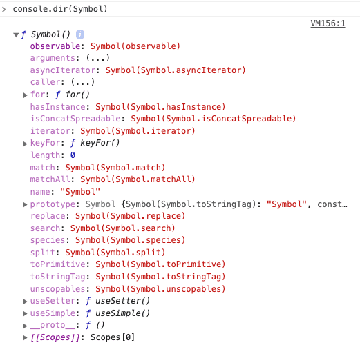

## 반복 가능한 객체(iterable object)
- `Array.form()` 메서드의 쓰임에 대해 찾아보니, **유사 배열 객체(array-like object), 반복 가능한 객체(iterable object)** 라는 용어가 언급되었다.
- 유사 배열 객체(array-like object)와 반복 가능한 객체(iterable object)에 대해 정리하고 넘어가도록 하자.
- 유사 배열 객체와 반복 가능한 객체를 정리하기 전에 배열에 대해서도 한번 정리한다.

<hr>
<br>

### 🔥 반복 가능한 객체(iterable object)
- ES6에서 추가된 `Symbol` 은 변경 불가능한 원시 데이터타입이다.
- `Symbol` 은 고유 값을 가지므로, 기존 코드에 영향을 주지않고 새로운 프로퍼티를 추가하기위해 사용된다



- `Symbol` 에 대한 내용은 브라우저의 콘솔창에서도 확인할 수 있다
- `Symbol` 의 프로퍼티들을 ECMAScript에서는 `Well-Known-Symbol`이라 부르며, 자바스크립트 내부 알고리즘에서 사용된다
- `Symbol` 에는 `Symbol.iterator` 메서드가 있는데, 이는 Array, String, Map, Set, arguments, DOM Collection 등과 같은 반복 가능한 이터러블 객체를 `for-of` 로 순회할 수 있도록 한다

```jsx
const nums = [1,2,3]

// 이터러블 객체인지 확인
console.log(Symbol.iterator in num);    // true

// for of 구문
for(var n of nums){
    console.log(n);     // 1 2 3
}

// 전개 연산자와 배열 구조 분해
console.log([0, ... nums])  // [ 0, 1, 2, 3 ]
```
- `Symbol.iterator` 를 갖고 있는 객체인지 `Symbol.iterator in 객체` 의 반환값을 통해 확인할 수 있다
- 이터러블 객체는 `for-of` 뿐만 아니라, 전개 연산자(...) 와 구조 분해 할당이 가능하다
- 즉, `Symbol.iterator`메서드를 갖고 있어야만 이터러블 객체로 취급된다
```jsx
var arr = [ 1, 2, 3 ];            // Array
var temp = { length: 3 };     // Array-like Object

console.log(Symbol.iterator in arr);        // true
console.log(Symbol.iterator in temp);     // false
```
- 유사 배열 객체는 `Symbol.iterator`메서드를 갖고 있지 않은 일반 객체이므로 `for-of`, 전개 연산자 등의 사용이 불가능하다
- 일반 객체에서도 이터러블 프로토콜을 준수하여 구현하면 이터러블 객체가 될 수 있다

```jsx
function test(){
    return Symbol.iterator in arguments;
}

console.log(test());    // true
```
- [참고] `arguments` `NodeList` `HTMLCollection` 는 유사 배열 객체이면서 이터러블 객체이니 기억해두자

<br>
<br>

### 🔥 이터러블 프로토콜
- 유사 배열 객체나 일반 객체에서도 이터러블 프로토콜을 준수하면, 이터러블 객체로 만들 수 있다
```jsx
const arrlike = {
    // Symbol.iterator() 
    [Symbol.iterator]() {
        this.i = 0;
        return this;
    },

    // next()
    next() {
        return { value: this[this.i], done: ++this.i > this.length };
    },

    // index
    0: "Nice",
    1: "to",
    2: "meet",
    3: "you",

    // length
    length: 4,
}

```
- 이터러블 객체를 만들기 위해서는 가장 먼저 `[Symbol.iterator]` 라는 이름의 메소드를 정의한다
- 그리고 이 메서드가 이터레이터(`Iterator`) 를 반환하도록 한다
- 이터레이터는 객체 내부에 상주하며, 현재 참조 중인 지점을 알려주는 포인터 역할을 한다
- 그리고 반복할 요소가 남아있는지를 확인해주는 `next` 라는 이름의 메소드도 정의한다
```jsx
for(var txt of arrlike){
    console.log(txt);               // Nice to meet you
}

console.log(...arrlike);            // Nice to meet you

var [ a, b, c, d ] = arrlike;
console.log(a);     // Nice
console.log(b);     // to
console.log(c);     // meet
console.log(d);     // you
```
- 일반 객체인 유사 배열 객체를 이터러블 프로토콜을 준수하여 위와 같이 이터러블 객체로 만들어 주면  `for-of` 구문, 전개 연산자, 구조 분해 할당이 가능하다 

<br>
<hr>

## [참고]

https://nohack.tistory.com/29 `📎 간단 설명`<br>
https://www.howdy-mj.me/javascript/array-and-array-like-object-and-iterable/ `📎 자세한 설명` <br>