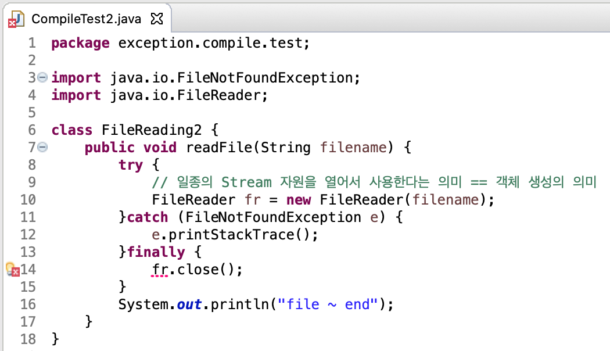

# 1-3. finally문

## ✏️  finally문

- `finally` 에는 예외 발생 여부와 상관없이 무조건 수행될 코드를 작성한다
    - 자원의 누수를 막는 코드를 일반적으로 finally문에 작성한다
- **[참고]** Stream 자원을 사용한다는 의미 : [http://tcpschool.com/java/java_io_stream](http://tcpschool.com/java/java_io_stream)
    
    

## ✏️  finally문이 실행되지 않는 경우

1. 원인 모를 이유에 의해 컴퓨터의 파워가 꺼진 경우 
2. finally block 안에서 또 다른 예외가 발생한 경우 → finally block 안에서의 예외 처리를 통해 대응할 수 있다

## ✏️  자원의 누수를 막는 finally문

- 참조변수 fr은 try문에서만 사용 가능한 Local 변수이므로 finally문에서는 접근할 수 없다
- 참조변수의 선언부를 try문 바깥으로 옮겨주면 fr에 대한 에러는 사라진다

- 참조 변수의 선언부를 이동했는데도 불구하고, `fr.close()`에서 에러가 발생한다
- 이는 `fr.close()` 에서도 예외가 발생하기 때문이다

- `fr.close()` 역시 try-catch문을 작성하면 더이상 오류가 발생하지 않는다