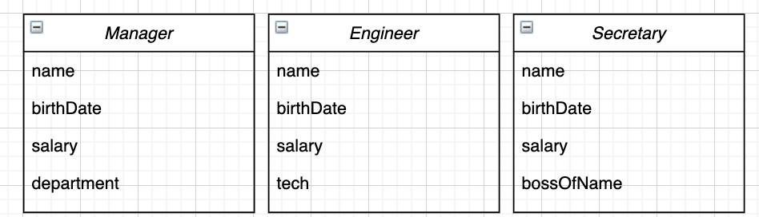
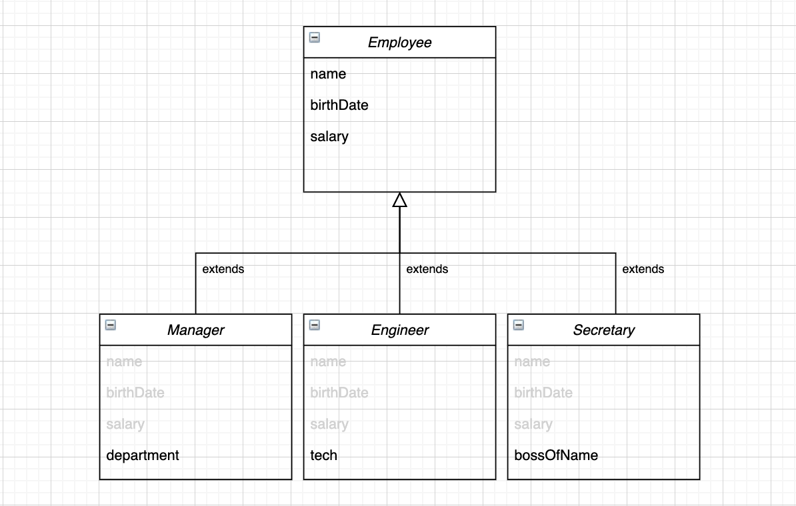

# [상속] 추상화 과정(Abstraction Generalization)

최종 편집 일시: 2021년 10월 26일 오전 11:41
키워드: 추상화과정

## ✏️  추상화 과정(Abstraction Generalization)

1. 다양한 클래스(Manager, Engineer, Secretary)에서 공통적인 성질을 추출한다 → `name` `birthDate` `salary`

1. 공통 성질을 일반적인 성질로 가지는 모듈을 하나 지정한다 
    - 공통적인 성질의 클래스를 한데 묶을 수 있는 부모 클래스를 설정한다 → `Employee`
2. 설정한 부모 클래스와의 **is a Relation 관계**가 성립하는지 확인한다 → 성립한다면 상속이 가능하다
    - **Manager** 는 **Employee** 이다 (O)
    - **Engineer** 는 **Employee** 이다 (O)
    - **Secertary** 는 **Employee** 이다 (O)
3. 부모 클래스에 공통적인 성질을 멤버로 선언하였으므로, 자식 클래스에서는 다루지 않고 상속받아 사용한다
    - 부모 클래스의 멤버는 3개, 자식 클래스의 멤버는 모두 4개이다 (상속받은 필드 3개 + 추가로 갖는 필드 1개 = 4개)