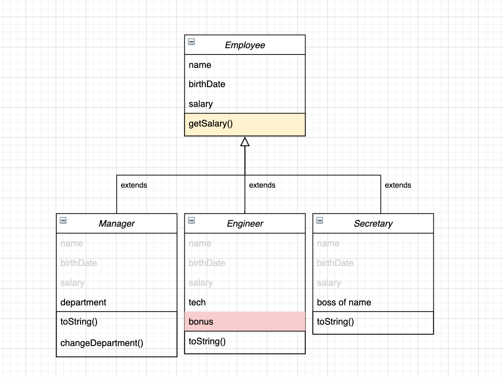

# 1-2. instanceof


## ✏️  instanceof 키워드




```java
Employee[] emps = {
	new Secretary("s1", new MyDate(1980, 1, 2),  100, "Tom"),
	new Engineer("e1", new MyDate(1990, 2, 3), 400, "AI", 100),
	new Manager("m1", new MyDate(1992, 3, 2), 500, "IT"),
};

// 부모 클래스에만 존재하는 메서드를 공동으로 사용할 수 있다		
for(Employee e : emps) { System.out.println(**e.getSalary()**); } // 100 400 500
```

- 자식 클래스마다 동일한 용도의 메서드를 생성할 필요 없이, 부모 클래스에만 메서드를 만들어 공통으로 사용할 수 있다
- 이는 상속 관계의 경우 클래스간의 결합도가 높아지기 때문이다 [[참고] 다형성 이슈(3)](1%20%E1%84%83%E1%85%A1%E1%84%92%E1%85%A7%E1%86%BC%E1%84%89%E1%85%A5%E1%86%BC(Polymorphism)%208f3e6b99acc24c93ad5198c425bbc523.md)
- 위와 같은 예제에서는 문제가 하나 발생하는데, Engineer의 경우 bonus 필드를 가지기 때문이다

```java
for(Employee e : emps) { 
	if(e instanceof Engineer) {
		System.out.println(e.getSalary() + **((Engineer) e).getBonus())**;
	}
	System.out.println(e.getSalary()); 
}
```

- `instanceof` 키워드를 사용해, 객체 타입을 확인하여 대응할 수 있다
- `getBonus()` 메서드는 부모 클래스의 메서드가 아닌 자식 클래스의 메서드이므로 [Object Casting](1%20%E1%84%83%E1%85%A1%E1%84%92%E1%85%A7%E1%86%BC%E1%84%89%E1%85%A5%E1%86%BC(Polymorphism)%208f3e6b99acc24c93ad5198c425bbc523.md)을 사용해주어야한다