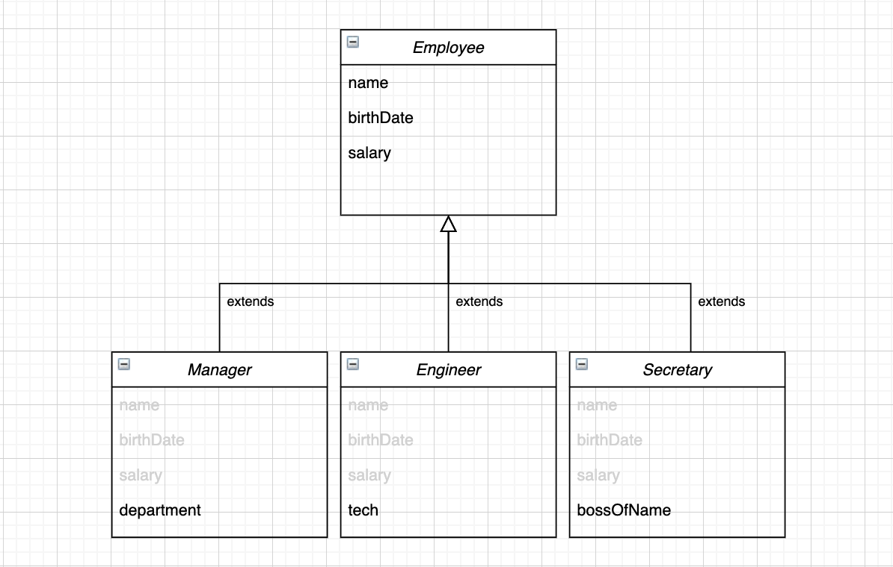

# 2. 다형성(Polymorphism)을 사용하는 이유

## ✏️  다형성(Polymorphism)을 사용하는 이유



```java
Employee m = new Manager("yuri", new MyDate(2021, 10, 26), 300, "IT");
Employee eg = new Engineer("chita", new MyDate(1990, 2, 3), 400, "AI", 100);
Employee s = new Secretary("jjangu", new MyDate(1980, 1, 2),  100, "Tom");
```

- 부모 클래스 타입으로 자식 클래스 객체를 만들었다. 왜 부모 클래스 타입으로 자식 클래스 객체를 만들었을까?
- 자식 클래스는 서로의 클래스 타입이 다르다. 이런 관계의 클래스들의 집합을 이기종 집합이라고 한다
- 이기종 집합을 다루기 위해서는 같은 레벨, 자식 클래스 타입으로는 다룰 수 없다
- 반드시 **한 단계 위의 부모 클래스에서 이기종 집합을 다루어야 단일화 관리가 가능하다**
- 즉, 부모 클래스 타입으로 자식 클래스 객체를 만드는 것은 **하나의 클래스 타입으로 다양한 이기종 집합을 다루기 위함이다**


- 부모 클래스 타입으로 자식 클래스 객체를 만들면 하나의 부모 클래스 타입으로 다양한 자식 클래스 타입을 묶을 수 있게 된다
- 결론적으로 부모 클래스가 다양한 이기종 관계의 자식 클래스를 다루기 위한 컨테이너, 즉 배열 타입으로 사용된다

## ✏️  Heterogeneous Collection

- 서로 다른 타입을 가지는 한 단계 상위 클래스로 묶인 이기종 간의 집합체를 의미한다
- 반대의 개념으로는 Homogeneous Collection이 있다