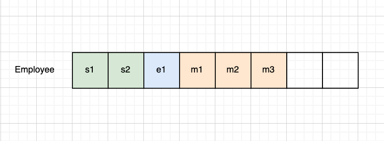

# 3. 이기종 집합 (Heterogeneous Collection)

## ✏️  Heterogeouse Collection

- 서로 다른 타입을 가지는 한 단계 상위 클래스로 묶인 이기종 간의 집합체를 의미한다
- 반대의 개념으로는 Homogeneous Collection이 있다
  


```java
Employee[] emps = {
	new Secretary("s1", new MyDate(1980, 1, 2),  100, "Tom"),
	new Secretary("s2", new MyDate(1982, 11, 4),  100, "Tom"),
	new Engineer("e1", new MyDate(1990, 2, 3), 400, "AI", 100),
	new Manager("m1", new MyDate(1992, 3, 2), 500, "IT"),
	new Manager("m2", new MyDate(1992, 3, 2), 500, "IT"),
};
```

- 하나의 부모 클래스 타입으로 이기종 간의 자식 클래스를 단일하게 관리할 수 있다
- 결국 부모 클래스 타입을 상속하여 부모 클래스로 묶었다는 점에서 배열의 same data type 전제가 무너졌다고 볼 수 있다
- 혹은 하나의 부모 클래스를 상속하였다는 점에 집중하여 모두 결국 같은 클래스 타입이라고 생각하는 관점도 틀리지 않다
- 관점에 따라 다르다. 이 점에 대해서는 집중할 필요는 없고 넘어가도 좋다

```java
for(Employee e : emps) { System.out.println(e); }
```

- 자식은 부모 클래스 타입으로 묶여 있으므로, 위와 같은 반복문 사용도 가능하다