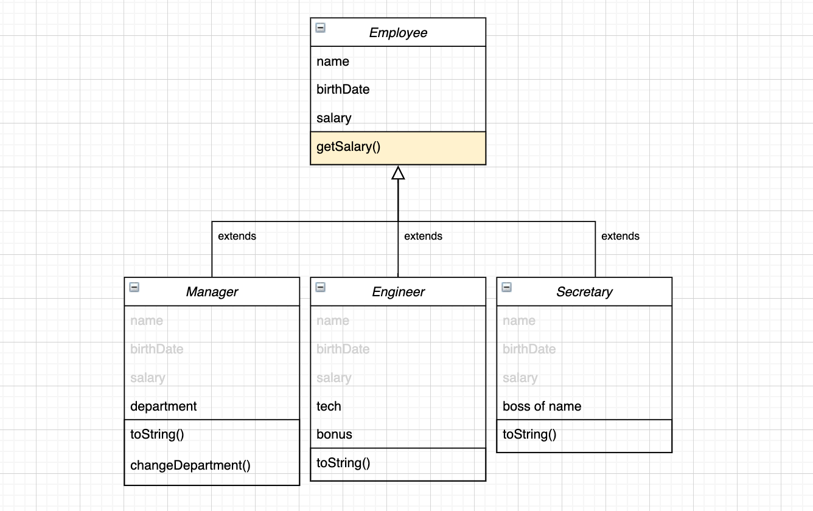

# 4. 이기종 집합을 핸들링하는 메소드 기법(⭐️)


## ✏️  알아보자



```java
public void addManager(Manager m) { ... }
public void insertEngineer(Engineer eg) { ... }
public void manageSec(Secretary s) { ... }
```

**Level 01**. 가장 저차원적으로 위와 같은 구조를 핸들링할 때 사용하는 메소드 기법 

- 추가에 관련된 기능을 정의하는 경우
- 이기종 클래스마다 서로 다른 identifier를 가지는 메소드명을 설정하는 방법이 가장 저차원적이다
    - (예) `addManager()`, `insertEngineer()`, `manageSec()`
- 서로 다른 기능으로 보이므로 코드의 가독성과 일관성이 저해된다
    
    

```java
public void addManager(Manager m) { ... }
public void addEngineer(Engineer eg) { ... }
public void addManage(Secretary s) { ... }
```

**Level 02.** 공통 기능인지를 identifier통해 확인할 수 있도록 정의하는 방법 (일관성)

- (예) `addManager()`, `addEngineer()`, `addManage()`
- 위와 같은 경우 동일한 identifier를 가지지는 않지만 유사한 형태를 가지므로 일관성이 있다
    
    

```java
public void addEmployee(Manager m) { ... }
public void addEmployee(Engineer eg) { ... }
public void addEmployee(Secretary s) { ... }
```

 **Level 03**. 더 좋은 방법은 부모 클래스의 identifier를 활용하는 것이다

- 오버로딩(Overloading) 을 사용하는 방법이다

```java
public void addEmployee(**Employee m**) { 
	if (m instanceof Manager) { ... }
	if (m instanceof Engineer) { ... }
	if (m instanceof Secretary) { ... }
}
```

 **Level 04**. 부모 클래스의 identifier를 활용하며, 인자 타입도 부모 클래스를 사용하는 방법

- 위와 같은 방법을 사용하면 한번의 정의로 모든 이기종 클래스를 대응할 수 있다
- 가장 일관적이고, 가독성을 높이는 방법이다