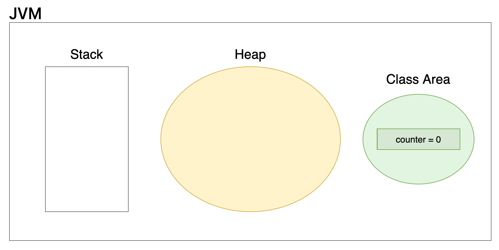

# 5. static 키워드


## ✏️  [정리] Static 키워드

- static 키워드를 사용한 멤버는 **객체 생성없이 바로 접근해 사용할 수 있다**
    - 컴파일된 class파일이 메모리(JVM)에 로딩되는 과정에서 static으로 지정한 멤버도 미리 메모리에 올라가기 때문이다
- **static 메서드에는 static 필드 변수만 사용할 수 있다**
    - 만약 static 메서드에서 객체 생성없이는 접근할 수 없는 일반 필드 변수를 사용하게 되면, 에러가 발생한다
    - 그렇기 때문에 static 메서드 내부에서는 static 필드 변수만 사용할 수 있다
- **static 변수는 Local 레벨에서 사용할 수 없다**
    - 메소드 내부의 로컬 변수에는 static 키워드를 사용할 수 없다
    - 필드 변수에만 static 키워드를 사용할수 있다
- **static 으로 지정된 변수는 생성된 객체들에서 공유된다 (중요)**
- static 키워드는 [final 키워드](7%20final%20%E1%84%8F%E1%85%B5%E1%84%8B%E1%85%AF%E1%84%83%E1%85%B3%20ce445b5c3bc543d9aa68dc81aac9db9b.md)와 함께 상수값을 선언할 때 사용되는 경우가 일반적이다
    - 프로그램 전역에서 접근 가능한 값이므로 `public` 접근 지정자와 함께 사용되는 것이 일반적이다
- 각 변수별 특징을 명확히 알고 있어야하는데 특히 Field와 Static변수에 대한 비교가 중요하다
    
    

## ✏️  static 멤버는 객체 생성없이 바로 접근해 사용할 수 있다

```java
package com.edu.test;

class Member{
	static String name = "jjangu";
	public static void getMember1() { System.out.println("My name is "+name); }
} 

public class StaticTest1 {
	public static void main(String[] args) {
		Member.getMember1(); // static 멤버에는 별도의 객체 생성 없이 접근 가능하다
}
```

- static 키워드를 사용한 멤버는 객체 생성없이 바로 접근해 사용할 수 있다
- 컴파일된 class파일이 메모리(JVM)에 로딩되는 과정에서 static으로 지정한 멤버도 미리 메모리에 올라가기 때문이다

```java
package com.edu.test;

class Member{
	static String name = "jjangu";
	public static void getMember1() { System.out.println("My name is "+name); }
	**public void getMember2()** { System.out.println("My name is "+name); }
} 

public class StaticTest1 {
	public static void main(String[] args) {
		Member.getMember1(); // static 멤버에는 별도의 객체 생성 없이 접근 가능하다

		// **Member.getMember2(); // ERROR!!!!**

    Member m = new Member();
		m.getMember2();      // static 멤버가 아닌 경우 반드시 객체 생성이 필요하다
}
```

- static이 아닌 멤버에 객체 생성없이 접근을 하려고 하면 에러가 발생한다

## ✏️  **static 메서드에는 static 필드 변수만 사용할 수 있다**

```java
package com.edu.test;

class Member{
	static String name = "jjangu";
	**int age = 5;**
	
	public static void getMember() { 
		System.out.println("Name :" + name);
		**System.out.println("Age :" + age); // ERROR!!!**
	}
} 
```

- **static 메서드에는 static 필드 변수만 사용할 수 있다**
    - 만약 static 메서드에서 객체 생성없이는 접근할 수 없는 일반 필드 변수를 사용하게 되면, 에러가 발생한다
    - 그렇기 때문에 static 메서드 내부에서는 static 필드 변수만 사용할 수 있다

## ✏️  **static 변수는 Local 레벨에서 사용할 수 없다**

```java
public **static** void main(String[] args) { 
	// **static String name = "jjangu";  // ERROR!!!!
	String name = "jjangu";**
}
```

- **static 변수는 Local 레벨에서 사용할 수 없다**
    - 메소드 내부의 로컬 변수에는 static 키워드를 사용할 수 없다
    - 필드 변수에만 static 키워드를 사용할수 있다
- main method 역시 static method 이므로, static 키워드에 대한 내용이 모두 적용된다

## ✏️  **static 변수는 생성된 모든 객체에서 공유한다 (중요)**

```java
package com.edu.test;

class Car{
	int serialNumber;		  // field V
	static int counter;		// static V
	
	Car(){ counter++; }
}

public class StaticExamTest2 {
   public static void main(String[] args) {
	   Car car1 = new Car();
	   Car car2 = new Car();
	   
		 // serialNumber
	   System.out.println(car1.serialNumber);  // 0
	   System.out.println(car2.serialNumber);  // 0
	   System.out.println(car3.serialNumber);  // 0

		 car1.serialNumber = 4;
	   System.out.println(car1.serialNumber);  // 4
	   System.out.println(car2.serialNumber);  // 0
	   System.out.println(car3.serialNumber);  // 0
	   
		 // counter
	   System.out.println(car1.counter);  // 3
	   System.out.println(car2.counter);  // 3
	   System.out.println(car3.counter);  // 3

		 car1.counter = 10;
	   System.out.println(car1.counter);  // 10
	   System.out.println(car2.counter);  // 10
	   System.out.println(car3.counter);  // 10
   }
}
```

- `counter` 는 static변수이므로 모든 객체에서 값을 공유한다
- 위 코드의 메모리상에서의 실행 순서는 아래 gif를 참고하자


    

## ✏️  **static 은 변하지 않는 값에 사용된다**

```java
class Card {
	// 카드마다 다른 성질은 Field 변수
	private int number;
	private String shpae;

	// 카드가 모두 동일하고, 변하지 않는 값은 static 변수
	private static double height = 8.5;
	private static double width = 12.8;
	private static String material = "paper";
}
```

- 트럼프 카드라고 했을 때, 카드의 모양이나 카드의 숫자는 일반 필드 변수를 사용해 표현한다
- 카드는 가로 세로의 크기, 재질이 모두 동일하다. 이렇게 공통 성질이며 변하지 않는 값은 static 변수를 사용한다
- static 키워드는 [final 키워드](7%20final%20%E1%84%8F%E1%85%B5%E1%84%8B%E1%85%AF%E1%84%83%E1%85%B3%20ce445b5c3bc543d9aa68dc81aac9db9b.md)와 함께 사용되는 경우가 일반적이다