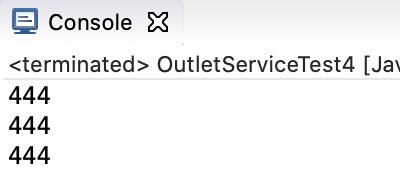

# 8. 싱글톤(Single Tone)

## ✏️  싱글톤(SingleTone)

- **객체의 인스턴스가 오직 1개만 생성**되는 패턴을 의미한다
- 하나의 클래스로부터 오직 하나의 객체만을 생성할 수 있다
- 최초 생성 이후에 호출된 생성자는 최초로 생성된 객체를 리턴한다.
- 고정된 메모리 영역을 얻으면서 동시에 단 한번만 `new` 를 사용하여 메모리 낭비를 방지할 수 있다.

## ✏️  싱글톤(SingleTone) 구현하기(1)

```java
class Factory{
	// 1. private static 객체 생성 
	private static Factory factory = new Factory();

	// 2. 외부 접근을 막은 private 생성자
	private Factory(){ }

	// 3. 객체를 return할 메서드를 생성
	public static Factory getInstance(){
		return factory;
	}
}
```

1. privte static으로 해당 클래스에서 객체를 일단 하나 생성한다
2. 다른 곳에서 객체 생성을 못하도록 생성자의 접근 지정자로 private를 사용한다
3. 하나 만들어둔 객체를 사용할 수 있도록 public으로 리턴할 수 있는 기능을 가진 메서드를 만든다
    
    ```java
    Factory f1 = Factory.getInstance();
    ```
    
    - 메서드는 객체 없이 접근할 수 있도록 static 키워드를 사용해야 한다

## ✏️  싱글톤(SingleTone) 구현하기(2)

- 강사님이 알려주신 방법과 거의 유사한데, 예습했던 내용은 아래와 같다

```java
// 1. 객체를 생성해 저장할 private 필드 생성 
**private static BankService instance;**	
```

1. 객체를 생성해 저장할 private 필드를 생성한다

```java
// 2. 생성자의 접근지정자를 private로 선언한다 
**private** BankService() {
	customers = new Customer[MAX_CUSTOMERS];
	numberOfCustomers = 0;
}
```

1. 생성자의 접근지정자를 private로 선언한다
    - 이를 통해 외부에서의 생성자 접근을 막아 객체를 생성할 때 getInstance()를 사용하도록 한다
    

```java
// 3. 객체(인스턴스)없이 외부 접근이 가능하도록 static 키워드를 사용한다
public static BankService getInstance(){
	// 4. instance 필드가 null이면 초기화하지 않았다는 의미이므로, 생성자를 사용해 객체를 생성한다
	if(instance == null){ 
		instance = new BankService();
	}		
	// 5. 이미 초기화된 적 있는 instance라면 그대로 반환한다 (객체는 하나이므로)
	return instance;
}
```

1. `static` 키워드를 사용해 객체 생성없이 외부에서 접근 가능하도록 `getInstance()` 를 선언한다 ([static 참고](https://www.notion.so/static-method-48bc8f18446947e188b20f9d0bd36df6))
2. instance 필드가 null이면 초기화하지 않았다는 의미이므로, 생성자를 사용해 객체를 생성한다
3. 이미 초기화된 적 있는 instance라면 그대로 반환한다 (객체는 하나이므로)

```java
// VO 클래스 : Customer
**private static count = 999;**
public static int getCount() {
	return count;
}
public static void setCount(int count) {
	Customer.count = count;
}
```

```java
// 실행 클래스
Customer[] cust = {
				new Customer(1, "짱구", "떡잎마을"),
				new Customer(2, "유리", "떡잎마을"),
				new Customer(3, "치타", "장미마을"),
};
	
cust[0].setCount(444);
for(Customer c : cust) {
		System.out.println(c.getCount());
}
```

* `static` 키워드와 함께 선언된 필드는 서로 다른 객체이더라도 모두 공유하게 된다


