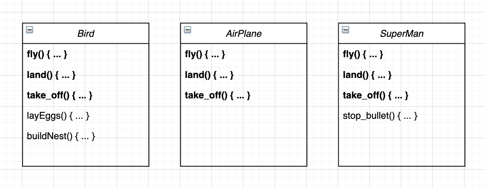

# 9. 인터페이스(Interface) 맛보기

## ✏️  인터페이스(Interface)

- 구현부가 없는 추상 메소드의 집합을 말한다
- 인터페이스와 클래스는 상속 관계가 아닌 **구현 관계**이다 (클래스와 클래스 사이만이 상속 관계가 된다)
- 인터페이스를 구현하는 클래스는 인터페이스의 추상메소드를 반드시 모두 구현해야한다
- 구현 관계는 점선으로 이루어진 화살표로 표기한다
- 인터페이스는 객체 생성의 대상이 될 수 없다
- 인터페이스를 implements 한 클래스에는 일반적으로 Impl를 붙인다

## ✏️  인터페이스(Interface) 그림으로 살펴보기

- 위와 같은 경우 공통적인 기능을 추출해서 일반적인 기능을 갖는 모듈을 만들 수 있다 (추상화 과정)
- 서로 유사성은 갖고 있지만, 클래스간의 연관은 없는 경우 인터페이스를 사용한다

- 상위 클래스는 메서드의 선언부만을 가진다. 말하자면 메서드의 템플릿만을 가진다
- 이 때의 상위 클래스는 클래스의 형태가 아니라는 의미로 **인터페이스(Interface)**라고 부른다
- 인터페이스는 구현부가 없는 메서드를 가지는데, 이러한 형태의 메서드를 **추상메서드**라고 한다
- **추상 메서드를 선언할 때는 public 접근지정자와 abastract 키워드**를 사용한다 (필수X)
- 선언부만을 물려주고, 구현부는 하위 클래스에서 작성한다
- 인터페이스와 클래스는 상속 관계가 아닌 **구현 관계**이다 (클래스와 클래스 사이만이 상속 관계가 된다)
- 상속 관계는 extends 키워드를 사용하고, **구현 관계는 implements 키워드를 사용한다**