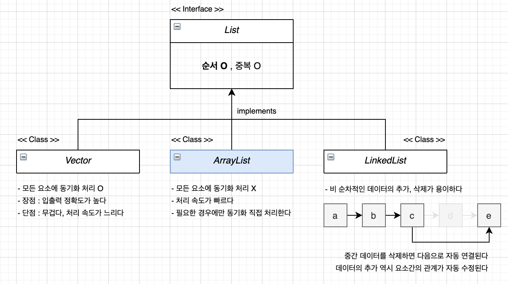

# 2-2. [List] ArrayList

## ✏️  [List] ArrayList



- 순서를 가지기때문에 내부적으로 index를 사용한 관리가 가능하다
- List타입은 데이터 중복을 허용한다
- **[API문서 → java.util → Interface → List](https://docs.oracle.com/javase/8/docs/api/)** 에서 자세한 내용을 확인할 수 있다
- Set의 메서드와 동일한 메서드를 발견할 수 있는데, Collection 인터페이스의 계보를 잇는 구현 클래스이기 때문이다
- 주요 메서드
    - 객체 추가 : `add(Element e)` → return Boolean, `add(int index, Element e)` → void
    - 모든 객체 삭제 : `clear()` → void
    - 특정 객체 삭제 : `remove(Object o)` → return Boolean, `remove(int index)` → return String
    - 특정 객체 포함 여부 확인 : `contains()` → return boolean
    - List의 크기 확인 : `size()` → return int
    - 특정 인덱스의 값을 얻을 때 사용 : `get(int index)` → return Element
    - 저장된 객체 출력 : `toString()` → Collection 인터페이스에 이미 오버라이딩 되어있기 때문
    

## ✏️  [List] ArrayList : `add(Element e)` , `add(int index, Element e)`, `toString()`

```java
package com.edu.collection.test;

import java.util.ArrayList;
import java.util.List;

public class ArrayListTest3 {
	public static void main(String[] args) {	
		// <E> : Set안에 들어있는 객체 타입을 미리 지정할 수 있다
		List<String> list = new ArrayList<String>();
		
		list.add("짱구");
		list.add("짱구");
		list.add("유리");
		list.add("철수");
		list.add(0, "훈이");
		
		System.out.println(list); // [훈이, 짱구, 짱구, 유리, 철수]
	}
}
```

- List는 순서를 가지기 때문에, 입력한 순서대로 데이터가 index를 가진다
- `add(int index, Element e)` 를 사용하면 원하는 위치를 지정하여 데이터를 추가할 수 있다
- List는 중복이 가능하기때문에 add가 여러번 발생하는 만큼 List에 추가된다

## ✏️  [List] ArrayList : `remove(Object o)` , `remove(int index)`

```java
//remove(idx)
System.out.println(list.remove(0));        // 훈이
// System.out.println(list.remove(10));    // ERROR! 

//remove(e)
System.out.println(list.remove("James"));  // false
System.out.println(list.remove("철수"));    // true
```

- `remove(int index)` 는 삭제된 값을 반환한다
- `remove(Object o)` 는 데이터 삭제를 성공했는지를 의미하는 논리값을 반환한다

## ✏️  [List] ArrayList :  `size()` , `get(int index)` , `equals(Object o)`

```java
System.out.println(list); // [짱구, 짱구, 유리]

// for, equals(), get()
for (int i = 0; i < list.size(); i++) {
   if(list.get(i).equals("짱구"))
      System.out.println(list.get(i)); // 짱구
}
```

- `size()` 는 List의 크기를 반환하는 메소드이다
- `get(int index)` 는 인자값에 입력한 index의 위치에 있는 값을 반환한다
- `equals(Object o)` 는 문자열간의 비교를 할 때 사용한다.
    - Object의 equals() 메소드를 Overriding한 메소드이다
    - 비교 결과를 논리값으로 반환한다