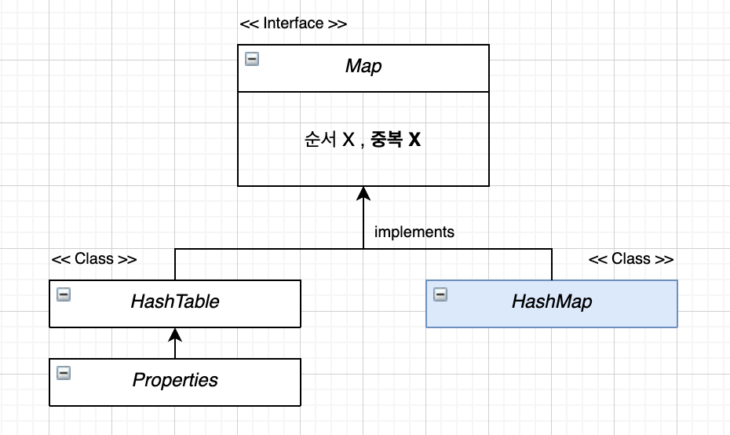

# 2-3. [Map] HashMap

## ✏️  [Map] HashMap



- 순서를 가지지 않으며 중복을 허용하지 않는다
- Collection의 계보가 아니므로, 독자적인 형태인 key-value의 형태로 데이터를 저장한다
- **[API문서 → java.util → Interface → Map](https://docs.oracle.com/javase/8/docs/api/)** 에서 자세한 내용을 확인할 수 있다
- Set의 메서드와 동일한 메서드를 사용하지 않는 것은 Collection 인터페이스의 계보를 잇지 않기때문이다
- 주요 메서드
    - 객체 추가 : `put(K key, V value)` → return V
    - 객체 삭제 : `remove(Object key)` → return V, `remove(Object key,  Object value)` → return boolean
    - key값을 사용해 value값 가져오기 → `get(Object key)` → return V
    - 모든 key 확인 : `keySet()` → return Set<S>
    - 모든 value 확인 : `values()` → return Collection<V>
    

## ✏️  [Map] HashMap : `put(K key, V value)`,  `keySet()` , `iterator()` , `size()`

```java
public static void main(String[] args) {	
		// <E> : Set안에 들어있는 객체 타입을 미리 지정할 수 있다
		Map<String, Integer> map = new HashMap<String, Integer>();
		
		map.put("jjangu", 60);
		map.put("yuri", 82);
		map.put("chulsu", 73);

		// 1. map의 모든 key값을 받아온다
		Set<String> keys = map.keySet();
		System.out.println(keys);

		// 2. set에 담겨진 key값을 iterator()함수를 적용해 뽑아낸다
		int total = 0;
		int average = 0;
		Iterator<String> it = keys.iterator();
		
		while(it.hasNext()) {
			String name = it.next();
			int score = map.get(name);
			total += score;
		}

		System.out.println("총점:" + total + ", 평균: " + total/map.size());
	}
```

- `Itorator` 와 `for문` 의 차이점
    - key값을 `keySet()` 으로 불러오면 return type이 `set` 이다
    - `set` 은 순서가 없으므로 일반적인 index를 사용하는 for문에 사용할 수 없다
    - 그렇기 때문에 `Map` 에는 `itorator()` Casting하여 일회용으로 for문을 돌릴 수 있도록 했다
        - `Itorator` 는 한번 사용한 후에는 다시 사용할 수 없다
    - `for-in문` 으로는 index없이도 for문을 사용할 수 있어서 `itorator()` 없이도 접근 가능하게 되었다

## ✏️  [Map] HashMap : `values()`

```java
Collection<Integer> scores = map.values();
int sum = 0;

for(int score : scores) sum += score;
System.out.println("총점 : " + sum); // 총점 : 215
System.out.println("최고 점수 : " + Collections.max(scores)); // 최고 점수 : 82
System.out.println("최저 점수 : " + Collections.min(scores)); // 최저 점수 : 60
```

- `values()` 는 Collection 타입의 객체를 반환하므로, [Collections 클래스](2-5%20Collections%20%E1%84%8F%E1%85%B3%E1%86%AF%E1%84%85%E1%85%A2%E1%84%89%E1%85%B3%2005e04d770bbc4c6a9bb5f0c9cd688950.md)의 메서드를 사용할 수 있다