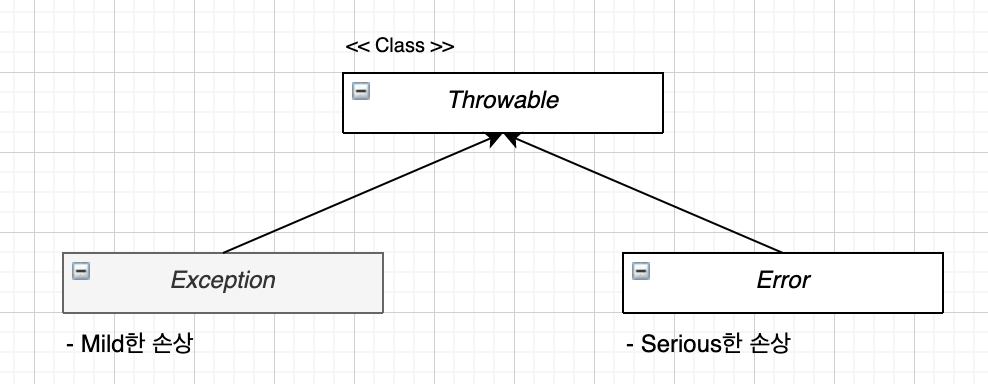

# 1. 예외 처리 (Exception)

## ✏️  API 문서 살펴보기

- java.util → Exception-Exception
    - Exception은 [java.lang.Throwable](https://docs.oracle.com/javase/8/docs/api/java/lang/Throwable.html) 의 자식이다
    - 다양한 자식 클래스를 가지며, 자식 클래스를 하나하나 파악하기보다 Exception을 먼저 이해하는 것이 좋다

## ✏️  예외(Exception)

- 프로그램을 실행하는 도중에 발생하는 예기치 못한 상황으로 일종의 버그를 말한다
- 버그를 처리하지 않으면 정상적으로 프로그램을 실행할 수 없다
- 예외 처리와 관련된 키워드 : `try` `catch` `finally` `throws` `throw`

- Exception : 개발자가 프로그래밍 처리를 통해 문제를 해결할 수 있는 경우의 Mild한 손상을 뜻한다
- Error : 장비의 손상으로 인해 개발자가 대응할 수 없는 경우의 Serious한 손상을 뜻한다 
(예) Phisical Memory full down, JVM Death

- Runtime 계열 Exception : 컴파일러가 인식하지 못한다 → 컴파일은 되나 Runtime에서 문제가 발생한다
- Compile 계열 Exception : 컴파일러가 인식한다 → 컴파일부터 문제가 발생한다

## ✏️  예외처리 방법

- 발생한 예외를 try-catch문을 사용해 명시적으로 즉각 처리한다 : [명시적 예외처리](1-1%20%E1%84%86%E1%85%A7%E1%86%BC%E1%84%89%E1%85%B5%E1%84%8C%E1%85%A5%E1%86%A8%20%E1%84%8B%E1%85%A8%E1%84%8B%E1%85%AC%E1%84%8E%E1%85%A5%E1%84%85%E1%85%B5%200a204648bd7444d5842fbd6d74d2b934.md)
- 즉각적으로 처리하지 않고 발생한 예외를 던진다 : [throws문](1-4%20throws%E1%84%86%E1%85%AE%E1%86%AB%20&%20%E1%84%8B%E1%85%A8%E1%84%8B%E1%85%AC%20%E1%84%8E%E1%85%A5%E1%84%85%E1%85%B5%20%E1%84%91%E1%85%A2%E1%84%90%E1%85%A5%E1%86%AB%203495c957458642229a7599fc0e7b8578.md)

## ✏️  예외의 종류

- `ArithmeticException` : 나누기 연산 시, 분모에 해당하는 값이 0 인경우 발생하는 예외
- `FileNotFoundException` : FileReader 객체로 외부 파일에 접근할 때, 파일이 존재하지 않은 경우 발생하는 예외