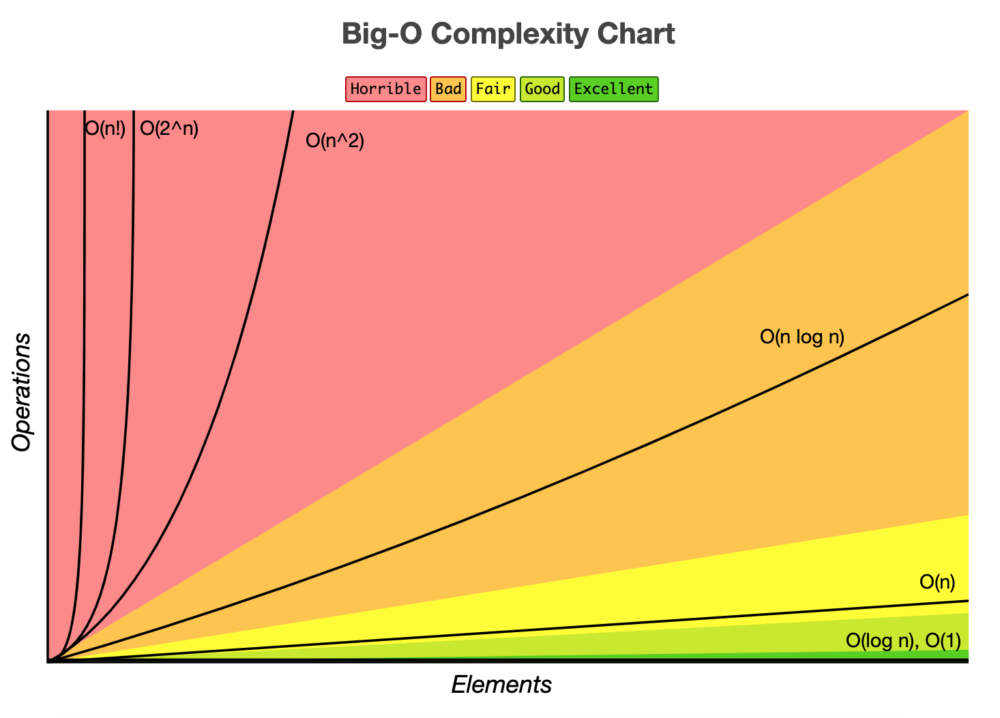
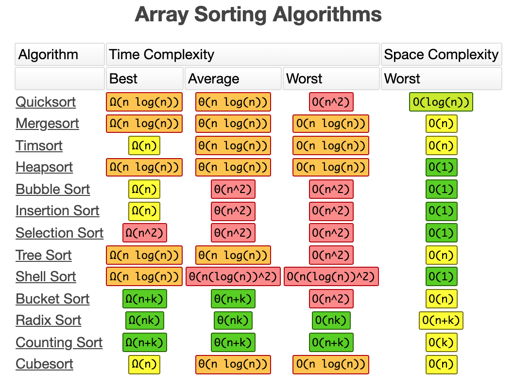

# 📌 7일차 
- 2021.10.01(금)
- 강의 : 수학 1~2강
  - 수학 Overview
  - 알고리즘 복잡도
  
<br>

### 👉 Overview
1. 알고리즘 복잡도 : 입력 크기 값에 대해 단위 연산 수행 횟수를 계산, 알고리즘 수행 시간을 평가하는 방법
2. 경우의 수
  - 어떤 사건 혹은 일이 일어날 수 있는 경우의 가짓수를 의미
  - 완전 탐색으로 경우의 수를 푸는 알고리즘
    - 순열      : 서로 다른 n개의 원소 중, r을 **중복 없이 골라 순서에 상관 있게 나열**하는 경우의 수 _(nPr)_
    - 조합      : 서로 다른 n개의 원소 중, r을 **중복 없이 골라 순서에 상관 없이 나열**하는 경우의 수 _(nCr)_
    - 중복순열   : 서로 다른 n개의 원소 중, r을 **중복 되게 골라 순서에 상관 없이 나열**하는 경우의 수 _(nH)_
3. 점화식 
  - 수열에서 이웃하는 두 개의 항 사이에 성립하는 관계를 나타낸 관계식
  - 대표적인 점화식
    - 등차 수열     : `F(n) = F(n-1) + a` <sup>* a : 고정된 상수</sup>
    - 등비 수열     : `F(n) = F(n-1) * a`
    - 팩토리얼      : `F(n) = F(n-1) * n`
    - 피보나치 수열  : `F(n) = F(n-1) + F(n-2)` 

<br> 


### 👉 알고리즘 복잡도
- 알고리즘 성능 평가 지표 : 정확성, 작업량, 메모리 사용량, 최적성, 효율성
- 효율성을 평가할 때에는 시간 복잡도와 공간 복잡도를 기준으로 한다
- 알고리즘 성능 평가 시, 메모리 사용량과 시간복잡도에 중점을 둔다



- **시간 복잡도**
  - 입력 크기 값에 대해 단위 연산 수행 횟수를 계산, 알고리즘 수행 시간을 평가하는 방법
  - 3가지 점근적 표현법
    1. Bic O (빅오) : **최악의 상황**을 고려한 성능 측정 결과 표현하며, 가장 일반적인 표현방법
      ✔  Big O(n!) > Big O(2^n) > Big O(n^2) > Big O(n log n) > Big O(n) > Big O(log n) > Big O(1)
    2. Θ (세타) : **평균적인 경우**에서의 성능 측정 결과 표현
    3. Ω (오메가) : **최선의 상황**일 때의 성능 측정 결과 표현 
      ✔  Big Ω(n!) > Big Ω(2^n) > Big Ω(n^2) > Big Ω(n log n) > Big Ω(n) > Big Ω(log n) > Big Ω(1)
  - [참고] https://www.bigocheatsheet.com/

```javascript
function big_o(n) {
  let sum = 0;    // 1회
  sum = n * 2;    // 1회
  return sum;     // 1회 
}
```
- 예제에서의 연산 수행 횟수는 총 `3` 이다 (실제 연산 수행 횟수 확인 방법과는 상이하지만 이해를 돕기 위해 간략히 보면)
- 연산 수행 횟수가 예제와 같은 상수인 경우는 그 값이 크더라도 `Big O(1)` 으로 표기한다
- `Big O(1)` 반복문이나 조건문이 없는 단순히 일련의 코드만을 수행하는 경우를 의미한다 

```javascript
function big_o(arr, n) {
  let sum = 0;                    // 1회

  for (let i = 0; i < n; i++){    // n회
    sum += arr[i];
  }

  return sum;                     // 1회
} 
```
- 예제에서의 연산 수행 횟수는 총 `n + 2` 이다
- 매개변수 n의 값에 따라서 연산 수행 횟수가 상이하다
- 연산 수행 횟수에 Big O 를 씌우면 상수는 표기를 생략하기 때문에 `Big O(n)` 으로 표기된다

```javascript
function big_o(arr, n) {
  let sum = 0;                    // 1회

  for(let i = 0; i < n ; i++){    // n * n = n^2
    for(let j = 0; j < n; j++){
      sum += arr[i][j]
    }
  }  

  return sum;                     // 1회
} 
```
- 이중 for문을 사용하기때문에 연산 수행 횟수는 총 `n^2 + 2` 이다
- 연산 수행 횟수에 Big O 를 씌우면 상수는 표기를 생략하기 때문에 `Big O(n^2)` 으로 표기된다

```javascript
function big_o(arr, n) {
  let sum = 0;                    // 1회

  for (let i =0; i < n; i *= 2){  // n/2회 
    sum += 2;
  }

  return sum;                     // 1회
} 
```
- for문의 증감식은 +1이 아닌 *2을 해주기 때문에 반복 횟수가 1/2 되어, 연산 수행 반복 횟수는  `n/2 + 2` 이다 
- 나눗셈은 Big O를 씌울 때 log로 치환하고 상수의 표시는 생략하므로 `Big O(log n)` 으로 표기된다


- Data Structure 요소들의 케이스별 시간복잡도를 정리한 표
- 시간복잡도는 어떤 상황에 어떤 Structure를 사용해야하는지에 대한 지표가 되어준다 


- 정렬 알고리즘별로 시간복잡도를 정리한 표


<br> 

