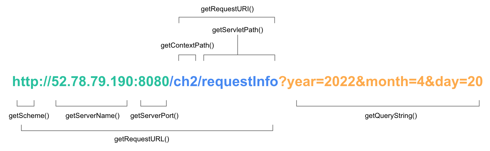

# 스프링의 정석
- 2022.04.19(화)
- 강의 목표: Spring의 기본 원리 이해, Spring으로 웹 사이트 구축 & AWS 배포
- 강의 자료: https://github.com/castello/spring_basic
- 강의 진도 
    - Ch023. HTTP 요청과 응답 - 실습 
    - Ch024. HTTP 요청과 응답 - 예제

<br>

## HTTP 요청과 응답 - 실습
- 프로그램의 실행결과를 콘솔창이 아닌 브라우저에 출력하는 방법에 대해 알아보자
- [참고] ctrl + shift + o : 자동 import
- [참고] Project > src > main > webapp > resources > img 경로 위치 

<br>

```java
package com.fastcampus.ch2;

import java.util.Calendar;

public class YoilTeller {

	public static void main(String[] args) {
		// 1. 입력
		String year = args[0];
		String month = args[1];
		String day = args[2];
		
		int yyyy = Integer.parseInt(year);
		int mm = Integer.parseInt(month);
		int dd = Integer.parseInt(day);
		
		// 2. 작업
		Calendar cal = Calendar.getInstance();
		cal.set(yyyy, mm-1, dd);
		
		int dayOfWeek = cal.get(Calendar.DAY_OF_WEEK);
		char yoil = " 일월화수목금토".charAt(dayOfWeek);
		
		// 3. 출력 
		System.out.println(year + "년 " + month + "월 " + day + "일은 ");
		System.out.println(yoil + "요일입니다");
	}
}
```
- 년,월,일을 입력하면 요일을 알려주는 프로그램을 작성한다

<br>

```cell
cd classes 
java com.fastcampus.ch2.YoilTeller 2021 10 1

// 실행 결과
2022년 4월 20일은 
수요일입니다
```
- 프로젝트의 target폴더에는 컴파일의 결과인 클래스파일이 존재한다
- `target 폴더 우클릭 → ShowIn → Terminal` 을 눌러 실행한다
- `java com.fastcampus.ch2.YoilTeller 2021 10 1`
	- `java`: java 인터프리터가 클래스파일의 MainMethod를 호출한다
	- `om.fastcampus.ch2.YoilTeller`: 패키지명과 클래스명을 입력
	- `2021 10 1`: 공백을 기준으로 값을 분리하여 String 배열(args)에 넣어 전달한다

<br>

### URL을 통한 요청과 응답
- 요청: `HttpServletRequest` 객체를 만들어 요청데이터를 담아 전달한다
- 응답: `HttpServletResponse` 객체를 만들어 응답데이터를 담아 전달한다
- 메인 메서드의 `String argus[]` 대신 `HttpServletRequest request`를 매개변수로 사용한다

<br>

### HttpServletRequest의 메서드



- 메서드의 설명과 실행 결과에 대한 정리는 아래를 참고한다
	- [참고] https://github.com/castello/spring_basic/blob/main/ch2/RequestInfo.java
- `?year=2022&month=4&day=20` = 쿼리스트링: URL에 붙여서 전달하는 값을 의미한다 

### 최종 실습 코드
```java
package com.fastcampus.ch2;

import java.io.IOException;
import java.io.PrintWriter;
import java.util.Calendar;

import javax.servlet.http.HttpServletRequest;
import javax.servlet.http.HttpServletResponse;

import org.springframework.stereotype.Controller;
import org.springframework.web.bind.annotation.RequestMapping;

// (1) 프로그램 등록 
@Controller 
public class YoilTeller {
	// (2) URL 매핑 
	@RequestMapping("/getYoil")
	public static void main(HttpServletRequest request, HttpServletResponse response) throws IOException {
		// 1. 입력
		String year = request.getParameter("year");
		String month = request.getParameter("month");
		String day = request.getParameter("day");
		
		int yyyy = Integer.parseInt(year);
		int mm = Integer.parseInt(month);
		int dd = Integer.parseInt(day);
		
		// 2. 작업
		Calendar cal = Calendar.getInstance();
		cal.set(yyyy, mm-1, dd);
		
		int dayOfWeek = cal.get(Calendar.DAY_OF_WEEK);
		char yoil = " 일월화수목금토".charAt(dayOfWeek);
		
		// 3. 출력 
		response.setContentType("text/html");
		response.setCharacterEncoding("utf-8");
		PrintWriter out = response.getWriter();
		out.println(year + "년" + month + "월" + day + "일은 ");
		out.println(yoil + "요일입니다");
	}
}
```
- `out.println` 에 <태그> 의 형태로 출력하면, 브라우저가 html으로 해석해서 화면에 띄워준다
	- (예) `out.println("<html>");`
- [참고] 리소스의 종류
	- 정적 리소스: 이미지파일, `*.html`, `*.css`, `*.js`
	- 동적 리소스: 프로그램이 생성해내는 고정되어 있지 않은 리소스 결과 (예) 스트리밍
- [예제] 주사위 이미지를 활용하여 랜덤으로 주사위 이미지가 html태그를 사용해 보여지게 한다
	- [이미지 소스] https://github.com/castello/spring_basic/blob/main/ch2/dice.zip

<br>

### Recap
- 원격 접근 허용하기
	1. 프로그램 등록: `@Controller`
	2. URL 매핑: `@RequestMapping`
- HTTP 요청과 응답
	1. 입력
		- 메인 메서드의 매개변수는 
			1. `HttpServletRequest request` 
				- 요청 시 전달할 데이터는 `HttpServletRequest` 객체에 담아 전달한다
				- 요청 시 전달한 데이터를 객체에서 얻기 위해서는 `객체명.getParameter(key)` 를 사용한다
			2. `HttpServletResponse response`
				- `response.getWriter()`: `HttpServeltResponse`를 통해 출력 스트림을 얻어와 `PrintWriter` 객체에 담는다 
	2. 작업
	3. 출력 
		- 브라우저가 전달할 수 있는 데이터는 String과 binary뿐이다
		- 브라우저가 어떤 데이터를 보낼 것인지에 대한 정보가 필요하고, 아래와 같이 명시한다
			- `response.setContentType("text/html");`: 데이터 유형 명시
			- `response.setCharacterEncoding("utf-8");` 텍스트의 인코딩 방법 명시 
		- `response.getWriter()`: `HttpServeltResponse`를 통해 출력 스트림을 얻어와 `PrintWriter` 객체에 담는다 
		- `PrintWriter` 객체의 `println()` 메서드를 통해 브라우저에 출력한다 
- image 경로: 프로젝트>src>main>webapp>resources>img 
	- 사용할 때 경로는 `resources/img/OOO.jpg`
