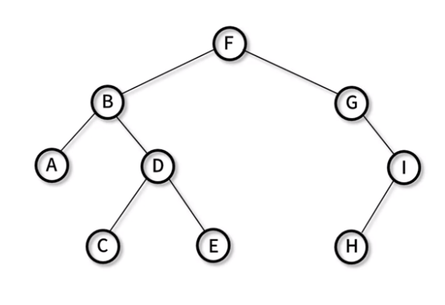
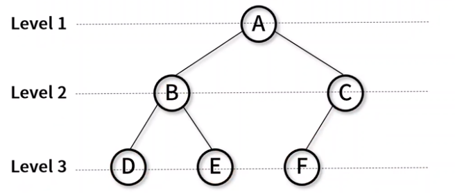
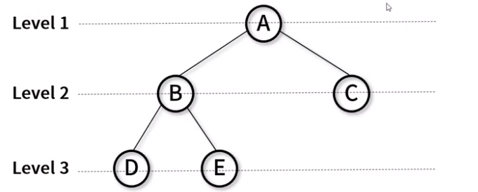

# 📌 21일차 
- 2021.10.15(금)
- 강의 : 비선형 자료구조 46~51강
  - 이진 트리


<br> 


### 👉 이진 트리 (Binary Tree)



- 각각의 노드가 최대 두개의 자식 노드를 가지는 트리 자료 구조 (트리 차수가 2인 트리)
- 현재 노드를 기준으로 왼쪽에는 작은 값, 오른쪽은 큰 값으로 정렬한다
- 활용 방식
  - 검색과 정렬 : 이진 탐색 트리와 이진 힙 구현에 활용
  - 허프만 코딩 : 연관 분기 구조 위한 데이터 표현에 활용
- 이진 트리 종류
  - 포화 이진 트리(Perfect binary tree)
  - 완전 이진 트리(Complete binary tree)
  - 정 이진 트리(Full binary tree)
  - 편향 이진 트리(Skewed binary tree)
  - 균형 이진 트리(Balanced binary tree)


<br>


### 👉 포화 이진 트리


- 모든 레벨의 노드가 가득 채워져 있는 트리
- Leaf 노드를 제외한 모든 자식은 2개의 노드를 보유한다
- 노드의 개수 : `n = 2^h -1`

<br> 


### 👉 완전 이진 트리



- 마지막 레벨 전까지 노드가 가득 채워져 있고, 마지막 레벨은 왼쪽부터 순차적으로 채워져있는 형태의 트리
- 배열을 사용해 효율적으로 표현할 수 있다
- 노드의 개수 : `n < 2^h -1`

<br> 


### 👉 정 이진 트리



- 모든 노드가 0개 또는 2개의 자식노드만 갖는 트리를 말한다
- proper 또는 plane 이진 트리라고 불린다
- 노드의 개수 : `n <= 2^h -1`

<br> 


### 👉 편향 이진 트리


- 왼쪽 혹은 오른쪽으로 편향되어 치우쳐있는 트리
- 각각의 높이에 하나의 노드만이 존재한다
- 노드의 개수 : `h`

<br> 


### 👉 균형 이진 트리


- 삽입과 삭제가 이루어질 때, 왼쪽 서브 트리와 오른쪽 서브트리의 높이 차를 1이하로 맞추는 이진 탐색 트리
- 서브 트리와의 높이 차이 항상 1 이하로 유지한다 를
- 균형 트리의 종류 : AVL 트리, Red-Black 트리, B트리, B+트리, B*트

<br> 


### 👉 이진 트리 순회


- 각각의 노드가 최대 2개의 자식노드를 가지는 이진 트리를 순회하는 방법
- 구현 메서드
  - 노드 추가 : `BinaryTree._insertNode()`, `BinaryTree.insert()`
  - 전위 순회 : `BinaryTree._preOrderTraverseNode()`, `BinaryTree.preOrderTraverse()`
  - 중위 순회 : `BinaryTree._inOrderTraverseNode()`, `BinaryTree.inOrderTraverse()`
  - 후위 순회 : `BinaryTree._postOrderTraverseNode()`, `BinaryTree.postOrderTraverse()`
  - 층별 순회 : `BinaryTree.levelOrderTraverse()`

<br> 


### 👉 이진 트리 순회 구현 : Node(), BinaryTree(), _insertNode(), insert()
```javascript
// Node()
function Node(value){
  this.value = value;
  this.left = null;
  this.right = null;
};

// BinaryTree()
function BinaryTree(){
  this.root = null; 
};

// _insertNode()
BinaryTree.prototype._insertNode = function(node, value){
  if(node === null){
    node = new Node(value);
  }else if (value < node.value){
    // 현재 노드보다 value가 작으면 왼쪽 
    node.left = this._insertNode(node.left, value);
  }else if (value >= node.value){
    // 현재 노드보다 value가 크면 오론쪽 
    node.right = this._insertNode(node.right, value);
  }
};

// insert()
BinaryTree.prototype.insert = function(value){
  this.root = this._insertNode(this.root, value);
};
```
- 메서드명 앞에 _ 를 사용하면 내부적으로만 사용하는 함수인 private function임을 의미한다

<br> 


### 👉 이진 트리 전위 순회 구현 : _preOrderTraverseNode(), preOrderTraverse()
```javascript
// _preOrderTraverseNode()
BinaryTree.prototype._preOrderTraverseNode = function(node, callback){
  if(node === null) return;
  callback(node);                                   // N
  this._preOrderTraverseNode(node.left, callback);  // L
  this._preOrderTraverseNode(node.right, callback); // R
};

// preOrderTraverse()
BinaryTree.prototype.preOrderTraverse = function(callback){
  this._preOrderTraverseNode(this.root, callback);
};
```
```javascript
let tree = new BinaryTree();

tree.insert("");
tree.insert("");
tree.insert("");
tree.insert("");
tree.insert("");
tree.insert("");
tree.insert("");
tree.insert("");
tree.insert("");

console.log(tree);

function printNode(node){
  process.stdout.write(`${node.value} -> `);
}

tree.preOrderTraverse(printNdoe);
console.log("end");

// F -> B -> A -> D -> C -> E -> G -> I -> H -> end
```
- `_preOrderTraverseNode()` : 재귀로 트리를 전위 순회 
- `preOrderTraverse()` : 전위 순회하며 노드 출력 

<br> 


### 👉 이진 트리 중위 순회 구현 : _inOrderTraverseNode(), inOrderTraverse()
```javascript
// _inOrderTraverseNode()
BinaryTree.prototype._inOrderTraverseNode = function(node, callback){
  if(node === null) return;
  this._inOrderTraverseNode(node.left, callback);   // L
  callback(node);                                   // N
  this._inOrderTraverseNode(node.right, callback);  // R
}

// inOrderTraverse()
BinaryTree.prototype.inOrderTraverse = funtion(){
  this._inOrderTraverseNode(this.root, callback);
}

```
- `_inOrderTraverseNode()` : 재귀로 트리를 중위 순회
- `inOrderTraverse()` : 중위 순회하며 노드 출력 

<br> 


### 👉 이진 트리 후위 순회 구현 : _postOrderTraverseNode(), postOrderTraverse()
```javascript
// _postOrderTraverseNode()
BinaryTree.prototype._postOrderTraverseNode(node, callback){
  if(node === null) return;
  this._postOrderTraverseNode(node.left, callback);
  this._postOrderTraverseNode(node.right, callback);
  callback(node);
}

// postOrderTraverse()
BinaryTree.prototype.postOrderTraverse(callback){
  this._postOrderTraverseNode(this.root, callback);
}
```
- `_postOrderTraverseNode()` : 재귀로 트리를 후위 순회
- `postOrderTraverse()` : 후위 순회하며 노드 출력 

<br> 


### 👉 이진 트리 층별 순회 구현 : Queue(), levelOrderTraverse()
```javascript
// Queue 객체 추가
function Queue(array){
  this.arr = arr ? arr : [];
}
Queue.prototype.isEmpty = function(){ return this.arr.lenght === 0; };
Queue.prototype.enqueue = function(element){ return this.arr.push(element); };
Queue.prototype.dequeue = function(){ return this.arr.shift; };

// levelOrderTraverse()
BinaryTree.prototype.levelOrderTraverse(callback){
  let q = new Queue();
  let node;
  q.enqueue(this.root);
  while(!q.isEmpty()){
    node = q.dequeue();
    callback(node);
    if(node.left !== null) q.enqueue(node.left);
    if(node.right !== null) q.enqueue(node.right);
  }
}
```

<br> 


