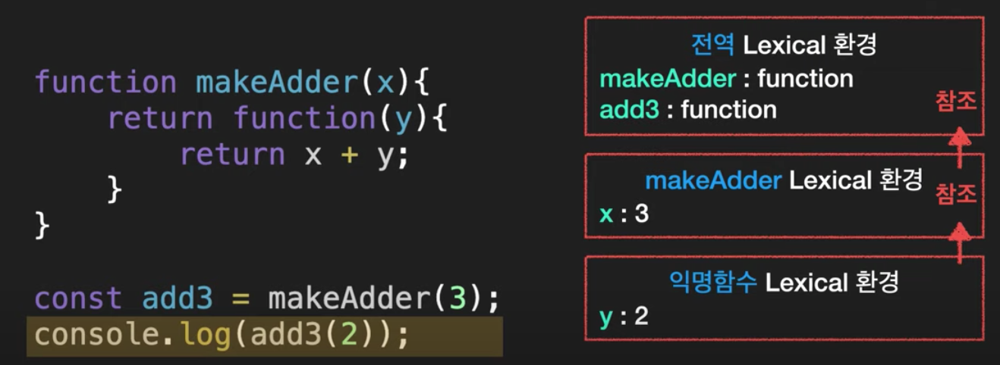

# 🔥 자바스크립트 중급 강좌(140분 완성) 정리

- 작성일 : 2022. 01. 23(일)
- 강의 : <a href="https://youtu.be/4_WLS9Lj6n4">자바스크립트 중급 강좌(140분 완성)</a>
- 진도 : (11) Closure

<hr>
<br>

## (11) 클로저
### 00. 클로저를 공부하기 전에
- 클로저를 공부하기에 앞서 실행 컨텍스트와 렉시컬 환경에 대한 공부를 선행하는 것을 추천한다
  - 호이스팅과 TDZ : 01-1.TemporalDeadZone(TDZ) 
  - 렉시컬 환경과 렉시컬 스코프 : <a href="https://github.com/dev-ku/Today-I-Learned/blob/main/javascript/%EC%9E%90%EB%B0%94%EC%8A%A4%ED%81%AC%EB%A6%BD%ED%8A%B8%20%EC%A4%91%EA%B8%89%20%EA%B0%95%EC%A2%8C(140%EB%B6%84%20%EC%99%84%EC%84%B1)/11-1.LexicalEnviroment%20VS%20LexicalScope.md">11-1.LexicalEnviroment VS LexicalScope</a>
  - ES5.1 이전의 실행 컨텍스트 : <a href="https://github.com/dev-ku/Today-I-Learned/blob/main/javascript/%EC%9E%90%EB%B0%94%EC%8A%A4%ED%81%AC%EB%A6%BD%ED%8A%B8%20%EC%A4%91%EA%B8%89%20%EA%B0%95%EC%A2%8C(140%EB%B6%84%20%EC%99%84%EC%84%B1)/11-2.LexicalEnviroment%20VS%20ExecutionContext(1).md">11-2.LexicalEnviroment VS ExecutionContext(1)</a>
  - ES5.1 이후의 실행 컨텍스트 : <a href="https://github.com/dev-ku/Today-I-Learned/blob/main/javascript/%EC%9E%90%EB%B0%94%EC%8A%A4%ED%81%AC%EB%A6%BD%ED%8A%B8%20%EC%A4%91%EA%B8%89%20%EA%B0%95%EC%A2%8C(140%EB%B6%84%20%EC%99%84%EC%84%B1)/11-3.LexicalEnviroment%20VS%20ExecutionContext(2).md">11-3.LexicalEnviroment VS ExecutionContext(2)</a>
<br>

### 01. 클로저
- JS엔진에서 코드가 실행되면 코드 실행 환경인 실행 컨텍스트가 생성된다
- 실행 컨텍스트는 2개의 환경(컴포넌트/프로퍼티)를 가진다
  - 어휘적 환경(Lexical Environment) = 렉시컬 환경
  - 변수적 환경(Variable Enviroment)
- JS엔진에서 코드가 실행될 때, 실행 컨텍스트의 생성 과정에 대해 살펴보자

<br>

```javascript
let one;
one = 1;

// 함수 선언식
function addOne(num){
  console.log(one+num);
}

addOne(5); // 6
```
- 자바스크립트 코드가 실행되면 실행 컨텍스트가 생성된다
- 실행 컨텍스트의 생성 단계에서는 식별자들이 렉시컬 환경에 아래와 같은 형태로 올라간다.
  - Lexical 환경
    - `one : <uninitialized>` → 초기화되지 않은 값을 의미 = 사용 불가
    - `addOne : <function>` → 함수 선언분은 선언과 초기화가 동시에 일어난다 = 사용 가능
- 실행 단계에서는 변수 선언 및 초기화 코드를 만나, 렉시컬 환경의 식별자가 초기화된다
  - `let one;` → `one : undefined`
  - `one = 1`  → `one : 1`

<br>


- 함수를 호출하는 코드를 만나면, 함수를 위한 실행 컨텍스트가 생성된다
  - 함수 내부의 식별자는 함수 실행 컨텍스트의 렉시컬 환경에 아래와 같은 형태로 올라간다
    - Lexical 환경
      - `num = 5` → 함수 실행 컨텍스트에는 지역변수 뿐만아니라 arguments에 대한 식별자도 올라간다
      - `외부에 대한 참조 = 전역 렉시컬 환경`
        - 필요한 식별자를 내부 렉시컬환경에서 찾지 못하면  
        - 외부 렉시컬 환경에 대한 참조를 타고 올라가 필요한 식별자를 찾는다

<br>


- `makeAdder()`의 return 값인 익명 함수는
  - y 를 가지고 있으며, 상위함수인 `makeAdder`의 x에 접근할 수 있다
  - `add3` 함수가 생성된 이후에도, 상위 함수인 `makeAdder`의 x에 접근할 수 있다
- 이러한 함수를 `Closure` 이라 부르며, 함수와 렉시컬 환경의 조합으로
- 함수가 생성될 당시의 외부 변수를 기억하고, 생성된 이후에도 계속 접근할 수 있다
- 외부 함수의 실행이 끝나, 외부 함수가 소멸된 이후에도 내부 함수가 외부 함수의 변수에 접근할 수 있다
- 클로저를 사용하면 소멸된 외부 함수의 식별자를 은닉하는 것이 가능하다


