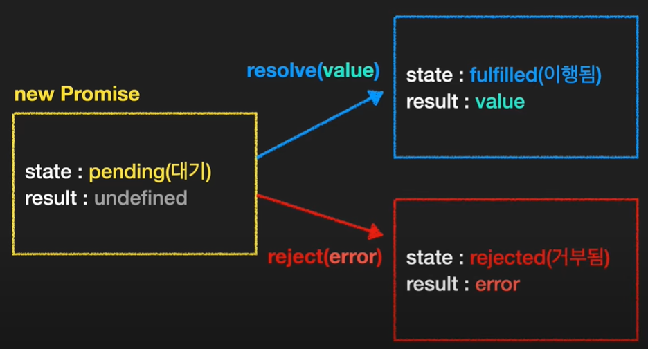
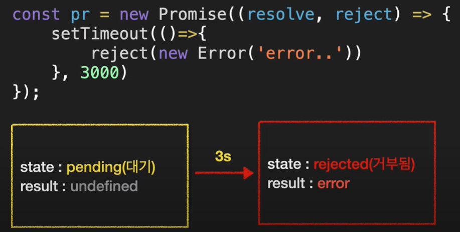

# 🔥 자바스크립트 중급 강좌(140분 완성) 정리

- 작성일 : 2022. 01. 24(월)
- 강의 : <a href="https://youtu.be/4_WLS9Lj6n4">자바스크립트 중급 강좌(140분 완성)</a>
- 진도 : (16) Promise

<hr>
<br>

## (16) 프로미스(Promise)
```javascript
const pr = new Promise(function(resolve, reject){
    // code 
});
```
- ES6에 도입된 프로미스는 자바스크립트의 대표적인 비동기 처리방식이다
- `resolve` 는 실행 결과가 성공인 경우 실행될 함수
- `reject` 는 실행 결과가 실패인 경우 실행될 함수
- 이렇게 어떤 일이 실행된 이후 실행될 함수는 콜백함수라고 부른다
- 프로미스의 콜백함수에 return value를 인자로 담아 전달할 수있다

<br>
<br>



- `new Promise()` 생성자가 반환하는 객체는 `state`와 `result` 프로퍼티를 갖는다 
    - `state` : 프로미스의 실행 결과가 성공인지 실패인지에 대한 상태값을 저장한다
    - `result` : 프로미스의 실행 결과로 받아온 인자 값을 바인딩한다

<br>
<br>


- `state` 의 초기값은 대기를 의미하는 `pending` 이었다가
    - 실행에 성공하면, 이행되었다는 의미의 `fulfilled` 값을 가진다
- `result` 의 초기값은 `undefined` 이며
    - 실행에 성공하면, resolve와 함께 전달받은 value가 바인딩된다


<br>
<br>



- `state` 의 초기값은 대기를 의미하는 `pending` 이었다가
    - 실행에 실패하면, 거부되었다는 의미의 `rejected` 값을 가진다
- `result` 의 초기값은 `undefined` 이며
    - 실행이 실패하면, reject함수와 함께 전달받은 error가 바인딩된다
    - error를 만들어 보낼 때는 `new Error()` 와 같이 `new` 키워드와 `Error` 생성자를 사용한다

<br>

### 프로미스의 then(), catch(), finally()
```javascript
console.log("구매 진행 중....")

function success(item){ console.log(`${item} 구매 성공`); }
function fail(err){  console.log(`${error} 에러 발생`); }

const pr = new Promise(function(resolve, reject){
    setTimeout(function(){
        resolve("가구");
    }, 3000);
});

pr.then(success, fail); // 가구 구매 성공
```
- `then()` 을 사용해 `resolve` 와 `reject` 를 처리할 수 있다
- 실행에 성공한다면, `resolve`의 인자값으로 받아온 value(OK)가 result에 바인딩된다
```javascript
// pr.then(success, fail); 

pr.then(
   function(result) { console.log("SUCCESS"); } 
   function(error) { console.log("ERROR"); } 
)
```
- `then()` 안에 위와 같이 실행에 성공했을 경우와 실패한 경우를 한번에 처리할 수 있다
```javascript
// pr.then(success).catch(fail); 

pr.then(
   function(result) { console.log("SUCCESS"); } 
).catch(
   function(error) { console.log("ERROR"); } 
)
```
- `catch()` 를 추가로 사용하여 에러가 발생한 경우를 분리하여 처리하기도 한다
- `catch()` 를 사용해 성공과 실패를 구분해주는 것이 가독성이 높으므로 권장한다
```javascript
pr.then(
   function(result) { console.log("SUCCESS"); } 
).catch(
   function(error) { console.log("ERROR"); } 
).finally(
    function() {console.log("CLEAR"); }
)
```
- `finally()` 는 실행 결과에 상관없이 무조건 실행된다

<br>

### 프로미스체인(PromiseChain)
```javascript
function func1(callback){
    setTimeout(function(){
        console.log("1번 완료");
        callback();
    }, 1000);
}

function func2(callback){
    setTimeout(function(){
        console.log("2번 완료");
        callback();
    }, 3000);
}

function func3(callback){
    setTimeout(function(){
        console.log("3번 완료");
        callback();
    }, 2000);
}

console.log("START");

func1(function(){ 
    func2(function(){
        func3(function(){
            console.log("END");
        })
    }) 
});
```
- 콜백함수를 중첩하여 사용하는 경우 콜백 지옥이라고 부른다

```jsx
function f1(msg) {
    console.log(msg);
    return new Promise(function(res, rej){
        setTimeout(function(){
            res("1번 주문 완료");
        }, 1000);
    });
}

function f2(msg) {
    console.log(msg);
    return new Promise(function(res, rej){
        setTimeout(function(){
            res("2번 주문 완료");
        }, 3000);
    });
}

function f3(msg) {
    console.log(msg);
    return new Promise(function(res, rej){
        setTimeout(function(){
            res("3번 주문 완료");
        }, 2000);
    });
}

f1("START")
.then((res) => f2(res))
.then((res) => f3(res))
.then((res) => console.log(res));
```
- 콜백함수 대신, 프로미스체인을 사용하면 더 간결하게 코드를 작성할 수 있다
```jsx
function f1(msg) {
    console.log(msg);
    return new Promise(function(res, rej){
        setTimeout(function(){
            res("1번 주문 완료");
        }, 1000);
    });
}

function f2(msg) {
    console.log(msg);
    return new Promise(function(res, rej){
        setTimeout(function(){
            rej("ERROR");
        }, 3000);
    });
}

function f3(msg) {
    console.log(msg);
    return new Promise(function(res, rej){
        setTimeout(function(){
            res("3번 주문 완료");
        }, 2000);
    });
}

f1("START")
.then((res) => f2(res))
.then((res) => f3(res))
.then((res) => console.log(res))
.catch((res) => console.log(res))
.finally(() => console.log("END"));
```
- `catch()` 와 `finally()` 를 함께 사용하기도 한다
- `f2()` 에서 에러가 발생했고, 그 이후의 프로미스 체인은 실행되지 않은채로 `finally()`가 동작한다

<br>

### Promise.all
```jsx
function f1() {
    return new Promise(function(res, rej){
        setTimeout(function(){
            res("1번 주문 완료");
        }, 1000);
    });
}

function f2() {
    return new Promise(function(res, rej){
        setTimeout(function(){
            res("2번 주문 완료");
        }, 3000);
    });
}

function f3() {
    return new Promise(function(res, rej){
        setTimeout(function(){
            res("3번 주문 완료");
        }, 1000);
    });
}

Promise.all([ f1(), f2(), f3() ]).then(function(res){
    console.log(res);
});

// [ '1번 주문 완료', '2번 주문 완료', '3번 주문 완료' ]
```
- 여러개의 프로미스를 한번에 실행하고자 할 때 `Promise.all` 을 사용한다
- 실행하고자하는 프로미스는 배열에 담아 `Promise.all(arr)` 의 인자로 전달한다
- 모든 프로미스가 종료되었을 때, `then()`이 한번에 실행된다
- 그렇기때문에 `Promise.all()` 은 하나의 정보라도 누락되면(하나라도 reject되면) 에러가 발생하므로 사용시에 주의하도록 하자
 
<br>

### Promise.race
```jsx
function f1() {
    return new Promise(function(res, rej){
        setTimeout(function(){
            res("1번 주문 완료");
        }, 2000);
    });
}

function f2() {
    return new Promise(function(res, rej){
        setTimeout(function(){
            res("2번 주문 완료");
        }, 3000);
    });
}

function f3() {
    return new Promise(function(res, rej){
        setTimeout(function(){
            res("3번 주문 완료");
        }, 1000);
    });
}

Promise.race([ f1(), f2(), f3() ]).then(function(res){
    console.log(res);                   // 3번 주문 완료        
    console.log("END");               // END
});
```
- 모든 프로미스가 종료되었을 때 `then()` 이 실행되는 `Promise.all` 과 다르게
- 프로미스 중 하나라도 종료되면 `then()` 이 실행된다