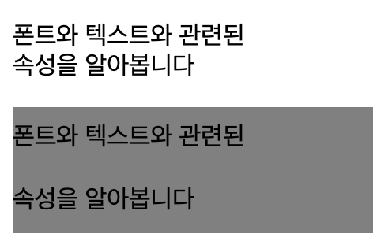

# 📌 12일차 
- 2021.09.08(수)
- 목차 : 폰트/텍스트 관련 속성

<br>

## ✅ 폰트/텍스트 관련 속성 
### 👉 폰트/텍스트 관련 속성
```html
<div>
    <p class="default"> 폰트와 텍스트와 관련된<br>속성을 알아봅니다 </p>
    <p class="text"> 폰트와 텍스트와 관련된<br>속성을 알아봅니다 </p>
</div>
```
```css
.text {
    color : tomato;
    font-size : 20px; 
    font-style : italic;
    font-weight : 400;
    font-family : Verdana, Arial, Helvetica, sans-serif;
}
```


<br>

1. `color` : 글자 색상을 지정한다. 색상 키워드, hex 값 등을 값으로 가진다 
   
2. `font-size` : 글자 크기를 지정한다. 크기 키워드, px, em 등의 단위를 사용하기도 한다
    - [참고] https://developer.mozilla.org/ko/docs/Web/CSS/font-size
    
3. `font-style` : 글자 스타일을 지정한다. `italic`, `oblique` 등의 값을 갖는다
    - 기본값은 `normal`이고, 글씨체에 따라서 적용되는 스타일의 형태가 다르다
    - [참고] https://developer.mozilla.org/en-US/docs/Web/CSS/font-style
    
4. `font-weight` : 글자의 굵기를 지정한다.
    - 일반적으로 100단위로 값을 사용하고, 굵기 키워드를 사용하기도 한다 (예) normal, bold, bolder ....
    - 글씨체마다 지원하는 글자 굵기가 다르기때문에, 확인하고 사용하자
    - [참고] https://developer.mozilla.org/ko/docs/Web/CSS/font-weight

5. `font-family` : 글씨체를 설정한다
    - 웹 브라우저나 OS에 따라서 기본 글씨체가 설정된다
    - 여러개의 글씨체를 설정하면, 사용 언어나 사용 환경에 따라서 사용 가능한 글씨체가 사용된다 
    - Generic family : 가장 마지막에 대부분의 브라우저가 지원하는 Generic family를 사용한다
        - 종류 : `sans-serif`, `serif` , `cursive` 등 ..
    - [참고] https://developer.mozilla.org/en-US/docs/Web/CSS/font-family

<br>

----
```html
<div>
    <p class="default"> 폰트와 텍스트와 관련된<br>속성을 알아봅니다 </p>
    <p class="text"> 폰트와 텍스트와 관련된<br>속성을 알아봅니다 </p>
</div>
```
```css
.text {
    background-color : gray; 
    line-height : 40px; 
}
```



<br>

6. `line-height` : 행간을 설정한다
    - 글씨체에 따라서 행간 설정이 다르다
    - 통일감을 주기위해서 상황에 따라 설정하는 것을 추천한다

<br>

### 👉 font의 단축 속성 (short-hand)
```css
.default {
   font-size : 20px;
   font-family : 'sans-serif';
   font-weight : bold;
   font-style : italic;
   line-height : 40px;
}
```
```css
.test{
   font : italic bold 20px/40px 'sans-serif';
}
```
- 같은 맥락의 CSS 속성(short-hand)을 한번에 묶어 스타일을 적용할 때 사용한다
- `font`의 단축 속성(short-hand)을 작성할 때에 빼먹은 속성은 `initial` 값이 적용되니 주의하자
- `font-family` 는 단축 속성(short-hand) 중 항상 마지막에 위치해야한다
- `font-weight`, `font-style`은 반드시 `font-size`보다 앞에 작성한다
- [참고] https://developer.mozilla.org/en-US/docs/Web/CSS/font


<br>

### 👉 `letter-spacing` 과 `word-spacing`
- 글씨체에 따라 적합한 여백이 정해져 있다. 
- 이를 다루고 싶을 때 `letter-spacing` 와 `word-spacing` 를 사용한다
- 입력 값은 기본 여백에 +,-되어 적용된다
- 사용 가능한 단위는 `px`, `em`, `%` 등 이 있다
- 사실 기본값이 가장 최적의 간격이므로, 간격을 따로 조정하지 않는 것이 가독성이 좋아 웹 접근성에 부합한다
 
<br>

```css
.test { 
   letter-spacing:5px;     /* 기본 글자 간격 + 5px을 의미 */
   word-spacing:-5px;      /* 기본 단어 간격 - 5px을 의미 */
}   
```

1. `letter-spacing` : 글자간의 사이 간격 (default:normal)
   - **[참고1]** https://developer.mozilla.org/ko/docs/Web/CSS/letter-spacing
2. `word-spacing` : 단어간의 사이 간격 (default:normal)
   - **[참고2]** https://developer.mozilla.org/ko/docs/Web/CSS/word-spacing

<br>

### 👉 `text-align` 
```css
.test { text-align : center; }
```
- 텍스트 정렬을 할 때 사용한다
- `left`, `center`, `right`, `justify` 등의 값을 가진다
- `text-align`을 사용하기 위해서는 요소가 블록 요소(block) 이어야만 한다
- 요소의 `width`값이 너무 좁을 때에도 제대로 적용되지 않을 수 있다 
- **[참고]** https://developer.mozilla.org/ko/docs/Web/CSS/text-align

<br>

### 👉 `text-indent` 
```css
.test { text-indent : 10px; }
```
- 텍스트의 첫 줄에 들여쓰기가 필요할 때 사용한다 
- `px`, `em`, `%` 등의 단위와 함께 사용할 수 있다
- `text-indent`을 사용하기 위해서는 요소가 블록 요소(block) 이어야만 한다
- **[참고]** https://developer.mozilla.org/en-US/docs/Web/CSS/text-indent
 

<br>

### 👉 `text-decoration` 
```css
.test { 
   color : tomato;
   text-decoration : line-through underline blue 3px double;  
}
```
- `text`와 관련된 속성을 한 줄로 작성하는 단축 속성(short-hand)이며, 속성의 순서는 상관없다
- 4개의 속성을 하나로 합친 단축 속성(short-hand)<br>
  :  `text-decoration-line`, `text-decoration-color`, `text-decoration-style`, `text-decoration-thickness`
- 속성을 따로따로 사용하기보다 단축 속성(short-hand)을 더 많이 사용한다 
- `text-decoration-line`은 하나의 값만을 가지는 것이 아니라, 중첩해서도 사용할 수 있다
- `text-decoration-line`을 중첩하여 사용할 때에는 붙여서 사용해야한다
- 따로 색상을 설정하지 않으면 `text-decoration`은 글자색과 같은 색상을 가진다.
- `text-decoration-line`의 값 : `normal`, `underline`, `overline`, `line-through`
- `text-decoration-style`의 값 : `solid`, `double`, `dotted`, `dashed`, `wavy`
- **[참고]** https://developer.mozilla.org/en-US/docs/Web/CSS/text-decoration
 
<br>

### 👉 `word-break` 
```html
<p lang="en">...</p>
<p lang="ko">...</p>
<p class="test test1" lang="en">...</p>
<p class="test test1" lang="ko">...</p>
<p class="test test2" lang="en">...</p>
<p class="test test2" lang="ko">...</p>
```
```css
p { width:40px; background-color:gray;}
p.test { background-color:tomato; }
p.test1 { word-break:break-all; }
p.test2 { word-break:keep-all; }
```
- 텍스트가 자신의 콘텐츠 박스를 넘치게 된 상황일 때, 개행을 할 지를 지정할 때 사용한다
- 언어에 따라서 동작 방식이 조금 다르다 
- `word-break` 의 키워드 : `normal`, `break-all`, `keep-all` ...
   - `normal` : default 값으로 언어마다 맞는 설정을 적용한다
   - `break-all` : html문서를 한/중/일 외의 언어로 작성했을 때 사용 (영어) → 정해진 박스를 넘쳐서 범위를 벗어난다
   - `keep-all` : html문서를 한/중/일 언어로 작성했을 때 사용  → 정해진 박스 내에서 개행된다
- **[참고]** https://developer.mozilla.org/en-US/docs/Web/CSS/word-break
 


<br>

### 👉 `text-transform` 
```css
.test { text-transform : uppercase ; }
```
- 사용 가능한 언어가 한정적이라, 한국어에는 사용할 수 없다 (영어는 가능하다)
- `text-transform`을 사용해서 대소문자 설정을 바꾸는 것은 스타일을 적용하는 것이므로, 실제 html문서에는 반영되지 않는다.
- `uppercase` : 모든 글자를 대문자로 변경
- `lowercase` : 모든 글자를 소문자로 변경 
- `capitalize` : 모든 단어의 첫 글자가 대문자로 변경 
- **[참고]** https://developer.mozilla.org/en-US/docs/Web/CSS/text-transform
 


