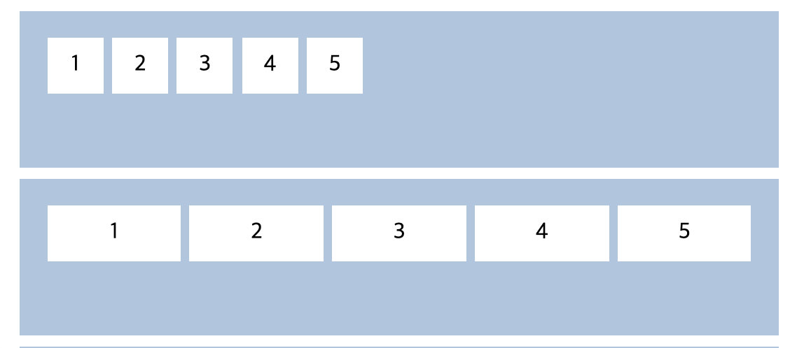
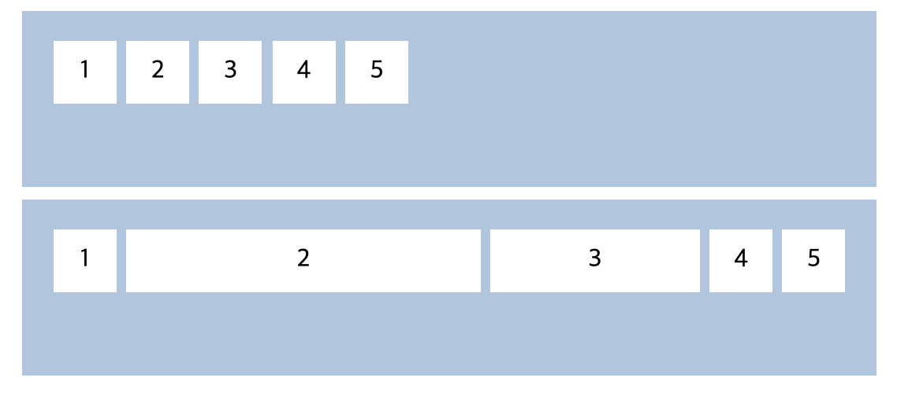

# 📌 16일차 
- 2021.09.12(일)
- 목차 : flexbox 

<br>

## ✅ Flexbox
### 👉 Flexbox 개요 
```css
.container { display : flex; }
.container>.item { width:50px; height:50px; }
```
- 요소의 레이아웃 설계를 위한 방법 
- `display:inlin-block`과 `float`는 원하는 레이아웃을 설정하기 힘들다 
- `display:flex`를 부모 요소에 사용하면 원하는 레이아웃으로 설정할 수 있다 
    - 자식 요소들이 가로 정렬된다
    - 부모 요소의 크기에 맞춰 자식 요소의 `width`값이 자동으로 변경된다  


<br>

### 👉 Flexbox 용어
- `flex container` : `item`을 감싸주는 부모 요소
- `flex item` : `container`의 자식 요소를 의미
- `flex container`와 `flex item`이 사용할 수 있는 속성이 다르므로 잘 구분해두자
- `flexbox` 는 1차원의 직선 형태의 정렬을 의미한다 
- `main axis` : 주축의 기본 값(default)은 가로축 
- `cross axis` : 교차축의 기본 값(default)은 세로축
- `axis` 의 기준은 변경될 수 있다

<br>


### 👉 Item : `order`
```css
.container  {
    height:200px; margin:10px;
    background-color:lightsalmon; 
    display:flex;  
}
.item:nth-child(3){order:1;}
.item:nth-child(5){order:8;}
.item:nth-child(4){order:-10;}
```


- `flex` 또는 `grid`가 적용된 `container`안에서 자신의 위치를 설정한다
- 정수를 사용할 수 있고, 음수도 사용할 수 있다 
- HTML문서 내부의 순서나 tab 순서와는 상관없고 화면에 보여지는 순서에만 영향을 준다 
- `item`에 `order`를 사용하려면 부모 요소가 `display:flex`이어야만 한다 
- 초기값 : `order:0` 
- 초기값이 0이므로, 특정 `item`을 맨 앞으로 보내고자 할 때에는 음수를 사용해야한다

<br>


### 👉 Item : `flex-grow`
- 선행 조건 : `item` 요소의 크기가 `container`보다 작을 때 사용할 수 있다
- `container`에 남는 공간을 `item`에게 어떤 비율로 할당할지에 대한 속성 
- `flex-grow : 0;` : 초기 값. `item`의 `max-width`가 자기 자신의 `width`
- `<number>`자료형을 값으로 갖기 때문에, `float`도 사용할 수 있다. (음수는 불가능)

```css
.item{ flex-grow:1 }
```



- `flex-grow : 1;` : `container`의 공간이 남아있는 경우 모든 `item`이 동일 비율로 남은 공간을 나눠가진다 

  
```css
.item:nth-child(2) { flex-grow:2 }  
.item:nth-child(3) { flex-grow:1 }
```


- `item` 마다 `flex-grow`의 값을 다르게 준다면, 해당 값에 맞는 비율대로 남은 공간을 나눠가진다

<br>


### 👉 Item : `flex-shrink`
- `flex-grow` 로 설정된 비율은 `item`의 크기가 커질 때 적용될 비율을 의미하고
- `flex-shrink` 는 `item`의 크기가 줄어들 때 적용될 비율을 의미한다 
- 선행 조건 : `item` 요소의 크기가 `container`보다 클 때 사용할 수 있다
- `<number>` 자료형을 값으로 갖고, 음수 값은 사용할 수 없다
- 초기 값 : `flex-shrink : 1;`
- `flex-shrink : 0 `은 `min-width`가 자기 자신의 `width`와 같다

<br>


### 👉 Item : `flex-basis`
- `flex-item`의 초기 크기를 지정한다
- `item`이 가지는 `width`값을 지정할 수 있는 속성
- `flex-basis:0` 으로 설정하면 기존의 `width`값과 상관없이 
  <br>`item`의 `width`가 `flex-grow`,`flex-shrink`에 맞춰 조절된다
- `flex-grow`,`flex-shrink`을 사용할 때에는 `flex-basis`의 설정이 중요하다


<br>


### 👉 Item : `flex` 단축 속성 (short hand)
- `item`이 `container`에 차지하는 공간에 맞추기위해 크기를 늘리거나 줄일 때의 방법을 설정하는 단축 속성
- `flex` = `flex-grow` + `flex-shrink` + `flex_basis`
- 단축 속성인 `flex`를 사용할 때에는 속성을 입력하는 순서가 중요하다
  - `flex : flex-grow flex-shrink flex_basis`
- 속성별 초기값
  - `flex-grow : 0 ;`
  - `flex-shrink : 1 ;`
  - `flex-basis : auto ;` : 작성하지 않았을 때 초기값을 따라가지 않는다 주의!
-----
```css
/* 1~2개의 단위 없는 숫자 값을 사용하면, `flex-basis`의 값은 초기값인 `auto`가 아닌 `0`이 적용된다 */

.test { flex-grow : 1; }      /* flex-basis : auto; */
.test { flex : 1; }           /* flex-basis : 0;    */

```
- `flex` 작성 방법
  - 1~2개의 단위 없는 숫자 값을 사용하면, `flex-basis`의 값은 초기값인 `auto`가 아닌 `0`이 적용된다
  - 값을 하나 작성했을 때 
    - `<number>`자료형을 사용하면 `flex-grow`
    - `<length>`, `<percentage>` 자료형을 사용하면 `flex-basis`
    - 이 외에도 `none` `auto` `initial` 중 하나를 사용할 수 있다 
  - 값을 두개 작성했을 때
    - 첫번째 값은 반드시 `<number>` 자료형을 사용해야한다
    - `<number>`자료형을 사용하면 `flex-shrink`
    - `auto` 혹은 `<length>`, `<percentage>` 자료형을 사용하면 `flex-basis`
  - 값을 세개 작성했을 때
    - `flex-grow` 에 사용할 `<number>`
    - `flex-shrink` 에 사용할 `<number>`
    - `flex-basis` 에 사용할 `<length>`, `<percentage>` 또는 `auto`

<br>


