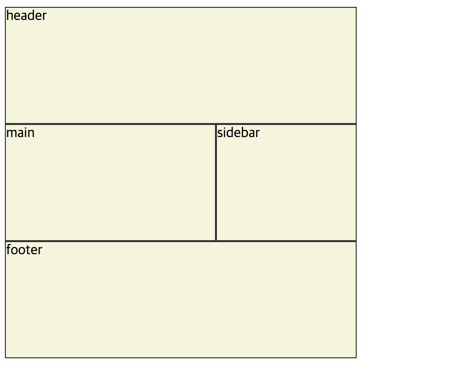
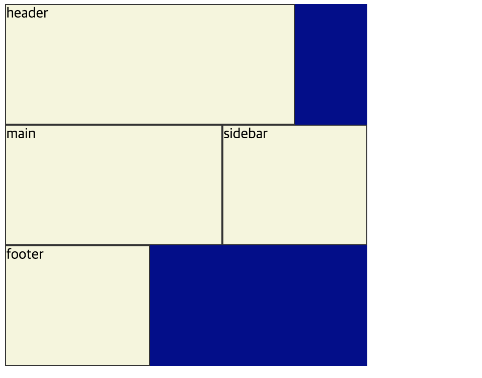

# 📌 18일차 
- 2021.09.14(화)
- 목차 : grid

<br>

## ✅ Grid
### 👉 Grid 개요 
- 웹 페이지의 2차원 레이아웃을 위한 시스템으로, 컨텐츠의 행과 열을 배치할 수 있다
- 복잡한 레이아웃을 직관적으로 구축할 수 있어 편리하다
- `FlexBox`는 기본적으로 `main-axis`의 `item`을 다루기위한 1차원 레이아웃을 위한 개념이다
- 반면 `Grid`는 `main-axis`뿐만아니라 `cross-axis`도 다루기 위한 2차원 레이아웃 시스템이다 
- 하나의 `Grid`는 열(`columns`)과 행(`rows`)으로 구성되며, 행과 열 사이의 간격을 `gutters`라고 말한다
- `Grid`를 사용해 요소의 순서가 변경되더라도, 이는 스타일적인 부분이며 실제 html문서의 작성순서가 변경되는 것은 아니다 


<br>


### 👉 Container : `display`
```css
.container{ 
    display : inline-grid; 
    grid-template-columns:1fr 1fr 1fr;
    width:200px;
}
```
- `container` 의 `display-outside:inline`, `dislay-inside:grid`로 지정하려면 `display:inline-grid`를 사용한다 (CSS3방식)
-----
- `display-outside` : **형제 요소**와의 배치 방법을 설정
    - 키워드 : `inline` `block` `inline-block` 
- `display-inside` : **자식 요소**를 어떻게 배치할지를 설정
    - 키워드 : `flex` `grid` 
- `display-outside` 와 `display-inline`을 함께 지정하려면 
    - CSS2의 작성 방식(`display-legacy`) : `display : inline flex;`
    - CSS3의 작성 방식 : `display : inline-flex;` 


<br>


### 👉 Container : `grid-template-rows`  
```css
.container { 
    display : grid;
    grid-template-rows : 100px 100px;
}
```
- 몇 개의 행(row)을 갖게 할 것인지에 대한 속성
- 값을 n개 작성하면, 작성한 높이를 가지는 n개의 행(row)이 지정된다
- 명시적으로 높이값을 지정했기 때문에, `container`의 크기에 변화가 있어도 높이값이 유지된다
```css
.container {
    display : grid;
    grid-template-rows : 100px 120px;
}
.item { width:80px; height:80px; }

/* 
1행 height : 100px; 
2행 height : 120px;
3행~5행 height : 80px; /* 원래 item이 갖고 있던 height*/
*/
```
- 만약 `grid-template-rows`에 입력한 값의 개수보다 행이 많다면
- `grid-template-rows`를 통해 높이 값이 지정되지 않은 행은 본인의 원래 `height`를 유지한다.
```css
.container{
    display:grid;
    grid-template-rows : 1fr 1fr 1fr 1fr;
}
```
- `fr` : `px`이나 `em` 등의 단위를 사용하는 값이 아니라, 비율을 의미한다.
```css
.container{
    display:grid;
    /* grid-template-rows : 100px 100px 100px 100px; */
    grid-template-rows : repeat(4, 100px);
}
```
- 값을 여러번 작성할수도 있지만, `repeat(n, value)` 함수를 사용해 작성할 수도 있다

<br>


### 👉 Container : `grid-template-columns`
```css
.container { 
    display : grid;
    grid-template-colums : 100px 50px 100px;
}
```
- 몇 개의 열(column)을 갖게 할 것인지에 대한 속성
- 값을 n개 작성하면, 작성한 가로 너비를 가지는 n개의 열(column)이 지정된다
- 명시적으로 너비값을 지정했기 때문에, `container`의 크기에 변화가 있어도 너비값이 유지된다
- 만약 `grid-template-columns`에 입력한 값의 개수보다 열이 많다면
- `grid-template-columns`를 통해 너비 값이 지정되지 않은 행은 본인의 원래 `width`를 유지한다.
- `fr` : `px`이나 `em` 등의 단위를 사용하는 값이 아니라, 비율을 의미한다. 
- `fr` 을 여러번 작성할수도 있지만, `repeat(n, value)` 함수를 사용해 작성할 수도 있다

<br>


### 👉 Container : `grid-template-areas` 
- 각각의 셀에 이름을 붙여, 열과 행의 병합을 설정할 수 있다
- 병합 없이, 셀의 자리를 비워두고 싶을 때에는 `.`을 사용한다
- 반드시 모든 `item`의 덩어리가 사각형의 형태가 되게 작성을해야 적용된다
```html
<div class="container">
  <div class="item header">header</div>
  <div class="item main">main</div>
  <div class="item sidebar">side-bar</div>
  <div class="item footer">footer</div>
</div>
```
```css
.container {
  width: 400px; height: 400px;
  display: grid;
  grid-template-columns: repeat(5, 1fr);
  grid-template-rows: repeat(3, 1fr);
  grid-template-areas:
    "hd hd hd hd hd"
    "ma ma ma sb sb"
    "ft ft ft ft ft";
}
.item {background-color:beige; border: 1px solid #333;}
.hd { grid-area: hd; }
.ma { grid-area: ma; }
.sb { grid-area: sb; }
.ft { grid-area: ft; }
```

- `item`에 이름을 붙여, `grid-template-areas`에서 열과 행의 병합을 설정할 수 있다
- `item`에 이름을 붙일 때에는 `grid-area`를 사용한다 
- 반드시 지정된 `container`의 행과 열에 맞춰 `grid-template-areas`에 값을 넣어주어야한다
```css
.container {
  grid-template-areas:
    "hd hd hd hd ."
    "ma ma ma sb sb"
    "ft ft . . .";
}
```

- 반드시 지정된 `container`의 행과 열에 맞춰 `grid-template-areas`에 값을 넣어주어야하는데
- 만약 셀을 비우고 싶을 때에는 `.`을 사용한다 
```css
/* 원하는 결과 얻을 수 없음! */
.container {
  grid-template-areas:
    "hd hd . hd ."
    "ma . ma sb sb"
    "ft ft . . .";
}
```

- 이 때, 병합이 연결되지 않게 값을 넣게 되면 원하는 결과를 얻을 수 없으니 주의하자


<br>


### 👉 Container : `row-gap`, `column-gap`, `gap` 
```css
.container{
  display:grid;
  grid-template-colums:repeat(3, 1fr);
  grid-template-row:repeat(3, 1fr);
  
  /*row-gap:20px; column-gap:50px*/
  gap : 20px 50px;
}
```
- `row-gap` : 행 사이의 간격을 지정한다
- `column-gap` : 열 사이의 간격을 지정한다 
- `gap` : 행과 열 사이의 간격을 지정하며, 먼저 작성한 값이 `row-gap`, 나중에 작성한 값이 `column-gap`에 적용된다 
- `grid-row-gap`과 `grid-column-gap`라는 이름으로 사용했으나 현재는 Deprecated 되었다
- 특정 브라우저에서는 사용될수도 있으니 기억해두자 

<br>


### 👉 Container : `grid-auto-rows`, `grid-auto-columns` 
- `grid-template-rows`, `grid-template-columns`으로 개수를 넘치는 `item`의 경우 
- `item`에 지정되어있는 스타일의 `width`, `height`가  적용된다
- 이 때, `grid-auto-rows`, `grid-auto-columns` 을 사용해 넘치는 `item`의 스타일도 지정할 수 있다
```css
.container{
  display:grid;
  grid-template-rows : repeat(3, 1fr);
  grid-template-columns : repeat(3, 1fr);
  
  grid-auto-rows : 100px;
  grid-auto-columns : 100px;
}
```
- `grid-auto-rows` : 넘치는 행의 높이(height)를 **암시적으로 명시한다** 
- `grid-auto-columns` : 넘치는 열의 너비(width)를 **암시적으로 명시한다**   
- 암시적으로 명시하는 값이기 때문에, `item`이 없는 한 시각적으로 확인할 수 없다 
- 반면 `grid-template-rows`, `grid-template-columns`는 `item`의 유무를 떠나 시각적인 확인이 가능하다 


<br>


### 👉 Container : `grid-auto-flow` 
- `item`이 자리를 찾아가는 과정은 일련의 CSS 내부 알고리즘에 의해 결정된다
- 이 때의 방법을 지정하는 것이 `grid-auto-flow`
- 키워드
  - `row` : `main-axis`의 방향으로 흐른다
  - `column` : `cross-axis`의 방향으로 흐른다
  - `dense` : `item`이 한 칸이 아닌 여러칸을 차지하는 경우, `dense`를 사용한다
  - `dense` 는 단독으로 사용할 수없고, 반드시 다른 키워드인 `row`이나 `column`과 함께 사용한다
---------
- `dense` 추가 설명 
  - 말하자면 `dense`는 줄 서 있는 손님 일행의 수에 맞춰 빈 자리를 유연하게 배정하는 방식
  - 식당의 자리가 나는 순서 `1인석 / 1인석 / 2인석`
  - 줄서있는 손님의 순서 `A:1명 / B:2명 / C:1명`
  - `dense`가 없는 경우는 손님을 들여보낼 때 무조건 웨이팅 순서를 따른다면 (`A/1인석 → B/2인석 → C/1인석`)
  - `dense`를 사용하면, 식당의 자리에 맞춰 유연하게 순서를 변경해 배정한다 (`A/1인석 → C/1인석 → B/2인석`)


<br>


### 👉 Container : `grid` (short hand) 
- `Container`에 사용할 수 있는 속성을 한 줄로 작성할 수 있는 단축 속성
- 많은 속성을 한 줄로 단축해서 사용하기 때문에, 직접 작성하는 연습을 거친 후에 단축 속성을 사용하는 편을 추천한다
- 사용하기보단 해석을 할 수 있는 정도로 공부해두도록 하자
- **단축 속성**
  - 외재적인 속성 (명시적) : `grid-template-rows` `grid-template-columns` `grid-template-areas`
  - 내재적인 속성 (암시적) : `grid-auto-rows` `grid-auto-columns` `grid-auto-flow`
- 외재적인 속성은 `item`의 유무와 다르게 자리를 확인 할 수 있고, 내재적인 속성은 `item`이 없다면 눈으로 확인할 수 없다
- 작성 시, `/`를 구분자로 사용하고 앞쪽은 `row`와 관련된 설정, 뒤쪽은 `column`과 관련된 설정을 작성한다
- `row`와 `column`에 관련된 속성 중 하나는 반드시 외재적인 속성을 사용해야한다
- **[참고]** https://developer.mozilla.org/ko/docs/Web/CSS/grid

<br>


