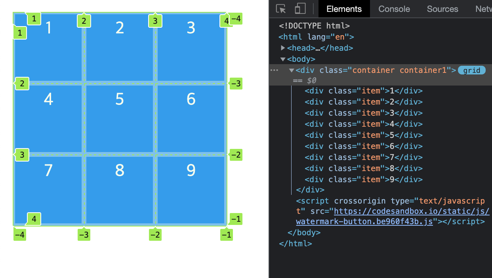
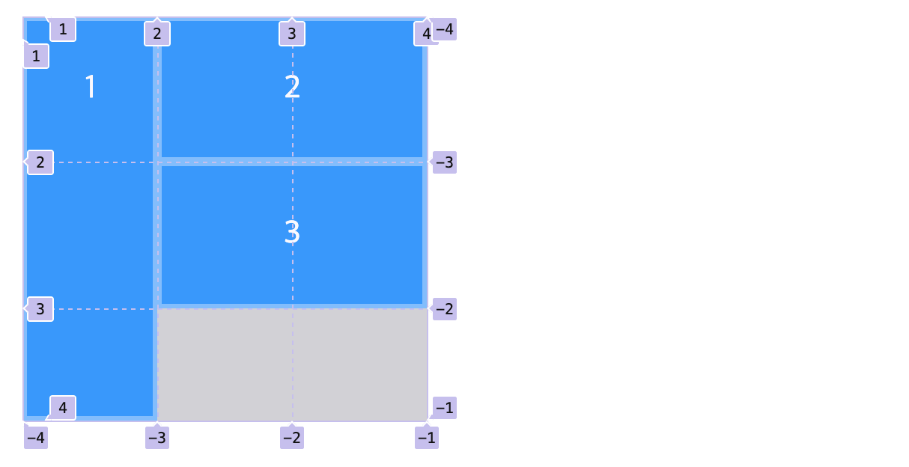
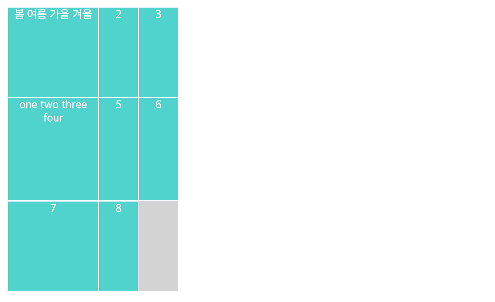
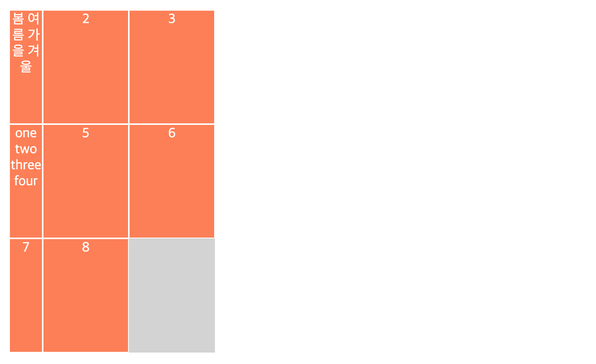
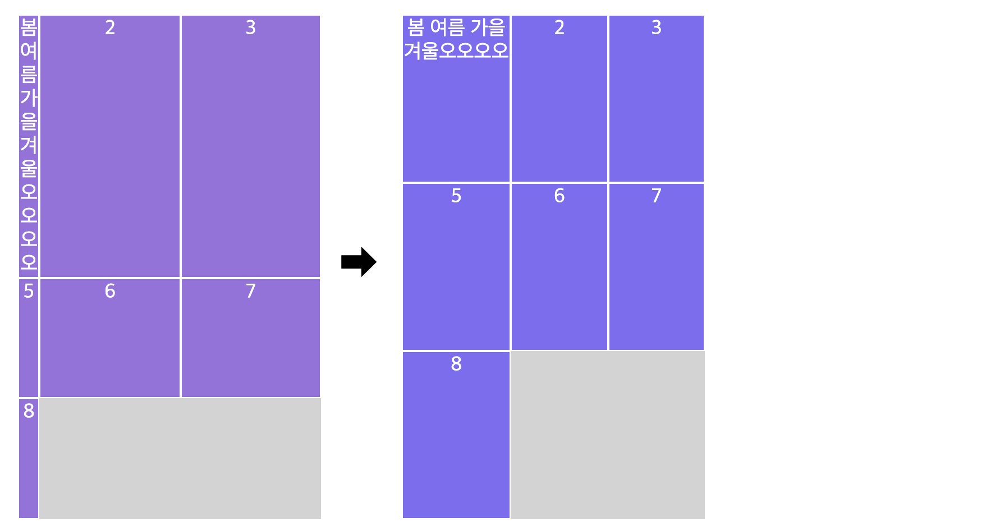
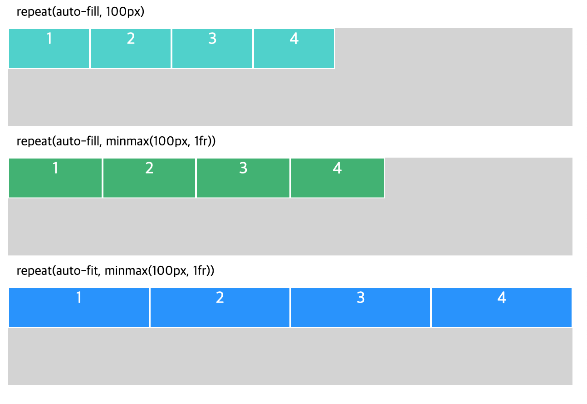

# 📌 19일차 
- 2021.09.15(수)
- 목차 : grid

<br>

## ✅ Grid
### 👉 Grid 개요 
- 웹 페이지의 2차원 레이아웃을 위한 시스템으로, 컨텐츠의 행과 열을 배치할 수 있다
- 복잡한 레이아웃을 직관적으로 구축할 수 있어 편리하다
- `FlexBox`는 기본적으로 `main-axis`의 `item`을 다루기위한 1차원 레이아웃을 위한 개념이다
- 반면 `Grid`는 `main-axis`뿐만아니라 `cross-axis`도 다루기 위한 2차원 레이아웃 시스템이다 
- 하나의 `Grid`는 열(`columns`)과 행(`rows`)으로 구성되며, 행과 열 사이의 간격을 `gutters`라고 말한다


<br>


### 👉 Container : `justify-content`
- `container` 의 크기가 `content`보다 커서 남는 공간이 있어야 `justify-content`를 사용할 수 있다 
- `justify-content`는 `container`의 남는 공간을 어떻게 사용할 것인가에 대한 속성이다
- `flexbox`와 마찬가지로 `main-axis`를 기준 축으로 가진다
- 키워드
  - `start` : `main-axis`가 시작하는 방향부터 정렬
  - `end` : `main-axis`가 끝나는 방향부터 정렬
  - `center` : `main-axis`의 시작과 끝의 중간 자리에 정렬
  - `space-around` : `main-axis`의 시작과 끝을 지키며, `item` 사이의 간격을 동일하게 설정 
  - `space-between` : `item` 사이의 앞 뒤 간격을 동일하게 설정 


<br>

### 👉 Container : `align-content`
- `justify-content`와 달리 `cross-axis`를 기준 축으로 가진다
- 키워드
  - `start` : `cross-axis`가 시작하는 방향부터 정렬
  - `end` : `cross-axis`가 끝나는 방향부터 정렬
  - `center` : `cross-axis`의 시작과 끝의 중간 자리에 정렬
  - `space-around` : `cross-axis`의 시작과 끝을 지키며, `item` 사이의 간격을 동일하게 설정 
  - `space-between` : `item` 사이의 앞 뒤 간격을 동일하게 설정 

<br>


### 👉 Container : `justify-items` , `justify-self`
```css
.item:nth-child(1) {
  width: 40px;
  height: 40px;
}
.item:last-child {
  width: 60px;
  height: 60px;
  justify-self: center;
  align-self: center;
}
```


- `main-axis`를 기준 축으로 가진다
- 정해진 `grid`의 크기보다 `item`의 크기가 작은 경우, `item`을 어떻게 정렬할 것인지에 대한 속성이다
- 키워드
  - `strech` : 정해진 `grid`의 크기에 맞춰 `item`의 크기가 늘어난다 / 초기값(default)
  - `center` : 정해진 `grid` 영역의 중간에 `item`의 크기 그대로 자리한다
  - `start` : 정해진 `grid` 영역의 `main-axis`의 시작 부분에 `item`의 크기 그대로 자리한다
  - `end` : 정해진 `grid` 영역의 `main-axis`의 끝 부분에 `item`의 크기 그대로 자리한다
- 특정 `item` 의 `justify-items`를 변경하고 싶은 경우는 `justify-self`를 사용한다

<br>


### 👉 Container : `align-items` 
```css
.item {
  font-size: 24px;
  line-height: 40px;
  color: #fff;
  text-align: center;
  border: 4px solid #fff;
}
```

- `justify-items`와 달리 `cross-axis`를 기준 축으로 가진다
- 정해진 `grid`의 크기보다 `item`의 크기가 작은 경우, `item`을 어떻게 정렬할 것인지에 대한 속성이다
- 키워드
  - `strech` : 정해진 `grid`의 크기에 맞춰 `item`의 크기가 늘어난다 / 초기값(default)
  - `center` : 정해진 `grid` 영역의 중간에 `item`의 크기 그대로 자리한다
  - `start` : 정해진 `grid` 영역의 `cross-axis`의 시작 부분에 `item`의 크기 그대로 자리한다
  - `end` : 정해진 `grid` 영역의 `cross-axis`의 끝 부분에 `item`의 크기 그대로 자리한다
- 특정 `item` 의 `align-items`를 변경하고 싶은 경우는 `align-self`를 사용한다

<br>


### 👉 Item : `grid-row`, `grid-column`
  


- `grid`를 사용하면 `grid`의 카운트는 각 행과 열이 아니라, 선으로부터 시작한다
- `grid-start`와 `grid-end`의 값으로는 `grid`가 가지는 선의 순서를 사용한다
- 명시적으로 `grid`를 지정한 경우 가장 마지막 선의 순서는 `-1`으로 표현할 수 있다
- 위의 이미지대로 선의 순서가 표현된다면, `grid-row:1/3` 과 `grid-row:1/-2`의 형태가 동일하다 

```css
.item:first-child {
  grid-row: 1 / -1;
}
.item:nth-child(2) {
  grid-column: 2 / 4;
}
.item:last-child {
  grid-column: 2 / span 2;
}
```

- `grid-row` : `grid-start`와 `grid-end`의 단축 속성
- `grid-column` : `grid-start`와 `grid-end`의 단축 속성
- 작성할 때 순서는 반드시 `grid-start` `grid-end` 순으로 작성하고, `/` 로 구분한다 
- 만약 작성할 때, `grid-start`은 정확하게 명시하고 끝은 시작점(n)으로부터 m개로 작성하고 싶다면 
- `grid-row : n / span m`의 형태로 작성한다 
- `grid-column` 역시 `grid-column : n / span m`로 작성한다
<br>


### 👉 Item : `grid-area`
```css
.item:firset-child{
  /*
  grid-row : 4 / span 2;
  grid-column : 2 / -1;
  */
  
  grid-area : 4 / 3 / spa2 / -1;
}
```

- `item`에 이름을 붙여, `grid-template-areas`에서 열과 행의 병합을 설정할 수 있다
- `item`에 이름을 붙일 때에는 `grid-area`를 사용한다 
- `grid-row-start`, `grid-column-start`, `grid-row-end`, `grid-column-end`의 단축 속성으로도 사용한다
- 단축 속성을 사용할 때, 속성의 구분자로 `/`를 사용한다
- `grid-row-start`, `grid-column-start`, `grid-row-end`, `grid-column-end`의 순서를 지켜 작성한다 

<br>


### 👉 Item : `order` 
- `container` 내부에서의 배치 순서를 지정한다
- `order`의 초기값은 0 이고, 동일 값을 갖는 경우 소스코드의 순서대로 정렬된다
- `<integer>` 자료형을 사용하며, 음의 정수도 사용할 수 있다
- 보여지는 `item`의 순서만 변경되고, 실제로 html문서 내부에서의 순서는 변하지 않는다
<br>


### 👉 Item : `z-index` 
- `grid-row`와 `grid-column`을 명시적으로 작성하다보면 `item`이 겹치는 경우가 발생할 수 있다
- 겹치는 범위의 `item`의 `z축` 순서를 지정할 때 사용한다 

<br>


### 👉 Grid 단위 - `fr`, `min-content`, `max-content` 
- `fr` : 절대 단위가 아닌 상대적인 비율을 지정할 때 사용한다
- `min-content` : `content`의 문자열 중, 가장 큰 문자열을 기준으로 너비를 결정한다 / 키워드 자체를 값처럼 사용
- `max-content` : `content`을 한 줄에 보일 수 있게 너비를 설정한다 / 키워드 자체를 값처럼 사용
```css
.container{
  grid-template-rows : repaet(3, 100px);
  grid-template-columns : 160px 1fr 1fr;
}
```

- 절대 단위와 `fr`이 함께 사용하면, 절대 단위로 설정된 크기를 제외한 공간을 동일 비율로 나눠갖는다
```css
.container{
  grid-template-rows : repaet(3, 1fr);
  grid-template-columns : min-content 1fr 1fr;
}
```

- `min-content`는 문장을 구성하는 문자열 중 가장 긴 문자열을 기준으로 `width`를 설정한다
- 영문으로 작성된 문장은 문자열을 구분하는 기준이 `spacing`으로 문제 없이 실행된다 
- 반면 한글로 작성된 문장은 다른 셀의 문장을 기준을 따라가게된다
  

- 만약 다른 셀에 기준이 될 문장이 없는 경우 한글자마다 개행된다
- 한글자씩 개행되는 것을 막으려면 `word-break:keep-all;` 속성을 사용하면 되는데
- 이는 한글에 `min-content`가 제대로 먹히게끔 도움을 주는 것은 아니다
- `word-break`는 개행 설정을 바꾸어주어 글자 하나를 기준으로 개행하는 것을 막아준다

```css
.container{
  grid-template-rows : repaet(3, 1fr);
  grid-template-columns : max-content 1fr 1fr;
}
```


<br>


### 👉 Grid 단위 - `auto-fill`, `auto-fit`
- 반응형 웹을 만드는데에 유용하게 사용하는 단위인 `auto-fill`, `auto-fit`에 대해 알아보자
- `auto-fill` : `container`의 공간에 여유가 있을 때, `column`의 개수를 유연하게 조절할 때 사용한다
- `auto-fit` :  기본적으로 `auto-fill`와 동일하게 적용된다
    - `column`의 개수를 조절했음에도 남는 공간의 사용하는 방법이 `auto-fill`과 다르다 
    - `auto-fill`은 남는 공간을 그대로 두는데, `auto-fill`은 `item`의 크기를 늘려 남는 공간을 꽉 채운다

```css
.container1, .container2{
  displya:grid;
  grid-template-columns: repeat(auto-fill, 100px);
  grid-auto-rows:50px;
}
.container2{
  grid-template-columns: repeat(auto-fill, minmax(100px, 1fr));
}
.container3{
  grid-template-columns: repeat(auto-fit, minmax(100px, 1fr));
}
```


- `minmax(min,max)` : `item`의 최소값과 최대값을 설정할 수 있다
- `auto-fill`과 `minmax()`를 함께 사용하면 `container`에 남는 공간 없이 사용할 수 있다

<br>


