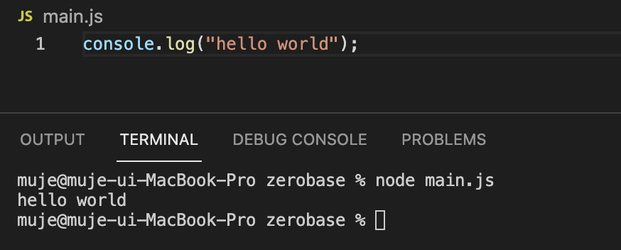
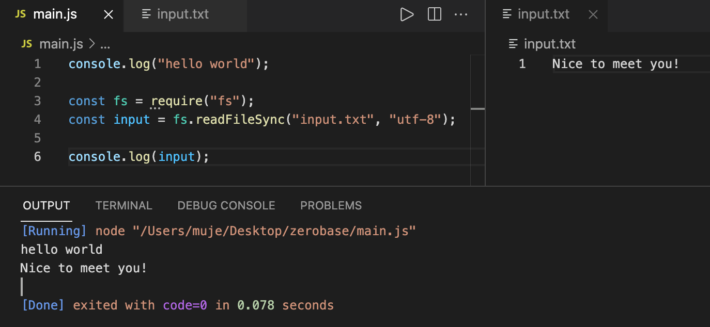

# 📌 1일차 
- 2021.09.25(토)
- 강의 : 자바스크립트 01~06
  - 자바스크립트 Overview
  - 기본 입출력, 기본 용어
  
<br>

### 👉 자바스크립트 학습 환경

1. Node.js : V8(자바스크립트 엔진)으로 빌드 된 이벤트 기반 자바스크립트 런타임 플랫폼
    - Node.js 설치를 통해 자바스크립트가 돌아가는 엔진을 사용할 수 있다
    - 확장성이 있는 네트워크 어플리케이션(서버 사이드)개발에 사용되는 소프트웨어 플랫폼이다
    - 자바스크립트를 활용해 Non-blocking I/O와 단일 스레드 이벤트 루프를 통한 높은 성능으로 처리 가능하다 
    - POC나 작은 규모의 프로젝트에서 Node.js를 백엔드로 사용하고, 큰 규모의 프로젝트에서는 JAVA와 SPRING을 사용하는 추세이다
    - 설치 확인 방법 : 명령 프롬프트에서 node를 입력해 설치 버전을 확인할 수 있다 

<br>

2. VS Code
```javascript
console.log("hello world");
```

- runcode를 사용해서도 실행이 가능하고, VS Code 내부의 Terminal을 사용해서도 실행이 가능하다
- Terminal에서 실행할 때에는 node 를 입력하고, 실행하고자하는 js파일의 경로를 입력한다
- 추천 확장 프로그램 : Code Runner, Prettier

<br>

3. 온라인 개발 환경
    - 프로그래머스 : https://programmers.co.kr/
    - LeetCode : https://leetcode.com  

<br>


### 👉 JavaScript
- 객체 기반의 스크립트 프로그래밍 언어
- 별도의 컴파일 없이 사용하는 인터프리터 언어 
- 명칭의 변화 : Mocha → LiveScript → **JavaScript**
- JavaScript는 JS엔진 위에서 수행된다
- JS엔진의 종류 : GoogleV8, FireFox SpiderMonkey, Edge Chakra
- **ECMAScript** 를 준수하는 범용 스크립팅 언어로, 웹의 동적 동작을 구현하기 위해 제작되었다


- ECMAScript : 표준화된 스크립트 프로그래밍 언어
  - 정포 통신에 대한 표준을 제정하는 비영리 표준화 기구인 Ecma International에서
  - ECMA-262 기술 규격에 따라 정의한 표준화된 스크립트 프로그래밍 언어 
    (ECMA-262 : Ecma International에서 제정한 기술 규격으로, 범용 목적의 스크립트 언어 명세 기술)
  - 자바스크립트를 표준화하기 위해 만들어졌으며, 액션스크립트와 J스크립트 등 다른 구현체도 포함되어 있다
  - 2015년 이후에는 매 해 6월에 버전을 갱신 중이며, ES5와 ES6에서 주요 변경 내용들이 많다 
    (97년 ES1(초판) / 09년 ES5 / 15년 ES2015(ES6) ...)

<br>


### 👉 프로그래밍
1. 코드 동작 흐름


- 개발자가 요구사항을 받아 해결하기위한 코드를 작성한다. 이에 대한 산출물이 바로 스크립트
- 스크립트를 컴파일러 혹은 인터프리터 언어를 통해 컴퓨터가 이해할 수 있는 언어로 변환한다
- 컴퓨터가 스크립트를 수행한 결과값을 확인해 수정 보완이 필요한 부분을 디버깅을 한다

<br>

2. 컴퓨터 내부 동작 원리


- 스크립트 파일을 Disk로부터 Load해와 Memory에 적재한다
- 스크립트 수행에 필요한 코드, 변수, 상수 등의 임시 저장소에 할당된다
- 연산이 필요한 경우는 CPU에 요청해 연산에 필요한 정보를 Memory로부터 CPU에 올린다
- CPU를 통해 얻어온 연산 결과는 다시 Memory에 적재한다

<br>

3. 자바스크립트 변환 절차


- JavaScript 코드를 Parser를 통해 문맥상 잘게 나누어 Abstract Syntax Tree의 형태로 변환한다
- 마지막으로 컴퓨터가 이해할 수 있는 언어로 컴파일러나 인터프리터를 통해 변환해 컴퓨터가 코드를 이해하고 수행할 수 있도록 한다

<br>


### 👉 입출력(I/O)
```javascript
console.log("hello world");

const fs = require("fs");
const input = fs.readFileSync("input.txt", "utf-8");

console.log(input);
```


- 입출력 : 사용자가 프로그램과 상호작용하기 위한 방법
- Input/Output의 첫 글자를 따 I/O로 줄여서 표기한다
- 운영체제에서의 대표적인 입출력은 **표준 입력, 표준력 출력, 표준 오류 출력**이 있다
  1. 표준 입력(stdin) : 프로그램의 데이터를 추가하기 위한 입력 장치로, 일반적으로 키보드의 응답을 받아 입력한다
  2. 표준 출력(stdout) : 프로그램의 실행 상태, 결과를 보고 판단하도록 모니터에 문자열로 출력하는 것이 일반적이다
<br>


### 👉 기본 용어
- 자바스크립트 코드 구성
  - C, C++, Java로부터 차용하여 제작된 스크립트 기반의 언어
  - 다수의 표현식으로 하나의 명령문을 만들며, 명령문으로 프로그램이 수행된다
  - 개행문자 또는 세미콜론을 붙여 하나의 명령문이 끝났음을 알린다 
- **표현식(expression)** : 하나 하나의 단어 (예) hello let "안녕하세요"
- **명령문(statement)** : 여러 단어가 연결된 문장 (예) let hello = "안녕하세요"
- **응용프로그램(application)** : 여러 문장의 집합 (예) let hello = "안녕하세요"; let hi = "hi";
- **키워드(예약어)** : 자바스크립트에서 문법을 만들 때 정한 용도로 동작하기 위해 정의한 단어
- **식별자** : 변수나 함수에 이름을 붙일 때 사용하는 단어
  - 대소문자를 구별하며, 예약어를 식별자로 사용해서는 안된다
  - 특수문자는 _ 와 $만 사용 가능하며 공백문자를 포함할 수 없다
- **주석** : 개발자가 작성하는 부연 설명으로, 실제로 실행되는 코드에 포함되지 않는다 
  - 단일 행 주석 // 과 다중 행 주석인 /* */ 이 존재한다


<br>


