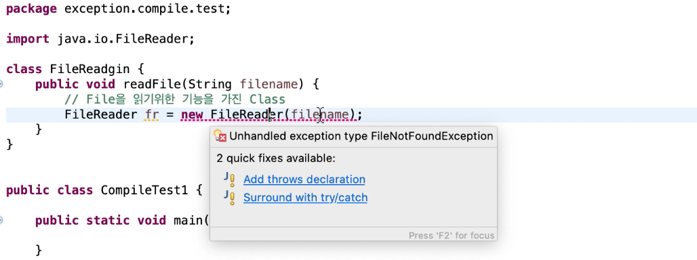
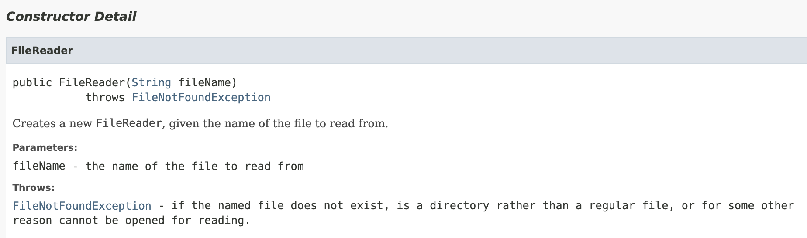

# 3. Compile Exception


## ✏️  Compile Exception



- 이렇게 실행하기 전에 발생하는 컴파일 단계의 예외를 Compile Exception이라고 한다
- FileReader 클래스는 항상 해당 파일을 찾지 못하는 예외를 처리해야하므로 Complie Exception이 발생한다
- 어떤 Exception이 발생했는지 확인하고 하나하나 catch문을 작성할 수 도 있지만, 자동완성을 통해 예외처리할수도 있다
- 아래와 같이 try-catch 문을 사용해 Complie Exception를 대응하자
    
    ```java
    try {
    	FileReader fr = new FileReader(filename);
    }catch (FileNotFoundException e) {
    	e.printStackTrace();
    }
    ```
    

## ✏️  API문서 살펴보기



- FileReader 클래스를 살펴보면 생성자의 호출 시에 예외를 발생시키도록 throw문이 작성되어 있는 것을 확인 할 수 있다
- 생성자를 호출함과 동시에 예외가 발생하므로, 컴파일할 수 없어 Compile-Exception에 해당한다